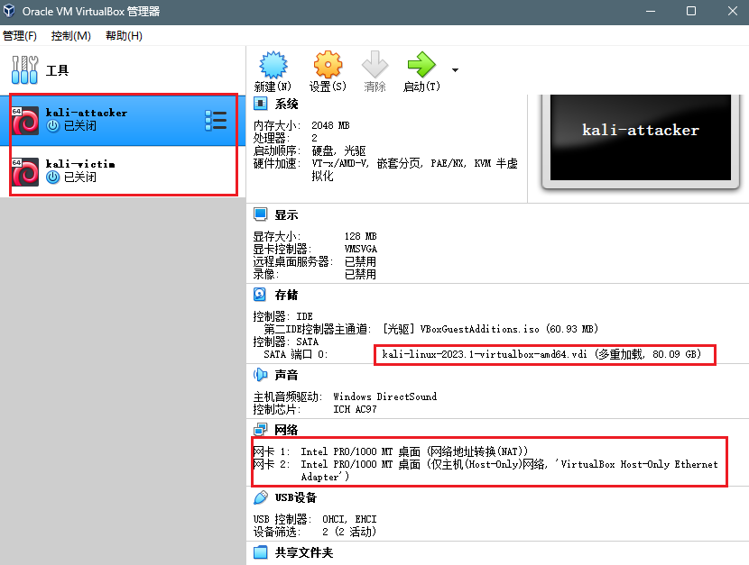
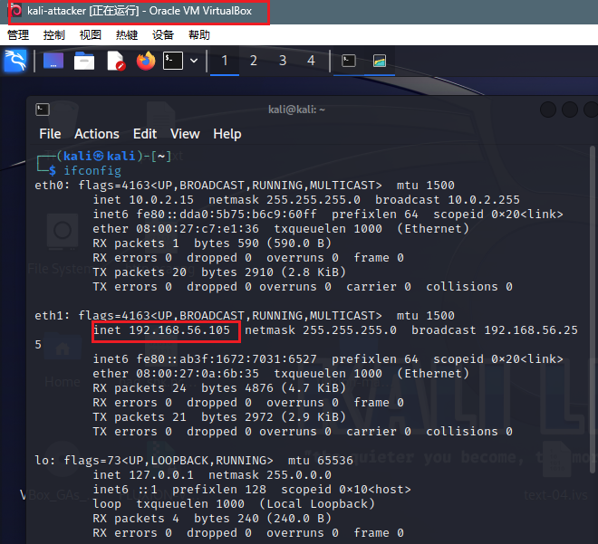
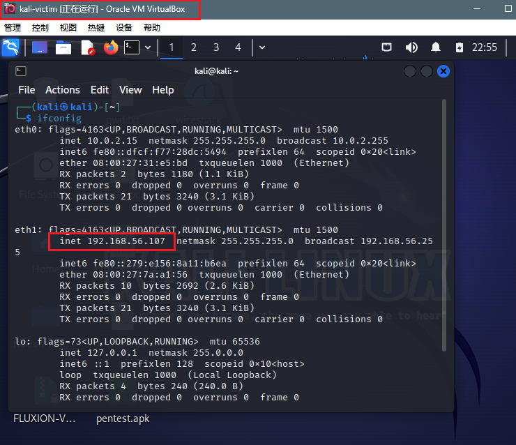
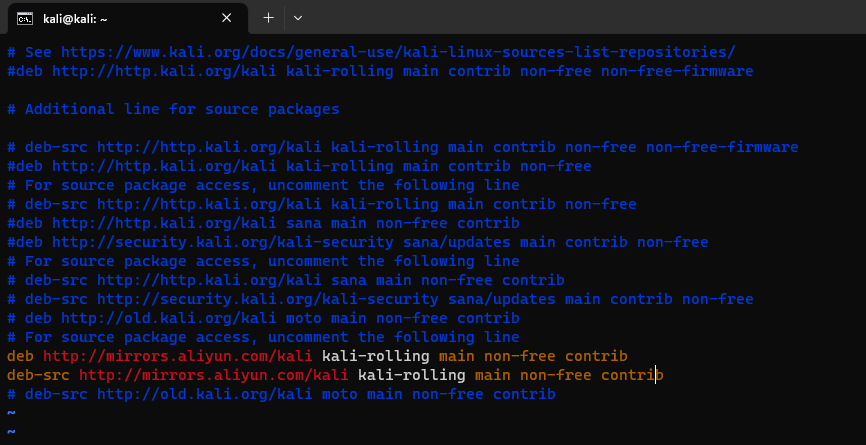
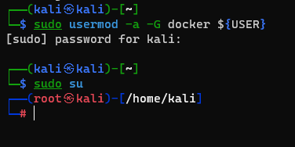

# **2023暑期网络安全攻防实践记录报告**

## 📖**负责工作**

- 实验环境搭建
- 作为蓝队对漏洞攻击行为进行持续检测和威胁识别，并进行修复

## 🔧实践过程

### 环境搭建

#### 虚拟机配置

VirtualBox kali-linux镜像多重加载，构建攻击者主机和受害者主机，两个主机的网卡配置均为`网络地址转换(NAT)`+`Host-only网卡`



两台虚拟机的ip地址如下：

|  虚拟机  |     ip地址     |
| :------: | :------------: |
| attacker | 192.168.56.105 |
|  victim  | 192.168.56.107 |





#### vulfocus

受害者主机克隆老师的[仓库](https://github.com/c4pr1c3/ctf-games)

```bash
git clone https://github.com/c4pr1c3/ctf-games.git
```

安装Docker Compose

```bash
sudo apt update && sudo apt install -y docker.io docker-compose jq
```

为提高下载速度，更换kali镜像源和docker镜像源

- **kali镜像源**

  ```bash
  sudo vim /etc/apt/sources.list
  ```

  国内镜像源地址：

  ```
  #aliyun 阿里云
  
  deb http://mirrors.aliyun.com/kali kali-rolling main non-free contrib
  
  deb-src http://mirrors.aliyun.com/kali kali-rolling main non-free contrib
  
  
  # ustc 中科大
  
  deb http://mirrors.ustc.edu.cn/kali kali-rolling main non-free contrib
  
  deb-src http://mirrors.ustc.edu.cn/kali kali-rolling main non-free contrib
  
  
  # tsinghua 清华
  
  deb http://mirrors.tuna.tsinghua.edu.cn/kali kali-rolling main contrib non-free
  
  deb-src http://mirrors.tuna.tsinghua.edu.cn/kali kali-rolling main contrib non-free
  
  
  #浙大源
  
  deb http://mirrors.zju.edu.cn/kali kali-rolling main contrib non-free
  
  deb-src http://mirrors.zju.edu.cn/kali kali-rolling main contrib non-free
  ```

  

  修改后执行`sudo apt update`更新软件源

- docker源

  在`/etc/docker/`目录下创建`daemon.json` 文件

  ```bash
  cd /etc/docker
  touch daemon.json
  ```

  写入配置

  ```bash
  {
      "registry-mirrors" : [
      "https://registry.docker-cn.com",
      "http://hub-mirror.c.163.com",
      "https://docker.mirrors.ustc.edu.cn",
      "https://cr.console.aliyun.com",
      "https://mirror.ccs.tencentyun.com"
    ]
  }
  ```

  重启服务

  ```bash
  systemctl daemon-reload
  systemctl restart docker.service
  ```

  查看配置是否成功

  ```bash
  sudo docker info
  ```

  

<br>

将当前用户添加到 docker 用户组，免 sudo 执行 docker 相关指令

```bash
sudo usermod -a -G docker ${USER}
sudo su
```



进入`fofapro/vulfocus`目录下执行老师封装好的脚本

```bash
bash start.sh
```

