# 2023暑期网络安全攻防实践记录报告


## 实验环境

- VMware Workstation Pro 17
- kali-linux-2023.2-vmware-amd64

## 实践过程

### 基础环境搭建

**1.配置虚拟机，调节网络环境**

根据需要，本次实践中的虚拟机要配置两张网卡：`网络地址转换(NAT)` 网卡和 `Host-only` 网卡

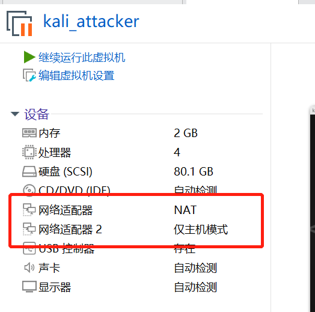

为了完成红蓝攻防对抗，就需要准备攻击者主机和靶机共两台虚拟机，如果是用 Virtualbox 的话就可以直接使用多重加载镜像来简化实验操作，但是我这里使用的是 VMware，不支持多重加载功能（貌似是Virtualbox独家特色），那就只能是自行准备两台 kali 虚拟机了。


**2.配置 ssh 免密登录，实现优雅操作虚拟机**

- __操作过程：__ 

     - 打开 gitbash，输入操作代码：
     ```shell
     
     $ ssh-keygen -t rsa 
     # 提示输入东西时，连续按3次回车即可，在~/.ssh目录下生成了id_rsa和id_rsa.pub两个文件，后者上传至目标服务器。
     # 但是因为已经生成过密钥文件了，这里就跳过这一步，权当是复习一遍之前的内容。
     $ ssh-copy-id -i id_rsa.pub server_user@ipAddr
     #server_user是服务器用户名，ipAddr是对应地址。
     ```

     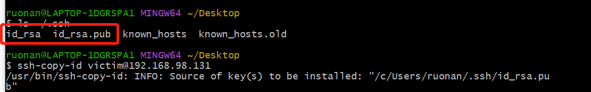
     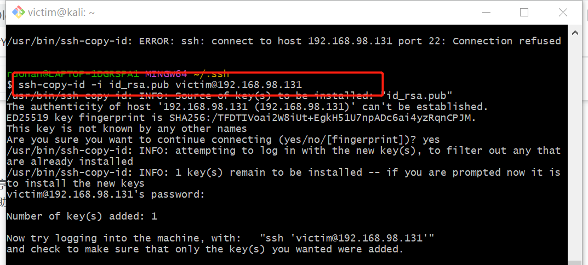
     


     - 在虚拟机上进行输入操作代码：
     ```shell
     $ vim /etc/ssh/sshd_config
     #找到/etc/ssh/sshd_config这个文件，取消以下几行注释。
     #PubkeyAuthentication yes
     #AuthorizedKeysFile .ssh/authorized_keys
     保存并退出vim：:x

     $ sudo service ssh restart
     #重启服务
     ```

     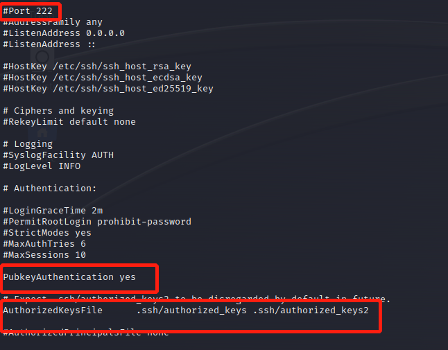
    

     - 在 gitbash 中输入操作代码：
     ```shell
     $ ssh username@ip
     ```
     即可免密登录虚拟机的 Linux 系统。
     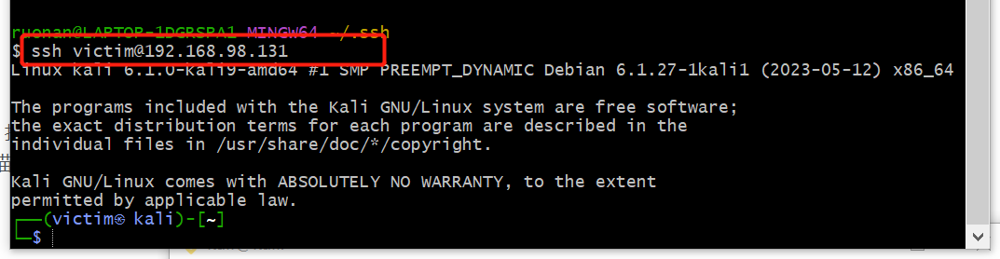

在宿主机上实现远程免密登录确实会让实验操作更加便捷。


**3.把攻防训练环境从仓库中拉取到虚拟机系统中**


- 根据黄药师提供的[vulfocus纯净版 Kali 初始化基础环境快速上手指南](https://github.com/c4pr1c3/ctf-games/tree/master/fofapro/vulfocus)进行环境搭建。

    ```shell
    $ git clone https://github.com/c4pr1c3/ctf-games.git
    ```


- 因为我在访问和拉取镜像时出现网络限制或者超时的问题，并且下载速度非常慢，于是就**更换了 kali 镜像源**：

  - 使用下列命令可以直接编辑`sources.list`

    ```css
    $ sudo vim /etc/apt/sources.list
    ```

  - 推荐的国内源地址如下：

    ```shell
    # 中科大
    deb http://mirrors.ustc.edu.cn/kali kali-rolling main non-free contrib
    deb-src http://mirrors.ustc.edu.cn/kali kali-rolling main non-free contrib
     
    # 阿里云
    deb http://mirrors.aliyun.com/kali kali-rolling main non-free contrib
    deb-src http://mirrors.aliyun.com/kali kali-rolling main non-free contrib
     
    # 清华大学
    deb http://mirrors.tuna.tsinghua.edu.cn/kali kali-rolling main contrib non-free
    deb-src https://mirrors.tuna.tsinghua.edu.cn/kali kali-rolling main contrib non-free
    ```

- 保存上述更改后要更新软件源：

    ```shell
    $ sudo apt update 
    ```

- 通过使用 Docker Compose 来构造 docker 环境，其中 git 下来的仓库老师已经配置好对应的 .yml文件，直接执行即可构建对应的环境：

   ```shell
   $ sudo apt install -y docker.io docker-compose jq
    ```

- 将当前用户添加到 docker 用户组，免 sudo 执行 docker 相关指令：

    ```shell
    $ sudo usermod -a -G docker ${USER}
    ```

    然后重新登陆 shell 生效。

    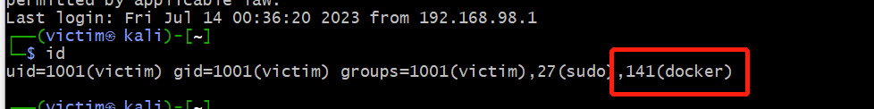

- 切换到 root 用户权限下执行：

   ```shell
   $ sudo su -
   ``` 

- 同样为了保证网络的顺畅，需要**更换 docker 源**：

  - 修改 `/etc/docker/daemon.json` 文件：

    ```shell
    # 添加一些国内的镜像源
    $ cat <<EOF > /etc/docker/daemon.json
    {
      "registry-mirrors": ["https://registry.docker-cn.com",
        "http://hub-mirror.c.163.com",
        "https://docker.mirrors.ustc.edu.cn",
        "https://cr.console.aliyun.com",
        "https://mirror.ccs.tencentyun.com"]
    }
    EOF
    # 查看是否修改成功
    $ cat /etc/docker/daemon.json
    ```


  - 重启 docker 守护进程：

    ```shell
    $ systemctl restart docker
    ```

     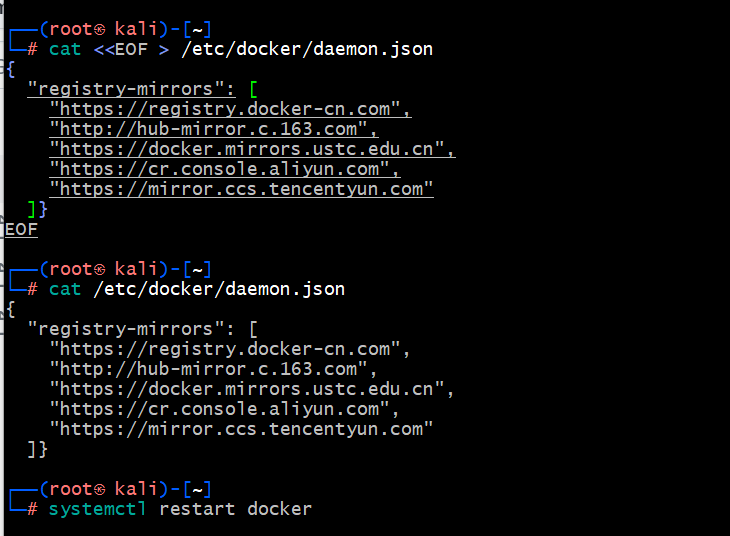

  - 查看配置是否成功：

    ```shell
    $ docker info
    ```

     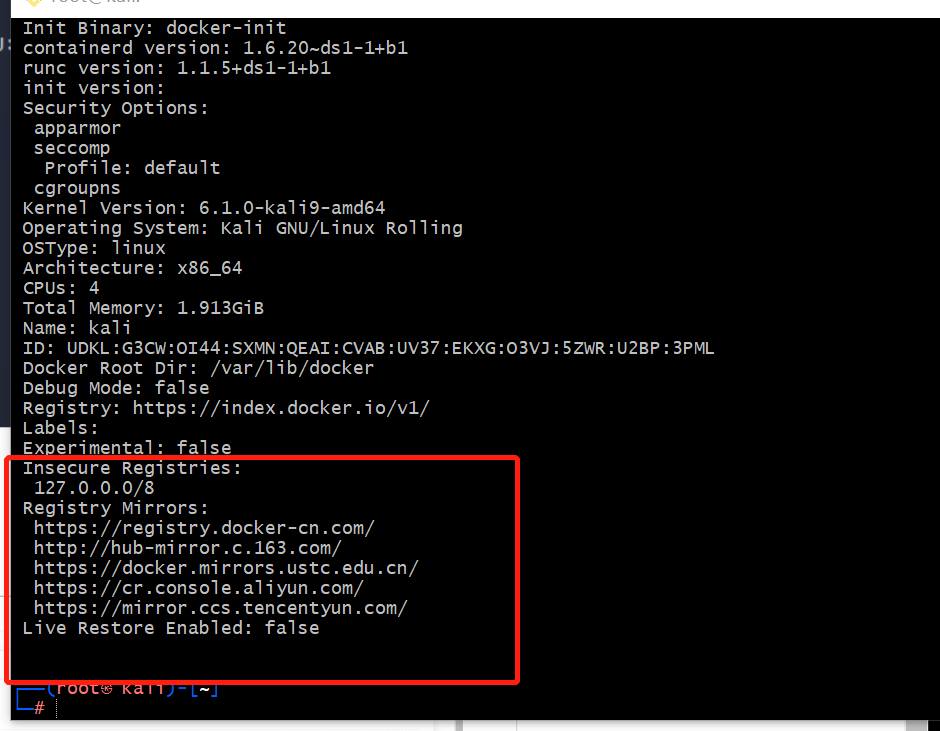


- 提前拉取 vulfocus 镜像：

    ```shell
    $ docker pull vulfocus/vulfocus:latest
    ```

    这就是一个纯等待的过程，所以前面换成国内镜像源那步很重要，可以大大减少等待的时间。

     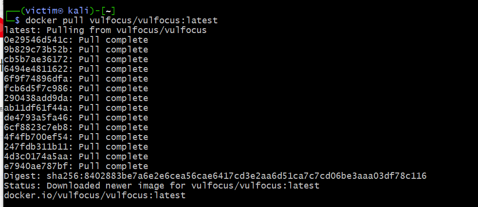


- pull 好后，直接运行老师给出的 `bash start.sh` 脚本，并选择对外提供访问 `vulfocus-web` 的 IP（这里选择的是 host-only 网卡的地址），即可在本地的 80 端口开启容器：

    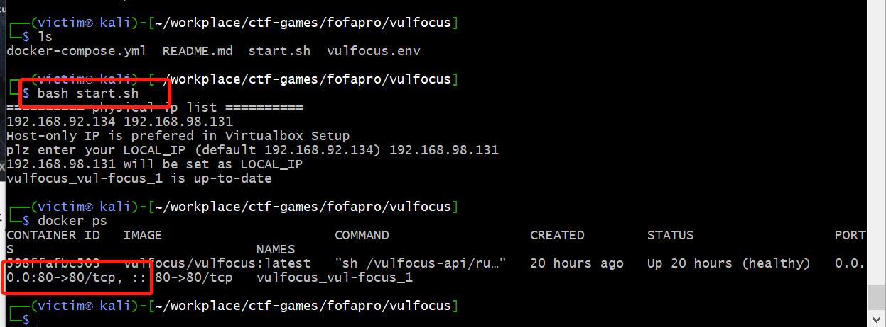


**4.测试部署本地的Vulfocus**


- 打开浏览器访问进入部署好的地址，【镜像管理】-【镜像管理】-【一键同步】，能够看到 Vulfocus 已经提供的镜像：

    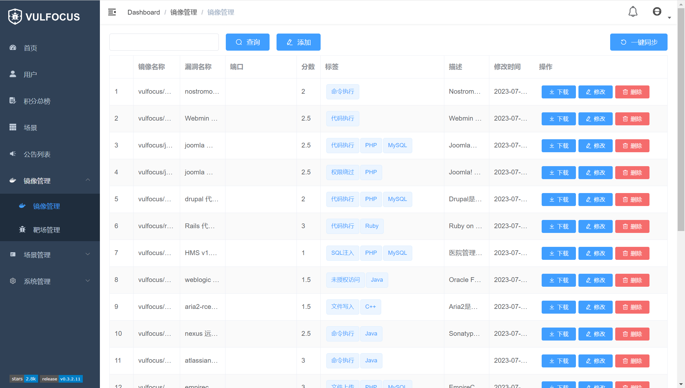

- 搜索感兴趣的漏洞镜像-【下载】

    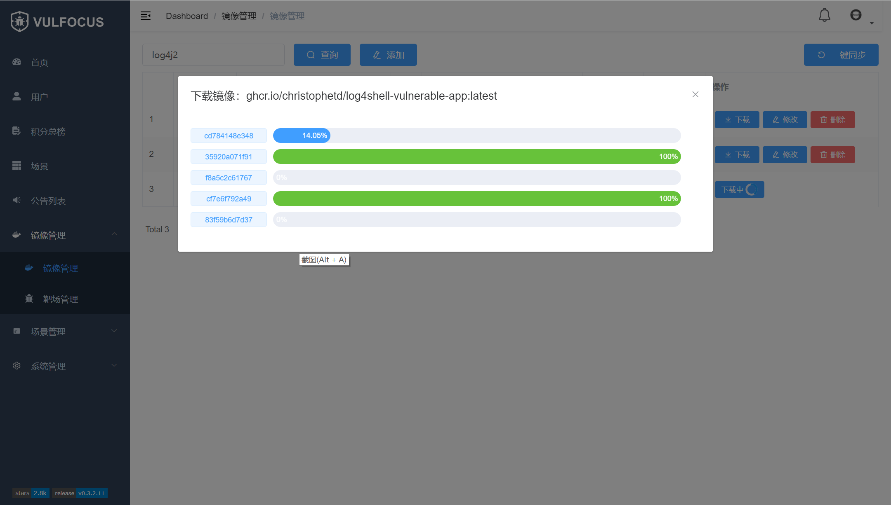


- 镜像下载完毕后，【首页】，能够看到下载好的镜像列表等信息，并在容器中【启动】环境进行测试：


    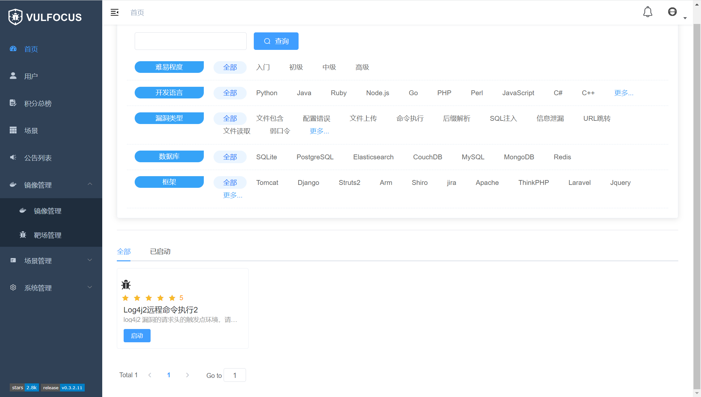

    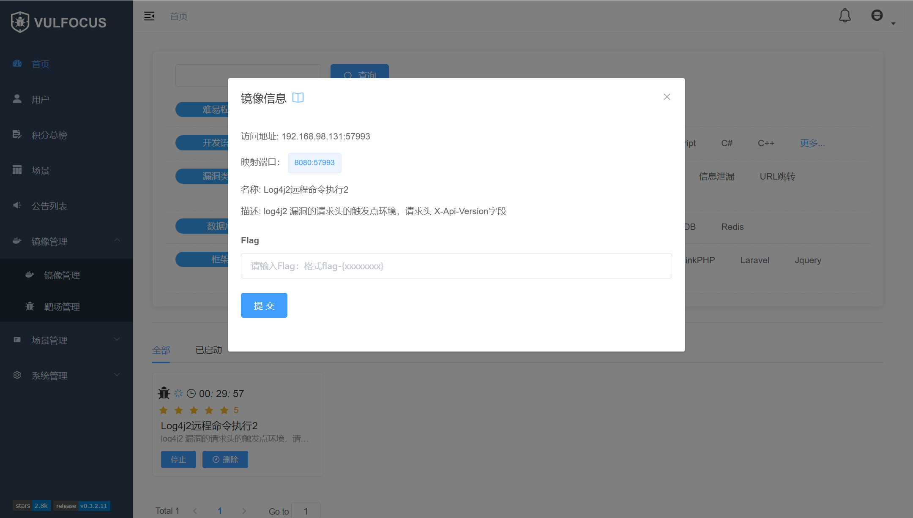


**5.自定义一个场景拓扑镜像**

- 根据同学提供的情报得知：由于[官网](https://vulfocus.cn/#/scene/list)已经不再提供下载和资源镜像分享，因此需要自己去设计构建相应的拓扑场景和镜像：

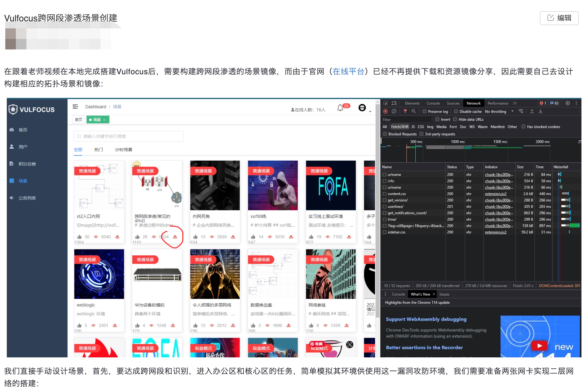

- 这里有两种方式，
  - 第一：直接导入 rock 同学提前搭建好的镜像场景——手搓 dmz，并且下载需要的漏洞镜像。
  - 第二：自己手动搭建场景。

- 为了方便起见，我选择了第一种方式，【场景管理】-【环境编排管理】-【添加场景】- 选择提前下载好的`手搓dmz.zip` -【修改端口开放状态】-【保存】-【发布】-【下载所需要的镜像】。

  > 注意记得将第二层容器中端口开放更改为 `false`。

  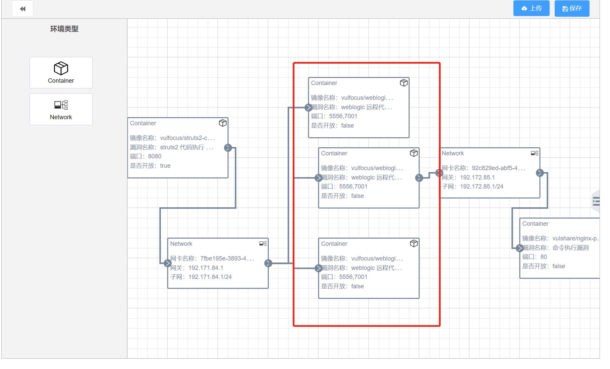

- 一共需要 3 种漏洞镜像：`struts2-cve-2020-17530`、`weblogic-cve-2019-2725`、`nginx-php-flag`。正常情况下，按照上述操作，此时我们需要做的就是静静等待它下载完成，需要一点耐心，因为它下载速度很慢。但是我下载的时候遇到了问题，`weblogic-cve-2019-2725` 该镜像的下载一直无法成功。我试过很多方法：重启虚拟机、重新导入场景、单独下载、更换镜像源...全部无济于事，下载进度一直卡在一个位置。

  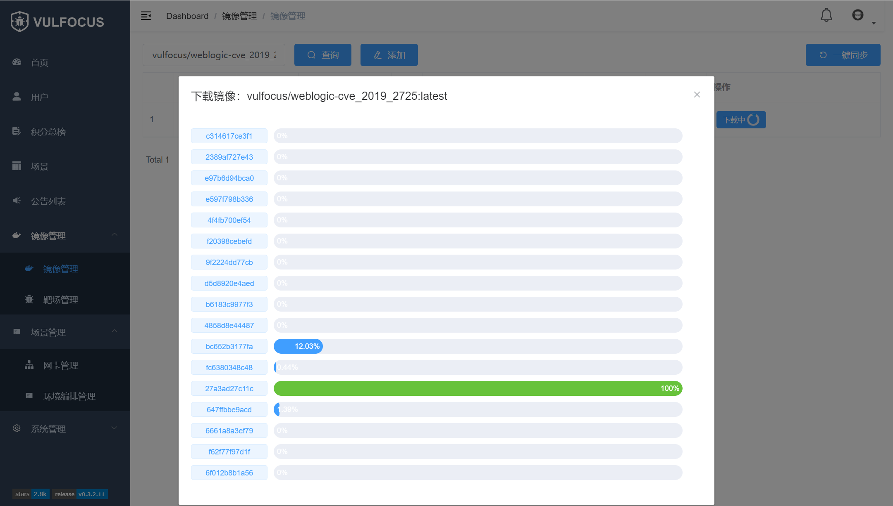

- 因为在这个地方我耗费了太多时间，心态崩溃，所以中间 gap 了两天。今天重振旗鼓，再次挑战。我想如果无法从这个网站上直接下载的话，那能不能用别的方式下载呢？在网上查找了一番资料，终于，根据 [Vulfocus 镜像维护目录](https://github.com/fofapro/vulfocus/blob/master/images/README.md)得知：可以直接在 docker 里面拉去漏洞镜像。

  ```shell
  $ docker pull vulfocus/weblogic-cve_2019_2725
  ```

- 这次，终于成功搭建好场景啦！

    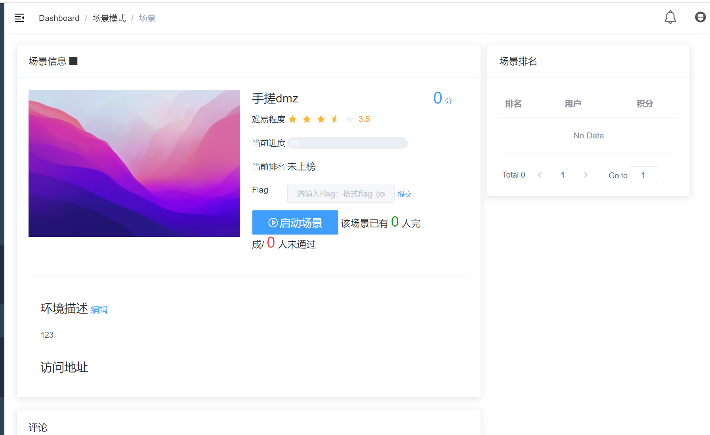


## 参考链接

- [网络安全(2021)综合实验](https://www.bilibili.com/video/BV1p3411x7da/?p=22&spm_id_from=pageDriver&vd_source=61a1cf010feeebc60643481f16fc695e)

- [cuc-ns-ppt](https://c4pr1c3.github.io/cuc-ns-ppt/vuls-awd.md.v4.html#/title-slide)

- [Vulfocus 镜像维护目录](https://github.com/fofapro/vulfocus/blob/master/images/README.md)