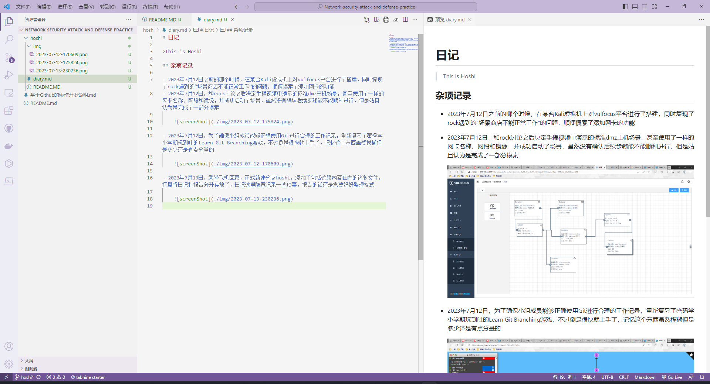

# 日记

>This is Hoshi

## 杂项记录

- 2023年7月12日之前的哪个时候，在某台Kali虚拟机上对vulfocus平台进行了搭建，同时复现了rock遇到的“场景商店不能正常工作”的问题，顺便摸索了添加网卡的功能
- 2023年7月12日，和rock讨论之后决定手搓视频中演示的标准dmz主机场景，甚至使用了一样的网卡名称、网段和镜像，并成功启动了场景，虽然没有确认后续步骤能不能顺利进行，但是姑且认为是完成了一部分摸索

    

- 2023年7月12日，为了确保小组成员能够正确使用Git进行合理的工作记录，重新复习了密码学小学期玩到吐的Learn Git Branching游戏，不过倒是很快就上手了，记忆这个东西虽然模糊但是多少还是有点分量的

    

- 2023年7月13日，乘坐飞机回家，正式新建分支hoshi，添加了包括这段内容在内的诸多文件，打算将日记和报告分开存放了，日记这里随意记录一些琐事，报告的话还是需要好好整理格式

    
