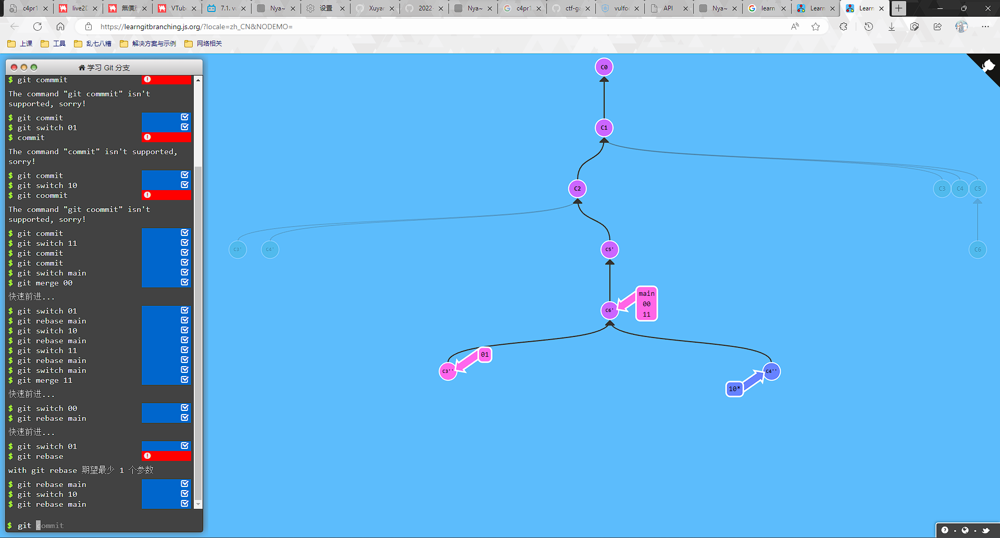
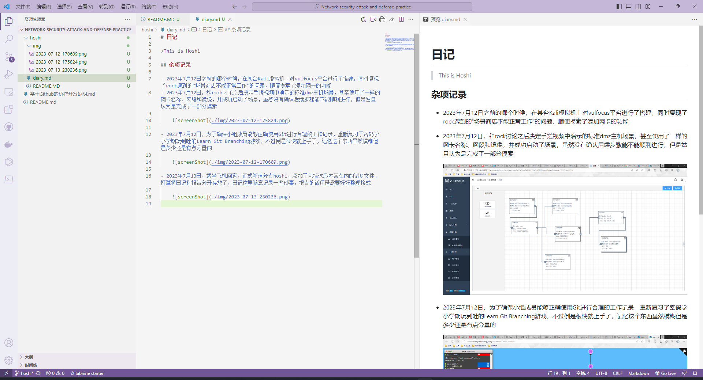
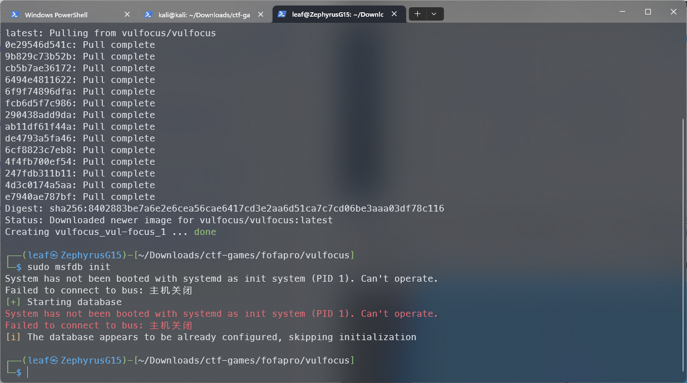
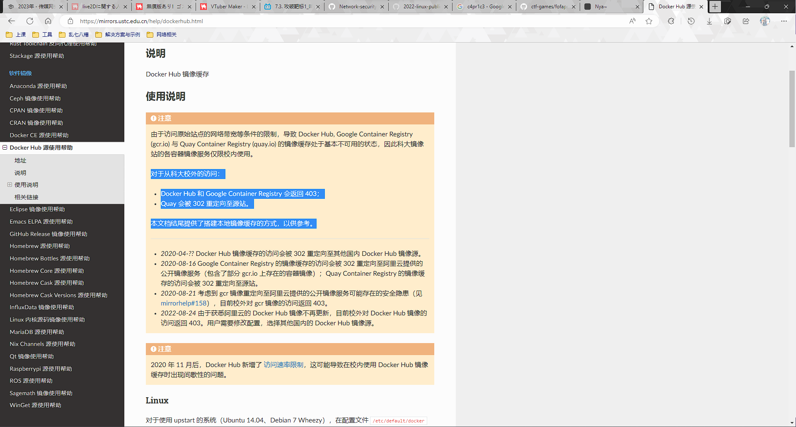

# 日记

>This is Hoshi

## 杂项记录

- 2023年7月12日之前的哪个时候，在某台Kali虚拟机上对vulfocus平台进行了搭建，同时复现了rock遇到的“场景商店不能正常工作”的问题，顺便摸索了添加网卡的功能
- 2023年7月12日，和rock讨论之后决定手搓视频中演示的标准dmz主机场景，甚至使用了一样的网卡名称、网段和镜像，并成功启动了场景，虽然没有确认后续步骤能不能顺利进行，但是姑且认为是完成了一部分摸索

    

- 2023年7月12日，为了确保小组成员能够正确使用Git进行合理的工作记录，重新复习了密码学小学期玩到吐的Learn Git Branching游戏，不过倒是很快就上手了，记忆这个东西虽然模糊但是多少还是有点分量的

    

- 2023年7月13日，乘坐飞机回家，正式新建分支hoshi，添加了包括这段内容在内的诸多文件，打算将日记和报告分开存放了，日记这里随意记录一些琐事，报告的话还是需要好好整理格式

    

- 2023年7月15日，尝试更改实验环境的角色配置，原本计划用作Victim主机的VirtualBox虚拟机Kali将被用作Attacker主机，原本计划用作Attacker主机的WSL2中安装的Kali子系统将被用作Victim主机，理由大概是下面的情况：

  - 为了确保WSL2中的Kali能够正常启用为WSL适配的Win-Kex模式，不能将WSL2的Kali设置为由systemd作为PID 1引导启动的完整虚拟机（WSL2本身是可以通过添加配置来实现由systemd启动的），而要使用类似chroot的方式，此时使用metasploit framework时，如果要启用数据库来记录操作，其自动化模式是通过systemd启动数据库，于是会出现很直白的无法启动的问题，虽然说可以通过手动管理数据库服务，但考虑到折腾量还是选择了交换Victim和Attacker主机，毕竟单就docker来说，因为之前已经手动配置了服务启动所以和实际使用虚拟机并没有太大的区别了

    

- 2023年7月15日，记不清是不是已经说过了，但是还是记录一下，USTC已经停止对校外提供docker hub的镜像源了，官网上有说明，[ctf-games中关于vulfocus的README还没改](https://github.com/c4pr1c3/ctf-games/tree/master/fofapro/vulfocus)，仍然是cat中科大镜像源🤔

  
